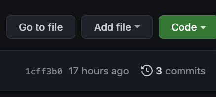
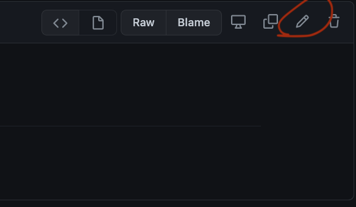
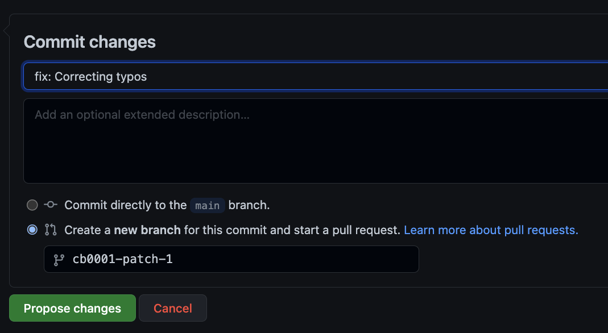

# external-docs
Project which generates AUCloud's external docs website

### Build status

## Current status
This project only builds to an internal development [website](https://pages.github.ss.australiacloud.com.au/platform/external-docs/) in preparation for an external facing website at
`docs.australiacloud.com.au`.


## How it works
The website is built using a python based tool called `mkdocs`.

When content is commited to the `main` branch on github, the documentation site is updated by running a github action.

The website is created by indexing the `docs` folder for markdown (`.md`) files.
Using the tree structure in the docs website, the markdown files are converted to html websites by mkdocs and served.

### Metadata
Markdown files can have metadata yaml blocks (see below), which can be used to set titles, and other data by power users.
This metadata block MUST START on the first line of a markdown file.

```markdown
---
title: A nice clean webpage title here
---
# Normal markdown content goes below.

```


## Contributing content
For content to be released content must go through a *pull request* based review process.

### Within github GUI
Users can contribute either by using the `add file`



or `edit` document



functions in github. When committing content user's *MUST* open up pull requests.



### Using traditional git workflows
Users comfortable with `git` workflows should propose pull requests as expected noting:
- `git lfs` MUST NOT be used
- All pull requests are squash merged.
## Local development / previewing

*NOTE: This presumes you either are a POSIX system (WSL or a Mac)*

Users need `make`, `python` and `pip`, installed.

- Install (remaining) dependencies with `make install`
- Test locally with `make docs-serve`

### Best practice
Local development users are encouraged to use `pre-commit` which has been configured for the project.

Install using `make pre-commit-install` (after `make install`).

