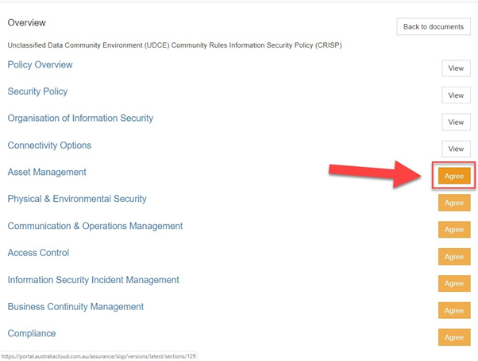

### Signing the CRISP

The Community Rules Information Security Policy (CRISP) has been developed to ensure all users of the AUCloud platform are aligned in the secure way they connect with and use the platform. The CRISP is held at account level and is only required to be signed by the designated Security Contact.

The CRISP is initially signed by the Assurance User (Security Contact) when you set up your account. The CRISP is regularly updated to remain current with Australian Government policies and procedures as outlined in the Australian Privacy Principles, the Information Security Manual and technical publications produced by ASD, ACSC, NIST and ISO.

You will be alerted to any changes made to the CRISP and will need to acknowledge these changes as they occur. This guide outlines the procedures to follow to sign the CRISP.

1. Log into AUCloud Portal.

    

1. Click the Assurance icon.

    

1. You will now see the Assurance page in the portal.

    

1. Scroll down to the Community Rules Information Security Policy (CRISP) section and click the Sign button. Depending on your community, you will see the ODCE, PDCE, or EDCE community rules.

    

    - *Note*: Click the Download button to preview a copy of the whole CRISP document.

1. The first four buttons direct you to important information that you must be aware of.  The last seven buttons will direct you to the sections of the CRISP that you must review and agree to before signing the CRISP.

    Click the View buttons to review all of the following sections: *Policy Overview*, *Organisation of Information Security* and *Connectivity Options*.

    

1. Click the Back to sections button after reviewing each section of the CRISP, as indicated at *step 5* (above).

    

1. Click the Agree button to review the CRISP section for Asset Management.

    

1. Review the Policy and click Agree to this section.

    

    - *Note:* After clicking the button to Agree, the browser is redirected to the main CRISP page in the portal.
    - *Note:* After clicking to agree to a section of the CRISP, you can not alter your response.
    - *Note:* If you have concerns regarding any of the contents of the CRISP, raise a request for assistance through the AUCloud Automation, Orchestration and Management Portal.

1. Proceed to click Agree and follow the process as indicated at step 8 through the remaining sections of the CRISP.

    

    - *Note:* After agreeing to any section of the CRISP, you will only be able to View the content of that section as illustrated in *steps 5* and *6* (above).

1. The sections of the CRISP can be agreed to in any order but must all be completed before the document can be signed.

    

1. After agreeing to all sections of the CRISP, you will be directed to scroll to the bottom of the CRISP page to sign and complete the document.

    

1. Enter your full name into the field indicated (A), use the mouse pointer and left mouse button to sign your name (B) and click the Sign button to complete the process.

    

1. You have now signed the CRISP.
