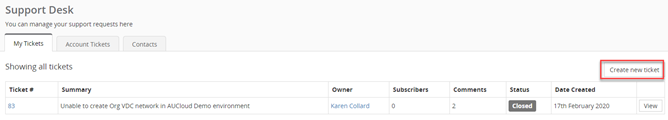
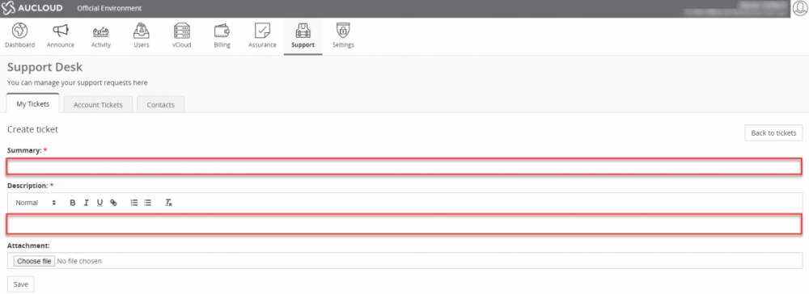
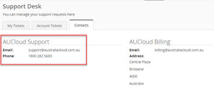

## AUCloud Support

The AUCloud support team is here to ensure your services with AUCloud are always operating seamlessly. AUCloud offers support to customers between 8:00am to 6:00pm Monday to Friday, with 24/7 emergency support at hand 

If you need assistance, you can contact AUCloud Support by

- Raising a Support ticket through the AUCloud portals by following the below procedure

- Emailing AUCloud Support at [support@australiacloud.com.au](mailto:support@australiacloud.com.au)

- Calling AUCloud Support on 1800 AUCLOUD (282 5683)

1. Click on the **Support** Tab in the ribbon bar.

    

1. _Click_ **Create new ticket**

    

1. Enter a Summary and Description with as much information as possible of the issue as this will assist our teams with troubleshooting. Attachments can be added to provide additional information. Once you have entered details _click_ **Save**.

    

    General users will only have visibility of tickets raised by themselves.

    If you have administrator access, you will be able to view all support tickets raised by your organisation through the Account Tickets tab.

    The AUCloud Support contacts are also available on the Contacts tab.

    [

    Outside of the standard support hours, AUCloud offer 24/7 emergency support for Priority 1 and Priority 2 incidents

    Emergency priority 1 and priority 2 incidents are classified by the following:

    - Priority 1 incidents

        - AUCloud systems are not functioning as expected with high impact on customer operations

    - Priority 2 incidents

        - AUCloud systems are partially usable with medium impact on customer operations

        - Priority 1 fault to which a temporary solution has been applied by AUCloud engineers

    If you require emergency support, you will need to do one of the following:

    - Raise a ticket in the AUCloud portals (ODCE, PDCE, EDCE)

    - Send an email outlining the issue to [support@australiacloud.com.au](mailto:support@australiacloud.com.au)

    By raising one of the following this will alert our out of hours engineers to investigate the issue/error and provide an update once a solution has been established.