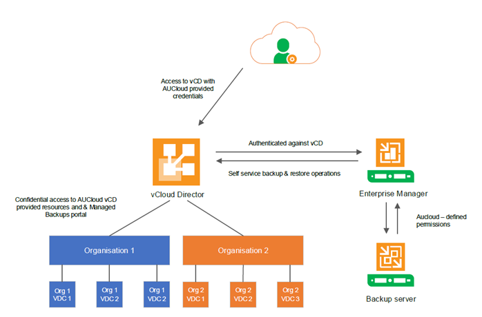

### Overview

The AUCloud backup solution for vCloud Director (vCD) environments uses Veeam backup infrastructure to protect vCD virtual machines (VMs). As such certain information been taken from the **Veeam Backup & Replication version 11 Enterprise Manager User Guide** and is intended to provide relevant information regarding backups within the AUCloud environment.

A full copy of the Veeam Enterprise Manager User Guide documentation can be found online [here](https://helpcenter.veeam.com/docs/backup/em/em_working_with_vcd_vms.html?ver=110).

### How it works

Veeam leverages the native vCloud Director authentication technology to authorise users to log in to Enterprise Manager. The authentication process and components interactions are shown in the figure below.

This approach helps to streamline administration and management tasks on provider side. A tenant only needs to be configured once in vCloud Director, and then any change like a new password or a 'Disable' operation will be immediately reflected in Veeam Enterprise Manager. User administration is handled at the AUCloud Automation, Orchestration and Management Portal level.

**AUCloud Tenant User Operations and Authentication**

When a user with the required permission level logs into vCloud Director and access the Managed Backups portal from the vCD menu, the user will be automatically logged into the backup portal using their vCloud Director credentials. Backup enabled users can perform the following operations:

-   Create new backup jobs for the objects within vCloud Director, based on the pre-defined templates. Tenant users can configure essential job settings (such as VMs to backup, retention, schedule, notifications, and guest OS processing options).
-   Modify or delete the jobs.
-   Enable or disable the jobs.
-   Start, stop, retry the jobs.
-   View statistics on vCloud Director backups.
-   Restore vCloud Director VMs to the original vApps and vApps to the original vDC.
-   Perform application item restore for SQL Server and Oracle databases.
-   Restore files from indexed and non-indexed VMs guest file system.

To simplify job management for users, advanced job parameters (like backup mode and repository settings) are automatically populated from the job templates created by AUCloud administrators.