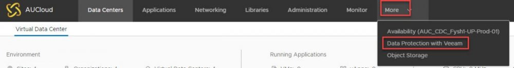

### Overview

Once enabled, the self-service backup portal can be accessed via a plug-in through vCloud Director. The self-service portal facilitates operations for vCloud Director VMs protection, including VMs and files restore. These operations do not require specific user accounts to be created. For restore operations, an administrator can access the Self-Service Backup Portal from within vCloud Director.

### Accessing the Veeam Backup portal

The portal can be accessed via a plug-in through vCloud director. If you would like access to back-up your VM's in your vCloud service, please contact your Customer Success Manager or AUCloud support to request to have this feature enabled. Please provide an estimation of the storage space required (if known)

### Assigning permissions within the AUCloud Automation, Orchestration and Management Portal

1. To assign permissions to a user within your tenancy navigate to the Users page

    Select Create New User or edit, to edit an existing user’s permissions. Further details on how to manage user permission are contained in [Managing User Accounts](https://connect.australiacloud.com.au/articles/aucloud-aom-portal/97_user-management/managing-user-accounts-r256/).  

1. The backup user requires Administrator access to the vCloud Director service. The administrator access role provides the user with full administrator rights within the vCD tenancy. A specific backup administrator role does not currently reside within the portal access; however; this is currently in development. 

### Working with the Portal

Using the Self-Service Backup portal, you can perform the following operations:

- **Dashboard** \- view statistics on vCloud Director backups.

- **Jobs** \- examine and export job sessions data, search for jobs, create new jobs and edit jobs.

- **VMs** \- search for and restore virtual machines and vApps with a single click to their original location (preserving or overwriting the production VM or vApp).

- [**Files**](https://helpcenter.veeam.com/docs/backup/em/em_vcd_self_service_restore_files.html) \- search for the files on the VM guest file system and restore the necessary files to the original location or download to the local machine.

- [**Items**](https://helpcenter.veeam.com/docs/backup/em/em_vcd_self_service_restore_items.html) \- perform application item-level restore (currently, for Microsoft SQL Server and Oracle databases).

Detailed information can be found in the following articles:

- [Viewing Statistics on vCloud Director Backups](./statistics_on_vcd_backups.md)

- [Working with vCloud Director Backup Jobs](./working_with_vcd_backup_jobs.md)

- [vCloud Director VMs and vApps Restore](./restoring_vms_and_vapps.md)