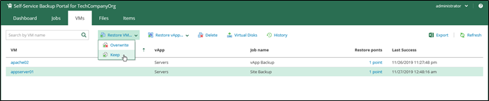
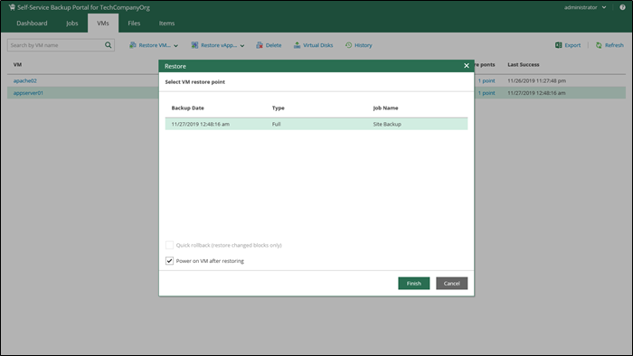
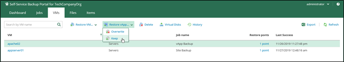
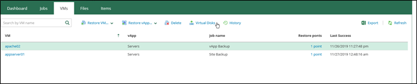

### Overview

You can perform the following tasks using the **VMs** tab of Self-Service Backup Portal:

-   Search and browse VMs and vApps
-   Restore VMs and vApps
-   Restore virtual disks
-   Delete VMs
-   Restore Guest OS and Application items

### Restore VMs

vCloud Director VMs can be restored to the original (production) vApp using flexible restore options.

1. On the **VMs** tab, select the necessary VM backup in the list of VMs. To quickly find the necessary VM, use the search field at the top of the window.

1. Click **Restore VM** and select the option you need:

    -   Select **Overwrite** if you want to restore the VM from the backup to the original vApp, replacing the production VM.
    -   Select **Keep** if you want to keep both VMs in the original vApp. The VM from the backup will be located next to the original production VM and will have the same name with the \_restored suffix.

    

1. Select the restore point that will be used to restore the VM.

1. Additionally, you can select to **Power on VM after restoring** or use the **Quick rollback** option. For VMware VMs, you can also select to **Restore VM tags**.

    

1. After you click **Restore**, you will get a message notifying you about the operation effect: the VM from the backup will replace the production VM if it is present in the original location. Click **Proceed** or **Cancel** the operation.

1. You can view the VM restore progress in the **Machines** tab after you click **View history**.

**IMPORTANT:** Restore of a standalone VM to the original location with the **Keep** option selected will result in an unpredictable behaviour and possible failure of the restore job.

### Restore vAapps

Similar steps can be taken to restore a vApp:

1. On the **VMs** tab, select the necessary vApp backup. To quickly find the necessary vApp, use the search field at the top of the window.

1. For the selected backup, click **Restore vApp** and select the option you need:

    -   Select **Overwrite** if you want to restore the vApp from the backup to the original vDC, replacing the production vApp.
    -   Select **Keep** if you want to kept the original vApp in the original vDC. The vApp from the backup will be located next to the original production vApp and will have the same name with the \_restored suffix. Names of VMs in the vApp will remain the same.

    

1. Select the restore point that will be used to restore the vApp.

1. Additionally, you can select to **Power on VM after restoring**.

    

1. After you click **Restore**, you will get a message notifying you about the operation effect — remember that with the **Overwrite** option selected, the existing vApp and all its VMs will be replaced with the vApp from the backup. Click **Proceed** or **Cancel** the operation.

**IMPORTANT:** Restore of a vApp with a standalone VM will return and ordinary and not standalone VM.

### Restore Virtual Disks

You can restore individual virtual disks from backups of vCloud Director VMs:

1. On the **VMs** tab, select the backup of the VM whose disks you want to restore. To quickly find the necessary VM, use the search field at the top of the window.

1. Click **Virtual Disks** and simply follow the steps of the **Virtual Disk Restore** wizard.

    

### Delete VMs and vApps

1. Once you select a VM, click the **Delete** button. If you are sure that you want to delete the selected VM, click **Yes** from the Delete VM window.

    _**Note:** If the selected VM is the last one in its vApp, then it is deleted from the backup with its vApp. If this vApp is the last one in its backup, then the whole backup is deleted. In other cases, only the selected VM is deleted._

1. If you delete a vApp all of the VMs will be deleted from backup.

1. When you remove data for deleted VMs from per-VM backup chains, it does not mark the space as available but deletes backup files since they contain data for 1 VM only.

1. When you remove data for deleted VMs from regular backup chains, it does not free up space on the backup repository. It marks the space as available to be overwritten, and this space is overwritten during subsequent job sessions or the backup file compact operation.

## Restore Guest OS and Application Items**

### Restore VM Guest OS Files**

1. The **Files** tab of the Self-Service Backup Portal allows users to browse the guest OS file system in a VM backup, search for guest OS files, and restore necessary files.

1. To restore files from indexed and non-indexed VM guest file system, go to the **Files** tab. After you find the necessary file, you can restore it from backup with one click. You can choose to restore it to the original location or download it to the local machine.

**NOTE:**

-   If you plan to restore from non-indexed VM guest, consider that mount operation will be performed using mount server assigned to the corresponding backup repository.
-   For more information on how to restore files from a Linux VM, see [this web page](http://www.virtualtothecore.com/en/concurrent-linux-file-restores-in-veeam-backup-and-replication-v9-5-vcloud-director-self-service-portal/).

### Restore Application Items

1. The **Items** tab of Self-Service Backup Portal allows users to perform item-level recovery from application-aware backups (currently, SQL Server databases and Oracle databases).

1. To restore application items (SQL Server databases or Oracle databases), go to the **Items** tab and follow the steps described in the [Restore Procedure for SQL Server](https://helpcenter.veeam.com/docs/backup/em/em_restore_procedure_sql.html) databases and [Restore Procedure for Oracle](https://helpcenter.veeam.com/docs/backup/em/em_restore_procedure_oracle.html) databases.