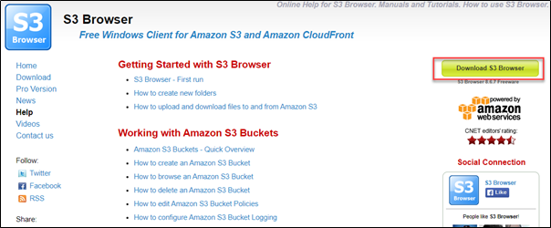
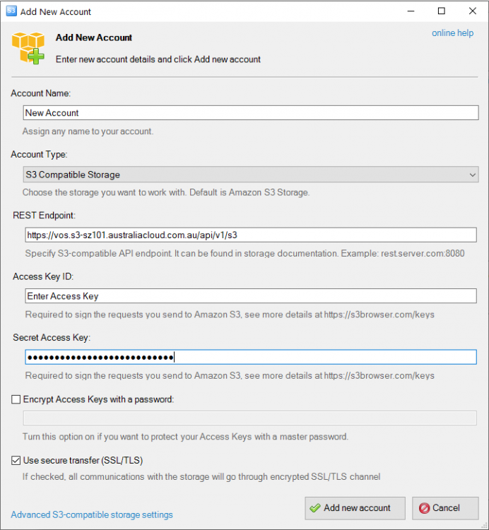
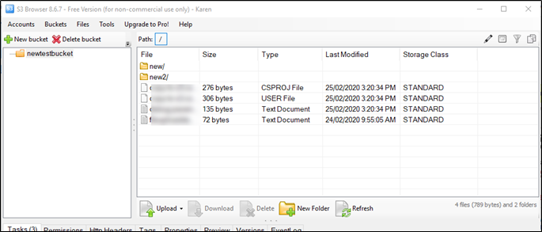
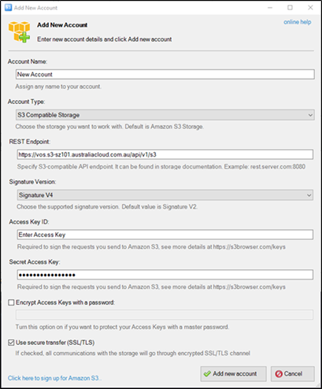

## Accessing buckets from a browser

1. You can access and manage your bucket from several web browsers with your user credentials. The free versions generally restrict upload and download to two concurrent connections. Paid versions enable up to 10 concurrent connections. The AWS S3 CLI tool can be used to programmatically access buckets. The example below provides information on using S3browser.com.

2. Navigate to [https://s3browser.com/help.aspx](https://s3browser.com/help.aspx)

3. Select Download S3 Browser.

      
 

1. You will be prompted to add a new account. Select the following parameters:

    -   **Account Name:** Select an account name
    -   **Account Type:** S3 Compatible Storage
    -   **Rest Endpoint:** [vos.s3-sz101.australiacloud.com.au/api/v1/s3](https://vos.s3-sz101.australiacloud.com.au/api/v1/s3)
    -   **[Access Key ID](./security_credentials.md)**: Access Key
    -   **[Secret Access Key](./security_credentials.md):** Secret Key
    -   **Encrypt Access Keys with a password:** Select if required
    -   **Use secure transfer:** Select if required  
        Click **Advanced S3-compatible storage settings**
    -   **Signature Version:** Signature V4
    -   **Addressing Model**: Path Style
    -   **Override storage regions**: un-ticked
    -   **Region Specific endpoint**: leave blank
    -   Click **Add new account**

    **Note:** if you do not enter your credentials correctly the account will fail to be added.

    

1. You can manage your bucket from this console including adding objects, deleting objects and downloading objects.

    

1. Further information and tutorials on using the S3 browser are available on the S3 browser website under the **Getting Started with S3 Browser** heading [https://s3browser.com/help.aspx](https://s3browser.com/help.aspx)

    
