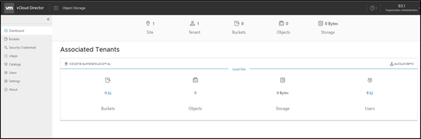

**Accessing Object Storage**  
 

## Introduction

Object storage is a data storage architecture that manages data as objects, as opposed to other storage architectures which manages data as a file hierarchy. Each object typically includes the data itself, an amount of metadata and a globally unique identifier which is stored within a bucket.

Buckets are containers for objects. You can have one or more buckets and control who has access to each bucket.

## Accessing Object Storage

1. S3 Object Storage can be accessed via a plug-in through vCloud Director. To enable the plug-in, contact your Customer Success Manager, Sales Executive or AUCloud Support [support@australiacloud.com.au](mailto:support@australiacloud.com.au).

1. When the plug-in has been enabled, you will be able to access Object Storage and commence creating your buckets. Select **Object Storage** from the Main Menu.

      
 
1. You will be presented with the dashboard which displays an overall view of your object store including:

    -   Total Buckets
    -   Total Objects
    -   Storage Used
    -   Users

    

***Note***: An AWS specific example on how to make this work using the aws command line tool:

1. Create an AWS credentials file (have your access\_key\_id and secret\_access\_key ready):

    ```
    aws configure --profile=aucloud
    ```

1. Test connectivity to the s3 bucket you created previously (assumed here to be myBucket)

    ```
    aws --profile=aucloud --endpoint-url=https://vos.s3-sz101.australiacloud.com.au/api/v1/s3 s3 ls s3://myBucket
    ```
