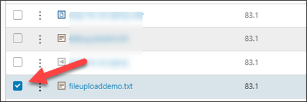
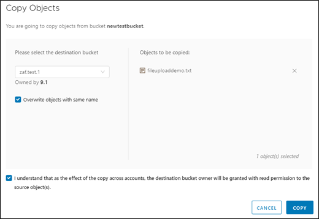

## Copy an object

1. To copy an object to another bucket, click the check box of the object you want to copy.

      
 
1. Under **ACTIONS** select **Copy to**.

      

1. The **Copy Objects** wizard will open

    

1. Select the destination bucket.

1. Check the tick box to acknowledge your understanding.

1. Click **COPY**.
