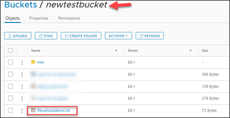
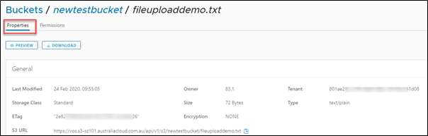
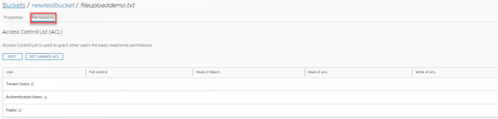

## View an object

1. Once an object has been added to a bucket, you can view information about the object and download the object to your local computer.

1. Click on the Object name to view properties and permissions.

    

1. The properties of the object will be displayed under the **Properties** tab.

1. Select **Preview** to view the document without downloading.

1. Select download to download the object. The object will be downloaded to the default location on your PC.

    

1. You can grant other users basic read/write permissions by clicking on the permissions tab and editing the Access Control List (ACL).

    
