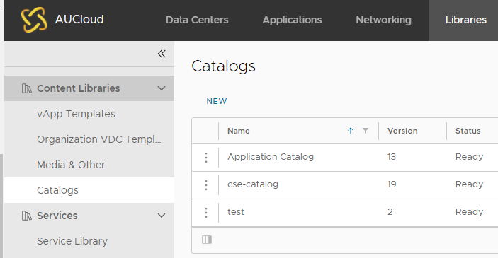
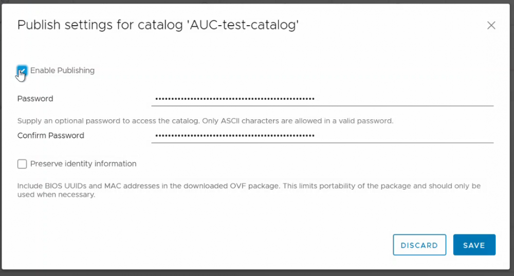
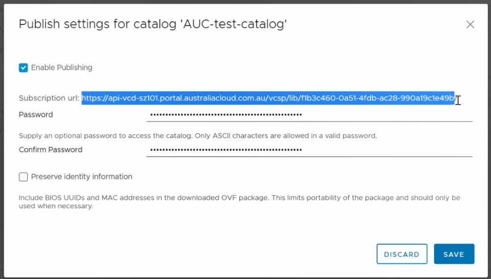
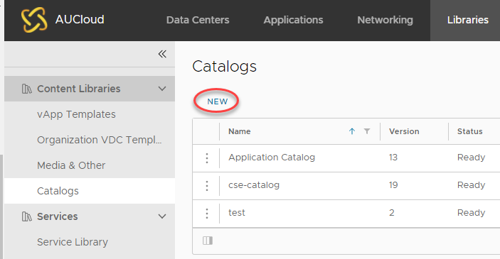
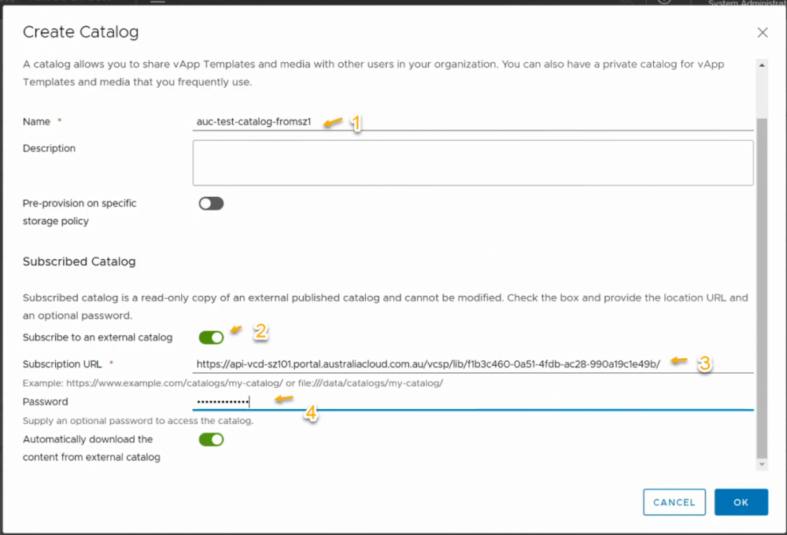
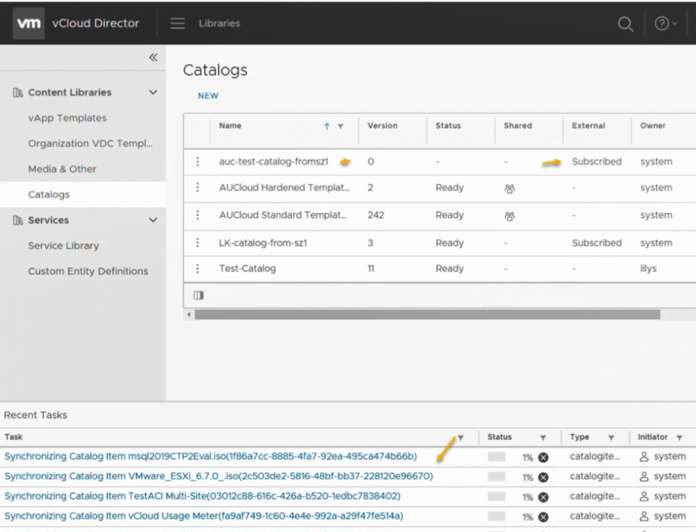

## Overview

You can share catalog library between AUCloud Sovereignty Zones (SZ) by performing Catalog publishing/subscription. 

Follow the below steps if you require access to a catalog created in SZ 1 (Canberra) when in SZ 2 (Sydney), or vice versa.

## Share catalog library between AUCloud Sovereignty Zones (e.g. SZ1 to SZ2)

1. Log in to the environment where the catalog you want to share is stored (e.g. SZ1)

1. Navigate to **Libraries,** then select **Catalogs**.

    

1. Click the ellipsis next to the catalog that you wish to share and select **Publish settings**.

1. A new pop up window will appear, then tick **Enable Publishing**.

    **Note:** To enable password protection on your catalog, enter a password and type the same password again to confirm then click on **Save**.

    

1. Once the publishing settings is saved, it will return to the _Catalogs_ page again. 

1. Click the ellipsis next to the catalog that you wish to share and select **Publish settings**. 

    **Note:** This time it will show the subscription URL. Highlight the URL and hit **Ctrl+C** on your keyboard to copy the URL details somewhere safe i.e. notepad.
    
    

1. Then login to the other environment where you want to share this catalog to (e.g. SZ2).

1. Navigate to **Libraries,** then select **Catalogs > New**.

    

1. Then perform the following:

    -   enter the **catalog name,**
    -   enable **subscribe to an external catalog** option,
    -   enter the **subscription url** (by pasting the url copied earlier on step 6),
    -   enter the **password** that was set earlier (Step 4), and
    -   click **OK.**

    

1. Once the new catalog is created with subscription to the catalog (e.g. from SZ1), it will start performing synchronisation of the catalog items between Sovereignty Zones (e.g. SZ1 to SZ2).  

    

Once the sync task is complete, the vApp templates/media from the new catalog can be utilised.