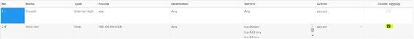

1. In the vCloud Director _Virtual Datacenters_ dashboard, select the VDC you want to work with.

1. In the left navigation panel, click **Edges**.

    

1. Select the ESG for configuration, and click **Services**.

    

1. Navigate to Edge Settings and select **EDIT SYSLOG SERVER.**

1. In the resultant window, enter the **IP address** of a host running software which can receive syslog messages (Kiwi Syslog, Rsyslog, syslog-ng etc).

    

1. Once this has been configured, the ESG will generate syslog messages in response to certain actions defined by the user. These messages will be transmitted using UDP on port 514. Example logging actions include:

-   **Firewall rule hits**

    

-   **NAT rule hits**

    

-   **Load balancer actions**

    