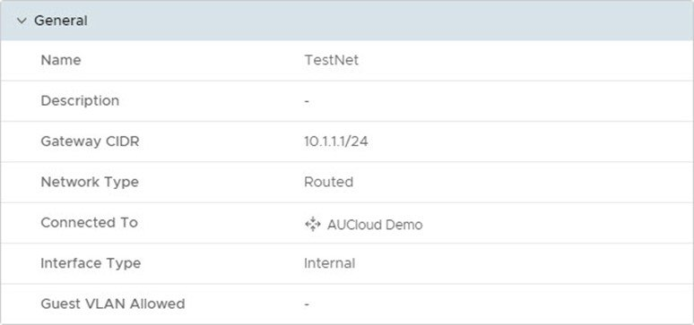
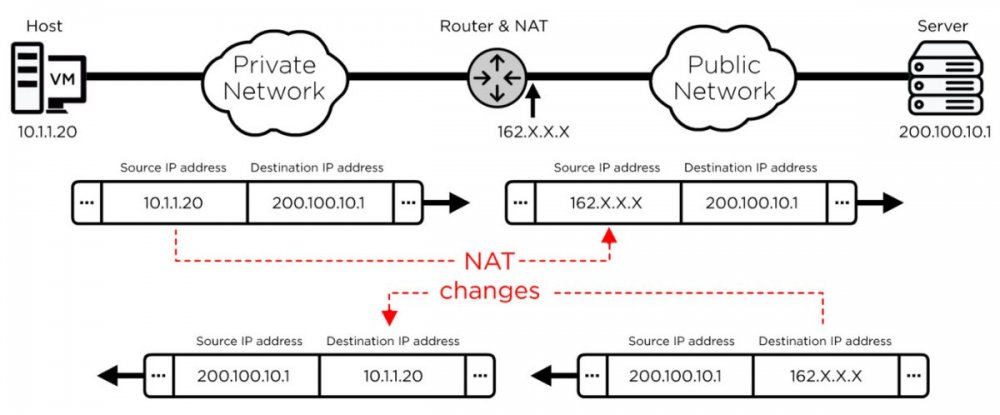

## This is an overview of the essential configuration required to successfully provide network connectivity for your virtual estate. This will address both the why and the how from a high-level perspective.

### What is an Edge Services Gateway (ESG)?

The ESG included as part of a Virtual Organisation (vOrg) provides connectivity between internal and external Organization VDC networks. It is a virtual appliance that provides multiple features, including:

-   Dynamic Host Configuration Protocol (DHCP)
-   Virtual Private Network (VPN)
-   Network Address Translation (NAT)
-   static and dynamic routing
-   load balancing; and
-   firewalling

Correctly configuring the vCloud Director interface is as much a matter of knowing why you are doing this as of how to apply the changes.

## Edge Services Gateway Operation

  
Image 1: ESG schematic (simple)

In this image, the ESG functions as a router and a firewall. Internal networks cannot communicate with external (public) networks unless the ESG has been correctly configured.

## Creating Virtual Network Infrastructure

Virtual compute and networking infrastructure must be created before ESG configuration.

  
Image 2: Connecting to an Edge Services Gateway

## Creating Routed Networks

Routed vDC networks are routed through the ESG and do not necessarily need to communicate with public networks.

  
Image 3: Network configuration

## Firewall Rules

By default, the ESG will deny all traffic attempting to traverse it. This includes traffic to and from the internet as well as hosts on different routed networks. An effective firewall policy is required to enable the successful operation of hosted applications.

  
Image 4: Firewall rules

## Network Address Translation (NAT) Rules

Image 5: Router and NAT function, simple schematic  
 

Communication over the internet requires that the two endpoints utilise a publicly routable IP address. These addresses are assigned to your ESG and can be found in the Edge Gateway Settings.

The process of converting your virtual machines addresses to these publicly routable addresses is known as NAT.

  
Image 6: NAT rule configuration

NAT establishes precise controls for Source and Destination IP addresses, and port translation.

Source NAT (SNAT), allows your hosted virtual machines (VM) to initiate communications with networks outside of your estate. This is achieved by translating the source address as it leaves your ESG. The ESG automatically untranslates the return traffic by modifying the destination address to the original source address. This bidirectional flow is depicted below.

  
Image 7: Network Address Translation, detailed schematic

Destination NAT (DNAT) allows hosts outside of your network to initiate communication to your hosted VM. This process is like SNAT, except the destination address is the first one modified and just like SNAT the response traffic is automatically converted to the original source.

  
Image 8: Edge Services Gateway configuration viewed in vCloud Director

**Note**: When supplementing NAT with the firewall, the firewall rules will always reference the pre-NAT addresses.  

## Default Rules on the ESG

-   **Internal High**: which allows communication between your vOrg and the AUCloud perimeter firewall.
-   **Default Policy**: set to deny all.
