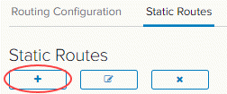
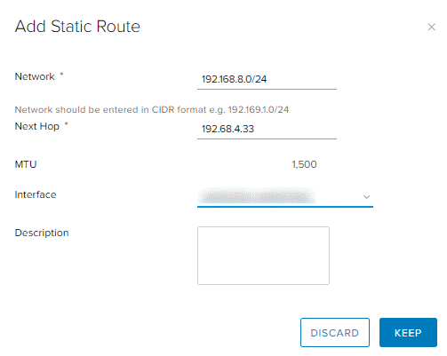

# Overview

Static routing allows you to configure your Edge Services Gateway (ESG) with knowledge of other networks which are not directly connected to it. It is particularly useful if you need to:

-   route between virtual data centres (VDCs) in the same virtual organisation (vOrg), or
-   route traffic to vApp networks.

Static routing is the only option on ESG; dynamic routing protocols cannot be used.

For example, you may have a vApp network `192.168.8.0/24` routed to a VDC network called `Front end network`. You could create a static route to enable traffic to get to the outside IP of the vApp edge at `192.168.4.33` (a NAT will exist there).  
 

## Create a static route

To create a static route:

1. In the vCloud Director _Virtual Datacenters_ dashboard, select the VDC that contains the ESG that requires the static route.

1. In the left navigation panel, click **Edges**.

    

1. Select the ESG for configuration, and click **Services**.

    

1. Select the **Routing** tab then the **Static Routes** tab.

      
 

1. Click the **+** button.

      
 

1. In the _Add Static Route_ dialog box, fill in the details of the network range, next hop (edge IP) and select the network interface to which you want to apply the static route.

      
 

1. To finish, click **Keep** then **Save changes**.

1. Repeat the steps for the second VDC.  
 

## Next steps

In this article you have learned how to create a static route. For other ESG configuration tasks, see:

-   [How to create firewall rules](./how_to_create_firewall_rules.md)
-   [How to create a DHCP pool](./how_to_create_a_dhcp_pool.md)
-   [How to configure IPsec VPN](./how_to_configure_ipsec_vpn.md)
-   [How to configure a load balancer](./how_to_configure_a_load_balancer.md)
-   [How to create NAT rules](./how_to_create_NAT_rules.md)