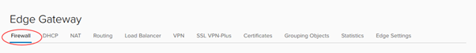
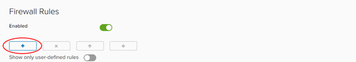
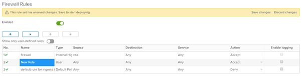
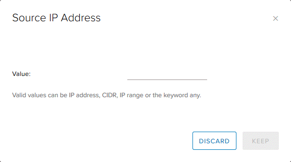
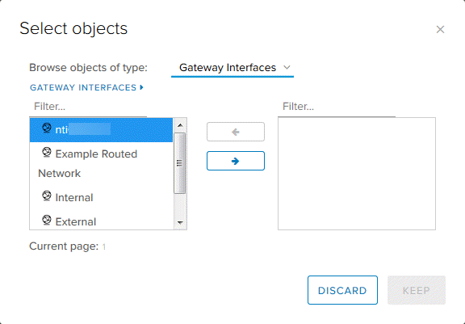
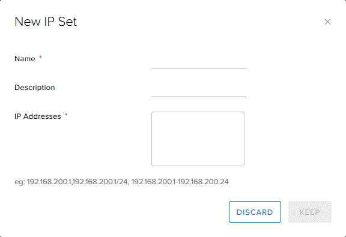
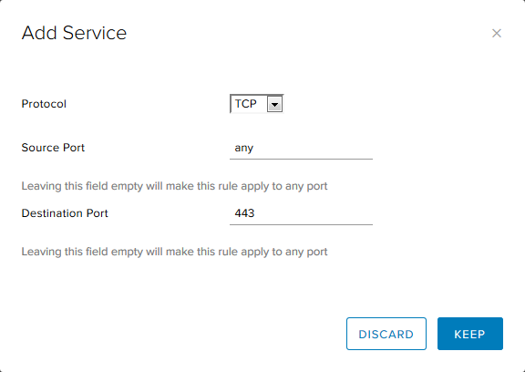
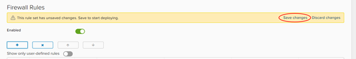
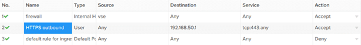

# Overview

vCloud Director provides a fully featured Layer 3 firewall to control transit from inside to outside security boundaries, and within the various virtual datacenters (VDC) networks you create.

When you specify networks or IP addresses, you can use:

-   An individual IP address
-   IP ranges separated by a dash (`-`)
-   A CIDR, for example, `192.168.2.0/24`
-   The keywords `internal`, `external` or `any`

## Create firewall rules

1. In the vCloud Director _Virtual Datacenters_ dashboard, select the VDC that contains the edge gateway in which you to create the firewall rules.

1. In the left navigation panel, click **Edges**.

    

1. Select the ESG for configuration, and click **Services**.

    

1. Select the **Firewall** tab.

    

1. Click the **+** button to add a new row to the firewall rules table.

    

1. For the **New Rule**, specify a **Name**.

    

1. In the **Source** and **Destination** fields, specify the source and destination addresses for the firewall rule.

    -   To specify an IP address or range, click **IP** and enter the appropriate **Value**. To finish, click **Keep**.

    

    -   To specify a group of VMs or IPs, click **+** and select the desired objects. To finish, click **Keep**.

    

    -   If you're likely to reuse a group of the same source or destination IP addresses in multiple rules, select the **Grouping Objects** tab and click **+** to create an IP set. You can then select this IP set in the _Select objects_ dialog box.

    

1. In the **Service** field, click **+** and, in the _Add Service_ dialog box, specify the **Protocol**, **Source Port** and **Destination Port** for the rule. To finish, click **Keep**.

    

1. Select whether the rule is an **Accept** or **Deny** rule.

1. If you have a syslog server configured, select the **Enable logging** check box.

1. To finish, click **Save changes**.

    

## Sample use case

A common use case for a firewall rule is to allow SSH through from the internet. The following example uses allocated public IP addresses.

When your VDC is provisioned, you are assigned two (2) public IP addresses.

In the example below, the source is `any` (any IP address within the VDC). The source port is also `any`. The destination is a public IP address and the destination port is `443` for HTTPS.

## Next steps

In this article you have learned how to create firewall rules. For other ESG configuration tasks, see:

-   [How to create a DHCP pool](./how_to_create_a_dhcp_pool.md)
-   [How to configure IPsec VPN](./how_to_configure_ipsec_vpn.md)
-   [How to configure a load balancer](./how_to_configure_a_load_balancer.md)
-   [How to create a static route](./how_to_create_a_static_route.md)
-   [How to create NAT rules](./how_to_create_NAT_rules.md)
