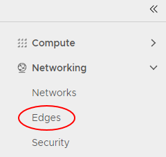
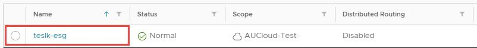
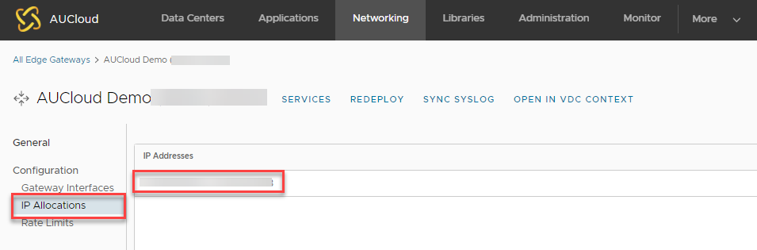

# Overview

To route traffic to your external network (for example internet, PSN) and configure settings such as NAT rules, you need to know your external IP addresses. AUCloud standard IP address allocation is 2 Public IP addresses per Org vDC.

## Find your IP addresses

To find your allocated external IP address range:

1. In the vCloud Director _Virtual Datacenters_ dashboard, select the VDC that contains the Edge Services Gateway (ESG) you want to configure.

1. In the left navigation panel, click **Edges**.

    

1. Select the ESG that you want to configure.

      
 
1. In the _Edge Gateway Settings_ section, in thein the _IP Allocations_ section, you will see the range of external IP addresses allocated for use.  

    

## Next steps

In this article you have learned how to find your allocated external IP addresses. For other ESG configuration tasks, see:

-   [How to create firewall rules](./how_to_create_firewall_rules.md)
-   [How to create a DHCP pool](./how_to_create_a_dhcp_pool.md)
-   [How to configure IPsec VPN](./how_to_configure_ipsec_vpn.md)
-   [How to configure a load balancer](./how_to_configure_a_load_balancer.md)
-   [How to create a static route](./how_to_create_a_static_route.md)
-   [How to create NAT rules](./how_to_create_NAT_rules.md)