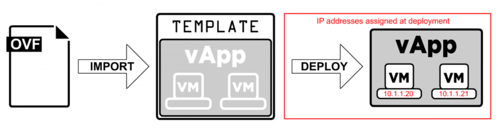
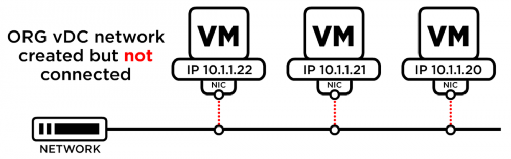
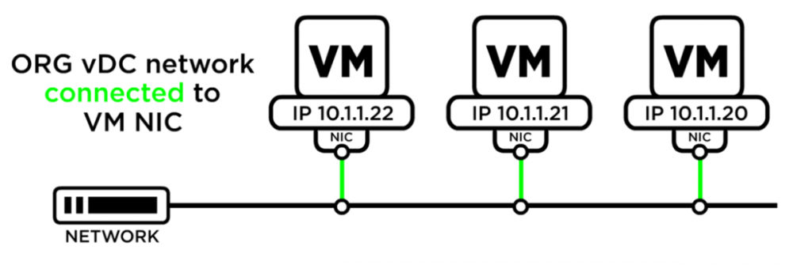
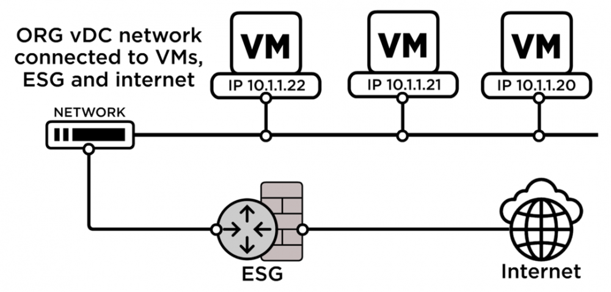

### Introduction

This use case is a walk-through of a general process for deploying a web and application server through vCloud Director.

### Build Virtual Machines

The first step is to build the required virtual machines (VMs).

VMs can be created as standalone or within a vApp. In this example we will create the VM from scratch inside a vApp which allow you to combine multiple VMs into a single management unit.  

[Create a New Standalone Virtual Machine](todo)

Additional information on how to import a saved vApp from an imported OVF

### Import OVF

[Create a vApp Template from an OVF File](todo)

Example only. vApp content and IP addresses are variable. IPs can be assigned in several different ways.

### Create an Internal Network

An ORG vDC network is required to allow your VMs to communicate with each other and external networks.

#### Build an ORG vDC network
[Add a Routed Organization Virtual Data Center Network](todo)

### Connect Network to vApp and VM

#### Connect vApp to network
[Add a Network to a vApp](todo)

#### Connect the VM Primary NIC to the network
[Change the Hardware Properties of a Virtual Machine](todo)

### Configure Firewall NAT rules on Edge Services Gateway

#### Configure firewall
[Add an NSX-T Data Center Edge Gateway Firewall Rule](todo)

**Note:** Locate your public IP address by clicking on Edges, navigating to **General** → **Configuration** → **Gateway Interfaces** tab. The public IP is located in the Primary IP column.

#### Configure NAT
[Add an SNAT or a DNAT Rule to an Edge Gateway](todo)

### About the ESG
[How the Edge Services Gateway works](todo)

Turn on VMs and force recustomisation to complete