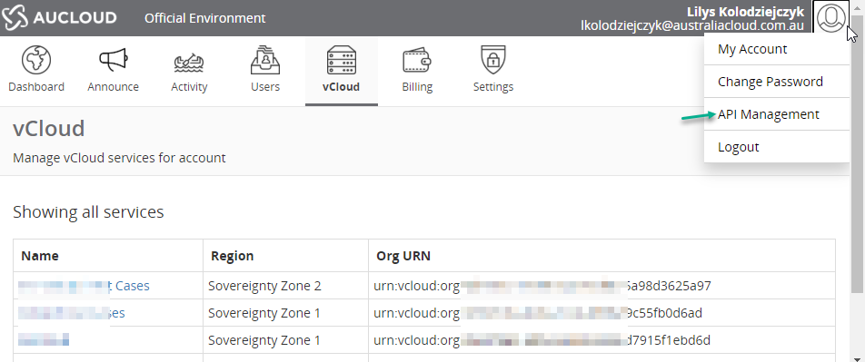
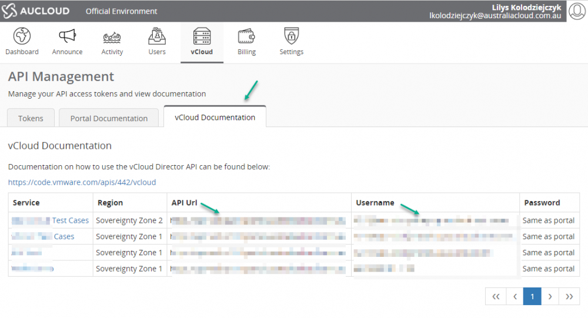

## Overview

VMware PowerCLI is a Microsoft PowerShell based command line interface tool which developed by VMware to manage and automate tasks on various VMware platforms such as vSphere, vCloud Director, Horizon, etc.

The latest version of PowerCLI is available from the [VMware website](https://developer.vmware.com/powercli): 

If your system has connection to the internet, you can perform the following to install the PowerCLI module:

``` > Install-Module VMware.PowerCLI -Scope CurrentUser ```

To connect to the AUCloud platform via PowerCLI, you need API-Url, Org-Id, and User-Id which can be found from the AUCloud Portal, under the API Management section of the top right menu -Then navigate to the vCloud Documentation tab.

Below screenshots for details:  




The API Url is listed in https://<address\> format and the Username is listed in _User-Id_@_Org-Id_ format.

To establish a connection to AUCloud platform, perform the following command:

``` > Connect-CIServer -Server <API-Url> \-org <Org-Id> \-User <User-Id> \-Password <Portal\_Password> ```

Note:

***API-Url*** :  remove https// from the API Url listed on the AUCloud Portal API

***User-Id*** :  enter the _User-Id_ without _@Org-Id_

***Org-Id*** : enter the _Org-Id_ listed under username

Once connected, you can start using PoweCLI commands to retrieve information/manage the ecosystem within your vDC Organisation. To verify that you have logged in to the environment successfully, you can perform a simple command line to retrieve all VMs in your tenancy by running the command below :

``` > Get-CIVM ```

Example of the output:

