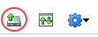

### Overview

You may find you need to upload ISO (DVD/CD) or FLP (floppy disk) media to vCloud that have already been provided by AUCloud. These media can then:

-   Be consumed by users within your organisation.
-   Facilitate the creation of VMs from scratch, which can then be saved to your catalog for future deployment.

### Uploading media

If you need to upload media from a file on your local machine, you can use the Tenant UI. To upload media from a URL, you'll need to use the Legacy UI.

### Uploading media from a local file

1. In vCloud Director, select **Libraries** from the top menu bar.

1. In the left navigation panel, click **Media & Other**.

    

1. Click **Add**.

1. In the _Upload Media_ dialog box, select the **Catalog** to which you want to upload the media.

1. Click the **Upload** icon and browse to the ISO or FLP file that you want to upload.

    

1. When you're done, click **OK**.

    In the _Media & Other_ page, you can monitor the progress of the upload. You can carry on with other work while the upload takes place.

### Uploading media from a URL

1. In the vCloud Director Legacy UI, select the **Catalogs** tab.

    

1. Select the **Media & Other** tab.
    
    

1. Click the **Upload** icon.

    

1. In the _Upload Media & Other_ dialog box you can:

    -   Paste in a URL for the ISO or FLP media.
    -   Browse to the ISO or FLP file on your local device and select it (for this to work, you need to have Java JRE available on your device).

    

1. You can give the media a name and then choose which catalog to put it in.

    

1. When you're done, click **Upload**.

    During the upload, you'll see a status window. You can carry on with other work while the upload takes place.  
 

1. You can close (and reopen) the window by clicking the **View uploads and downloads** icon.

    

    This opens the _Transfer process_ dialog box.

    