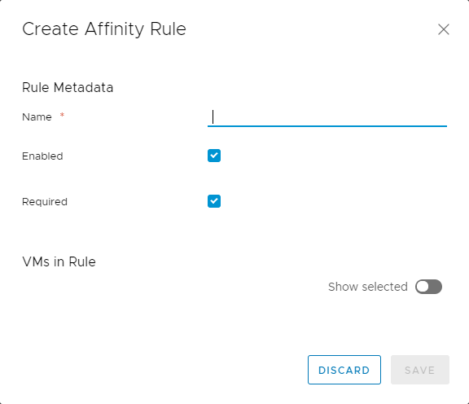

### Overview

Affinity and anti-affinity rules determine whether or not VMs are kept together as they are moved around within your environment.

-   Affinity rules keep VMs together on the same host.
-   Anti-affinity rules ensure that VMs are distributed across different hosts.

For example, if it is important that your application has very low latency, you can create affinity rules to make sure that the application's VMs are always kept on the same host. If you want your application to be robust in the event of host failures, you can create anti-affinity rules to spread the VMs across multiple hosts.  
 

### Creating an affinity or anti-affinity rule

To create an affinity or anti-affinity rule:

1. In vCloud Director, click the VDC in which you want to create the affinity or anti-affinity rule.

1. In the left navigation panel, select **Affinity Rules**.

1. To create an affinity rule, in the _Affinity Rules_ section, click **New**.

    To create an anti-affinity rule,in the _Anti-Affinity Rules_ section, click **New**.
  
1. In the _Create Affinity Rule_ or _Create Anti-Affinity Rule_ dialog box, enter a **Name** for the rule.

1. If you don't want the rule to take effect immediately, deselect the **Enabled** option.
    If you leave this option selected, the rule is applied and the selected VMs are redistributed as required as soon as you create the rule.

1. If you want the VMs added to the rule to be powered on if the rule cannot be met, deselect the **Required** option.

    If you leave this option selected **and** if the rule cannot be met, the VMs added to the rule will not power on.

1. In the _VMs in Rule_ section, select the VMs that you want to add to the rule.

    
 

1. When you're done, click **Save**.