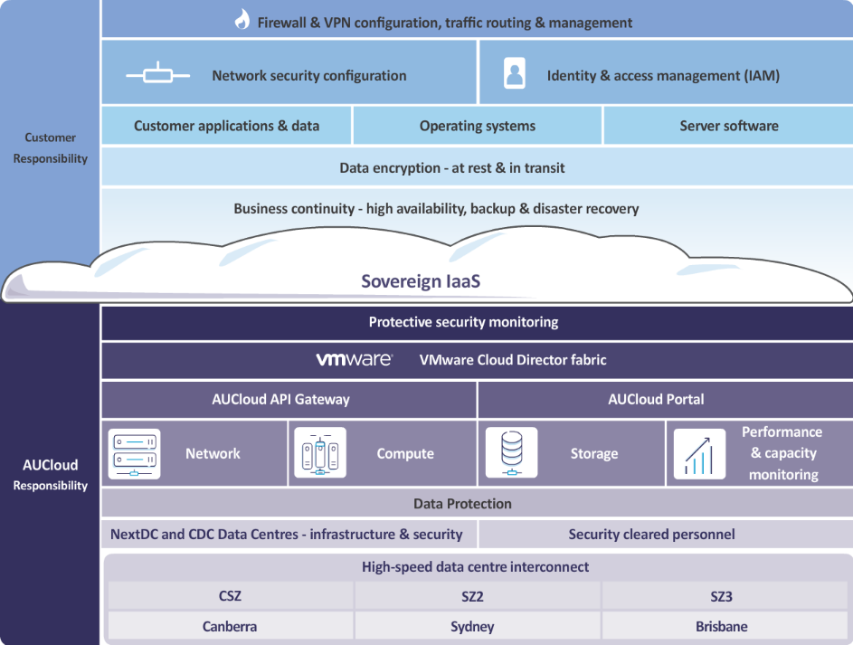

## Overview

The AUCyber CRISP describes the shared security model between AUCyber and the customer.
The shared responsibility model varies based on the underlying service(s) consumed by customers.

## Infrastructure as a Service (Compute)

The IaaS offering is the core of our platform, and hosts any PaaS or SaaS services provided by AUCyber; inheriting the IaaS RACI.

The following diagram describes the shared responsibility for the AUCyber customers and AUCyber for our core IaaS services.

### IaaS RACI

The following RACI chart describes, the responsibilities, and accountabilities between AUCyber and the AUCyber Customer.

| Feature                                                   | AUCyber (IaaS) | Customer                                     |
| --------------------------------------------------------- | -------------- | -------------------------------------------- |
| Backups & replication (storage)                           | C              | R, A                                         |
| Change Management AUCyber IaaS                            | R, A           | C                                            |
| Change Management customer PaaS / SaaS                    | C              | R, A                                         |
| Configuration and management of physical network devices  | R, A           | C                                            |
| Configuration and management of virtual network devices   | C              | R, A                                         |
| Configuration and management of Server VM’s               | C              | R, A                                         |
| Configuration management of customer application          | C              | R, A                                         |
| Configuration and management of databases                 | C              | R, A                                         |
| Logical segmentation & service isolation                  | R, A           | C                                            |
| Logging and monitoring customer PaaS/ SaaS                |                | R, A                                         |
| Logging and monitoring AUCyber IaaS                       | R, A           | I                                            |
| Network access and controls, packet inspections (network) | R, A           | C                                            |
| Patch management of physical devices                      | R, A           | C                                            |
| Patch management of virtual machines                      | C              | R, A                                         |
| Physical access and video monitoring (facilities)         | R, A           | I                                            |
| Privileged user management customer PaaS / SaaS           |                | R, A                                         |
| Privileged user management AUCyber IaaS                   | R, A           |                                              |
| User management customer PaaS / SaaS                      |                | R, A                                         |