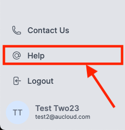

## Overview

If you're interacting with an AUCloud VMware Cloud Director (VCD) environment beyond the web GUI, note that the authentication method will change following the new AUCloud Portal release on June 18th, 2024.

Affected VMware tools and services include, but are not limited to:

- [VCD Terraform Provider](https://registry.terraform.io/providers/vmware/vcd/latest/docs)
- [VCD API](https://docs.vmware.com/en/VMware-Cloud-Director/index.html)
- [VCD PowerCLI cmdlets](https://developer.vmware.com/docs/powercli/latest/products/vmwareclouddirector/)
- [VCD OVF Tool](https://docs.vmware.com/en/VMware-Cloud-Director/10.5/VMware-Cloud-Director-Install-Configure-Upgrade-Guide/GUID-2B34775B-7C96-44F2-A9A3-D6A9D3B0CAD2.html)

## What's changed?

Our updated Portal integrates a new identity provider leveraging OIDC, replacing the previous LDAP-based identities.

**Important**: VCD does not currently support username + password authentication for OIDC identities. This means that new "local" VCD users will need to be created in order to use traditional username + password authentication for tools like the VCD API.

## What to do next?

To continue accessing AUCloud vCD instances and using related tools (APIs, Terraform Provider, OVF tool, etc.), consider these authentication methods:

- Username + Password with a "local" vCD user
- Bearer Token

For detailed guidance on adapting to these changes, please refer to [this guide](../../Platform_Services/Compute/using-the-api-new/authentication_methods.md)

## Getting Support

Please refer to [this guide](../support/index.md) for information on getting support in general at AUCloud.

For convenience, once you have [logged in](./portal-login.md) to the Portal, there is a **Help** button on the left sidebar. Click this to open an email to [support@aucloud.com.au](mailto:support@aucloud.com.au).
  
  
