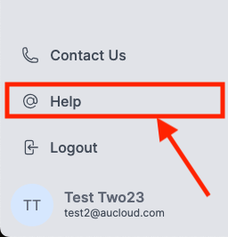

## Overview

This document provides an overview of the authentication settings for the AUCloud Portal. It covers password reset timeouts, VMware Cloud Director (VCD) session durations, and account inactivity policies.

## Password Reset Timeout

The password reset timeout is configured as follows:

- Users must change their passwords every 182 days.
- You will receive reminders to change your password before it expires.
- Follow [these steps to update your password](./portal-account-self-mgmt.md#updating-your-password)

## VCD Session Durations

Sessions in VMware Cloud Director (VCD) are configured with the following details:

- Once you open your VCD tenancy, your session will last for 4 hours.
- After 4 hours, you will be prompted to log-in again to continue your session.

## Account Inactivity Lockouts

Accounts are not automatically locked out to inactivity. You can log in to your account regardless of how long it has been inactive.

## Login Lockout Policies

To protect against unauthorized access, we have implemented login lockout policies. Here are the details:

- After 5 unsuccessful login attempts, your account will be temporarily locked. Your account administrator can unlock your account by follow [these steps](./portal-users-mgmt.md#unlocking-an-account).  Alternatively, you can [contact AUCloud support](../support/index.md) for assistance.
- The lockout duration increases incrementally with each failed attempt, up to a maximum of 15 minutes.
- Failed login attempts are reset after 12 hours.

## Getting Support

Please refer to [this guide](../support/index.md) for information on getting support in general at AUCloud.

For convenience, once you have [logged in](./portal-login.md) to the Portal, there is a **Help** button on the left sidebar. Click this to open an email to [support@aucloud.com.au](mailto:support@aucloud.com.au).
  
  
