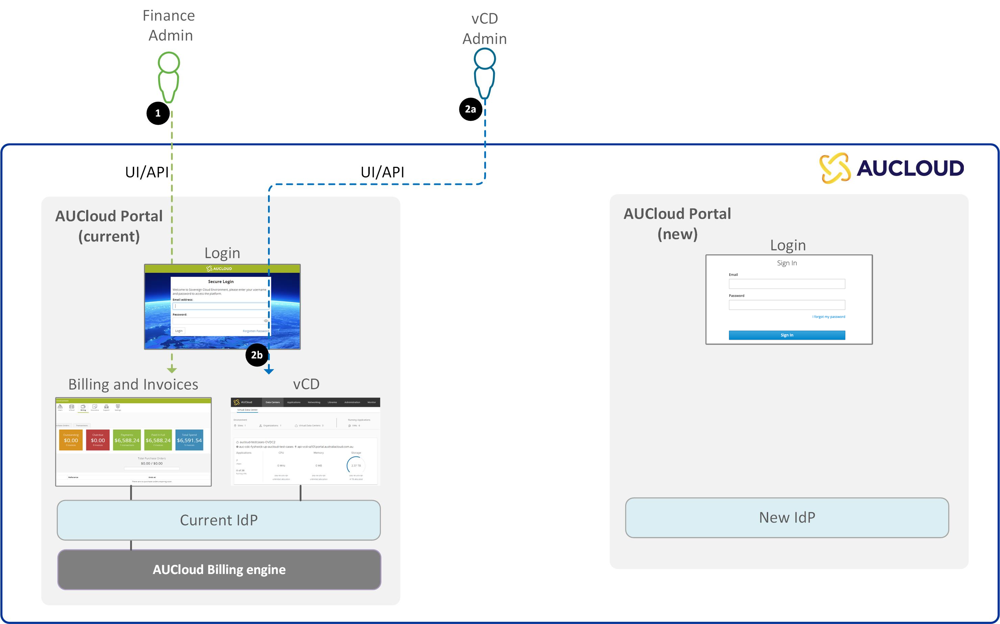
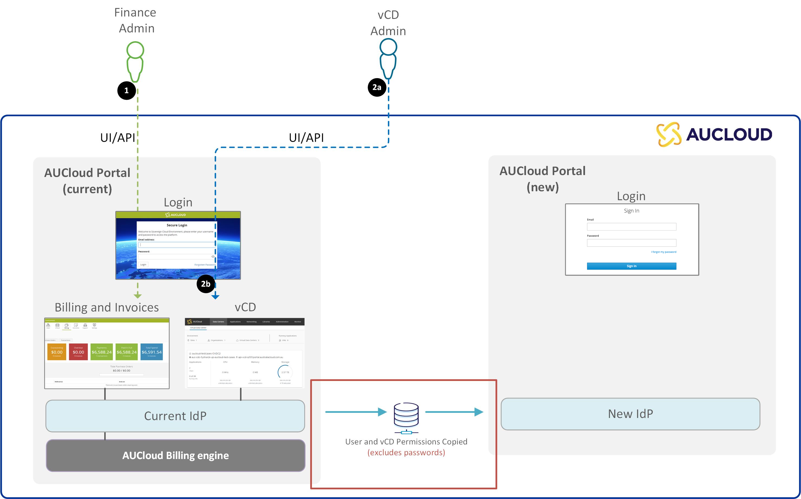
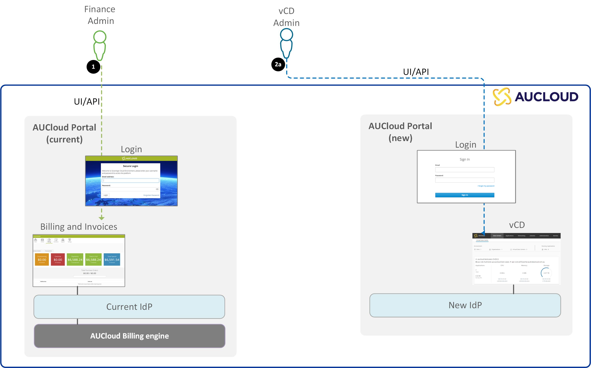

## Overview

AUCloud is releasing a new Portal to address customer feedback on our existing Portal.

Modernising our identity provider solution will allow customers to reset their own password, dramatically extend password reset intervals, remove the inactive account impediment, and allow more streamlined access to the products that our customers use our Portal for. 

### What does this mean for you

In order to access our new portal and continue using our VCD service you will need to go through the [initial setup of your new portal account](./portal-account-setup.md#initial-setup).  

Additionally, if you interact with our VCD environments outside of the web UI, you may need to [change the way you authenticate](./api-authentication.md).  If you use one of the following tools you may be effected:

- [VCD Terraform Provider](https://registry.terraform.io/providers/vmware/vcd/latest/docs)
- [VCD API](https://docs.vmware.com/en/VMware-Cloud-Director/index.html)
- [VCD PowerCLI cmdlets](https://developer.vmware.com/docs/powercli/latest/products/vmwareclouddirector/)
- [VCD OVF Tool](https://docs.vmware.com/en/VMware-Cloud-Director/10.5/VMware-Cloud-Director-Install-Configure-Upgrade-Guide/GUID-2B34775B-7C96-44F2-A9A3-D6A9D3B0CAD2.html)

## Release Stages

The way that key features are accessed will change as a result of this release. The stages of the release are as follows:

### Stage 1 - Current state

- Currently there is a [single Portal](https://portal.australiacloud.com.au) that handles billing and authentication into VCD.
- The existing portal is where you currently go to gain access all features.

### Stage 2 - Migrating

- We will be copying all users and permissions over to our new identity provider.
- AUClouds strong security controls mean that passwords and 2FA credentials are encrypted in our database, preventing us from migrating existing passwords and 2FA devices to our new Portal. 
- This will create an **additional** account for all users in our new Portal.

### Stage 3 - Final state

- Following the release on Nov 30th our [existing Portal](https://portal.australiacloud.com.au) will still be live, **both portals will be running side-by-side**. The following features will only be available in our new Portal, they will **no longer be accessible in the [existing Portal](https://portal.australiacloud.com.au)**. Follow the links below for details of each of these changes:
    - [Access VMware Cloud Director (VCD) tenancies](#access-vmware-cloud-director-vcd-tenancies)
    - [Manage Users and Permissions with your organisation](#manage-users-and-permissions-with-your-organisation)
    - [Account Self Management (user details and password)](#account-self-management-user-details-and-password)
- All other features of the existing Portal will continue to function as normal. 
- Both portals will run side-by-side, and you will have a separate login for each portal. 
- Attempting to access a feature in the old Portal that has been moved to the new Portal will result in you being redirected to the new Portal. 
    - If you click the "vCloud" or "Users" (highlighted below), you will be redirected to our new Portal to access this functionality. 

        

## Changed features

### Access VMware Cloud Director (VCD) tenancies

Our new Portal is built on top of a new identity provider that allows SSO authentication into your VCD tenancies.  This means that you'll only need to provide your credentials once when logging in, then you'll be able to access all your VCD tenancies from a single dashboard with one click!

Please refer to [this guide](./vcd-login.md) for details on how to login to VCD using our new Portal. 

### Manage Users and Permissions with your organisation

Managing users and permissions in the new Portal will be handled by our new identity provider.  Proving more ways to manage your users, and more fine grained controls over access to your organisation portal, and the VCD tenancies in it. 

Please refer to [this guide](./vcd-permissions.md) for more details on how to manage users and permissions in our new Portal. 

### Account Self Management (user details and password)

Managing your own user in the new Portal will be handled by our new identity provider.  This includes updating your password, resetting 2FA, managing sessions across devices, and updating your personal information. 

Please refer to [this guide](./portal-account-self-mgmt.md) for more details on how to manage your account using our new Portal. 