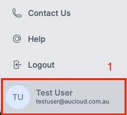
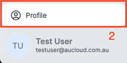
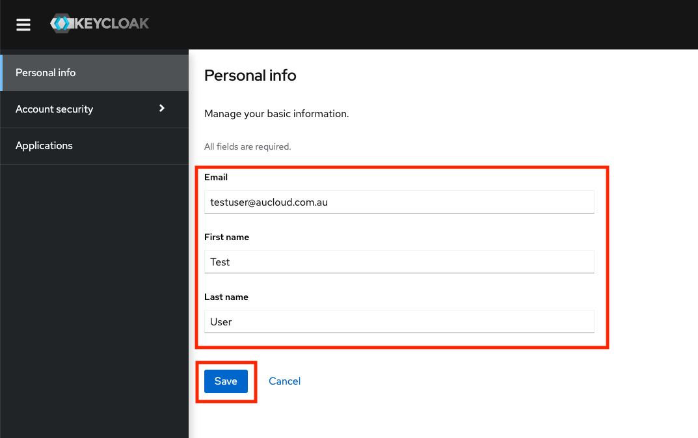
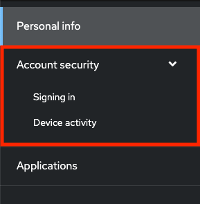
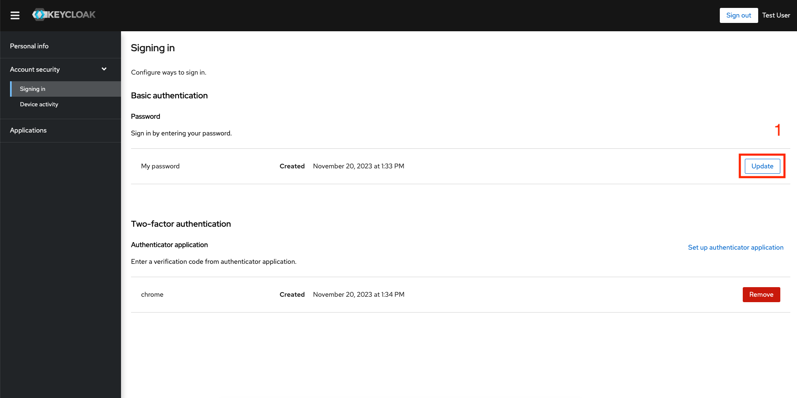
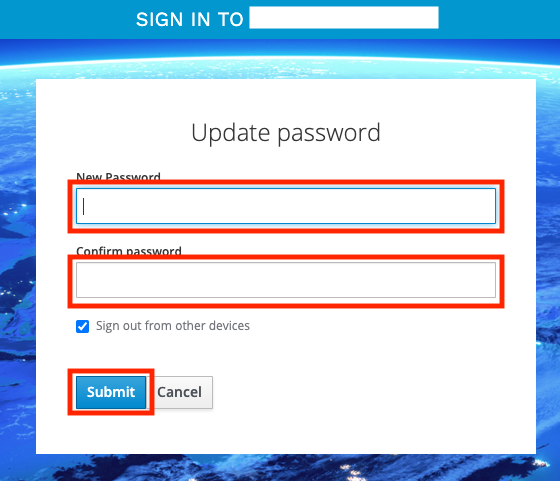
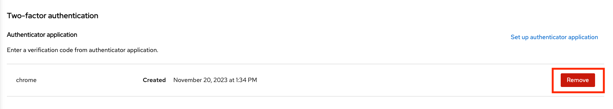
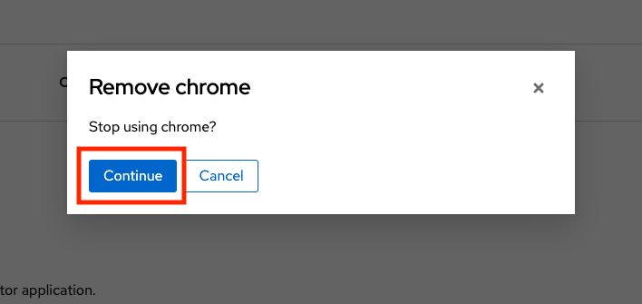
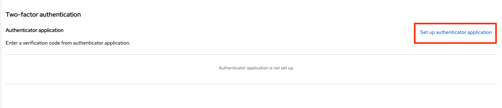
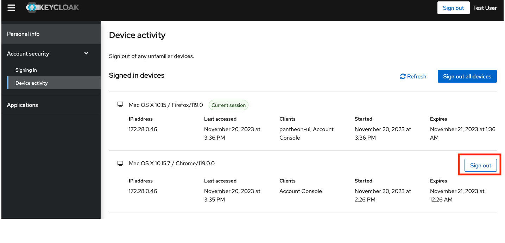

> :warning: **Effective from Dec 1st, 2023**

## Overview
This guide will detail how to manage and change a user's own details after logging into the new Portal.

### Getting to Keycloak Account Management
1. After [logging in](./portal-login.md) to your Portal account, click your **user name** in the bottom left.
   
    

1. Click the **Profile** button that pops up above the user name area.

    

2. A new tab will open that will navigate to the **Account Management** page.

&nbsp;

### Personal info
On the **Personal info** tab, you can change your First and Last names. Please note that at this time, changing your Email is not supported and will not work. Enter the information as needed and press Save.

  

### Account Security
**Account security** has two subsections: **Signing in** and **Device activity**.

  

&nbsp;

#### Signing in
The **Signing in** page allows you to change your **password** and setup and remove applications for **two-factor authentication**. 

To change **password**:

1. Click **Update** in the **Password** section of the page.

    

1. The browser will redirect to a page asking you to re-authenticate. Please follow the same login flow as [outlined here from step 3](portal-login.md).

1. The browser will redirect to a page where you can enter your new **password**. Please type it again in the **confirm password** box, then click **Submit**.
   
    

&nbsp;

To **remove** an existing two-factor authentication application:

1. Click the relevant **Remove** button in the **Two-factor authentication** section of the page on the same line as the application you want to remove:

     

1. A confirmation dialog will pop up. Click **Continue**.

    

&nbsp;

To **set up** a new two-factor authentication application:

1. Click the **Set up authenticator application** button.

    

2. The browser will redirect to a page asking you to re-authenticate. Please follow the same flow as [outlined here from steps 5 to 8](portal-account-setup.md).

&nbsp;

#### Device activity
The **device activity** page allows you to view all devices which are currently logged in with your user. You can sign out of sessions other than the current session using the **Sign out** button against the relevant session.

  

### Applications
The **applications** tab currently has no use for the end user.