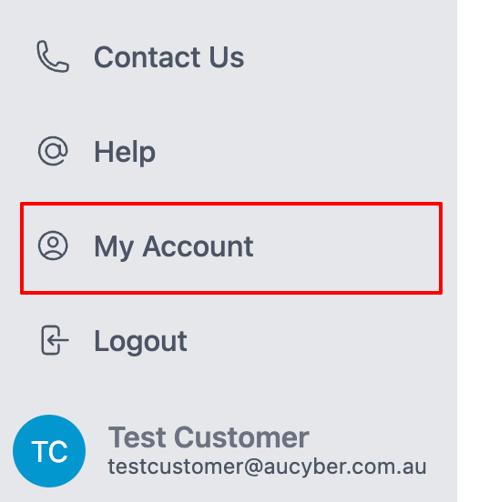
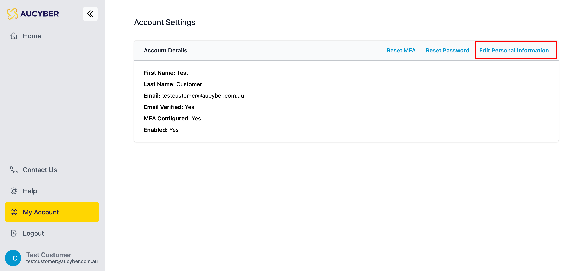
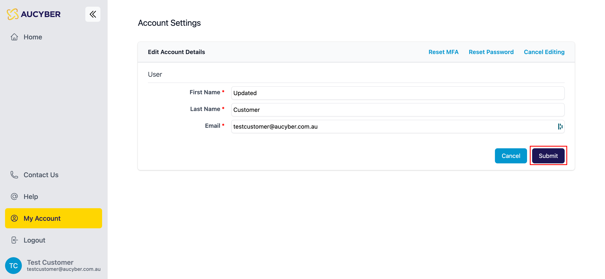
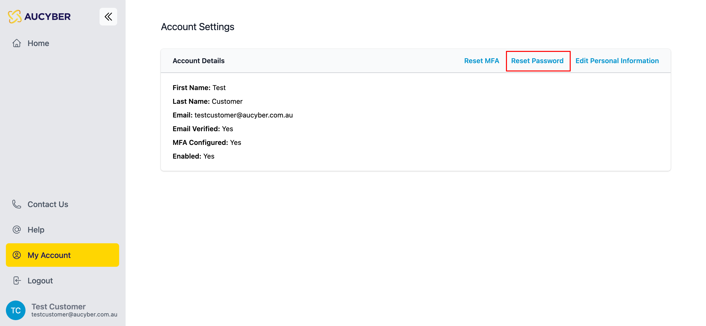
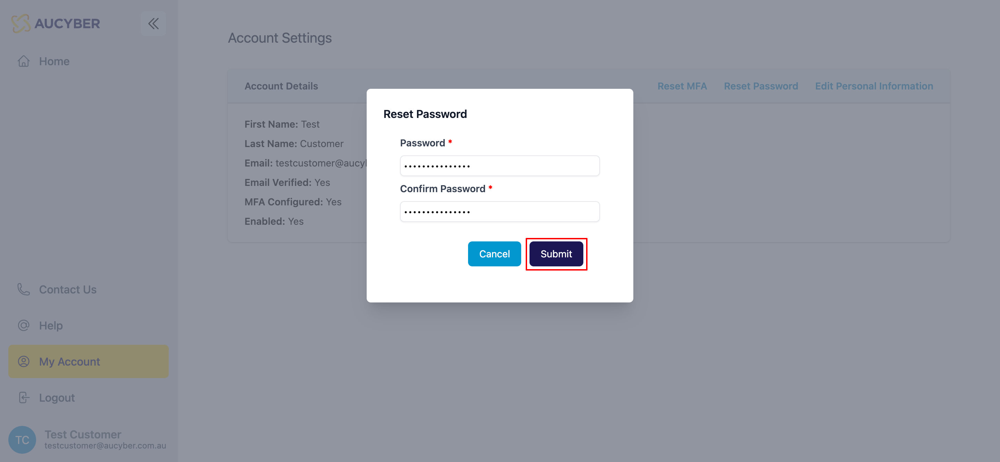
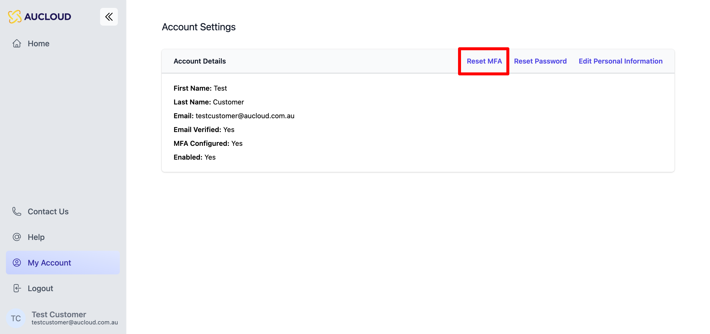
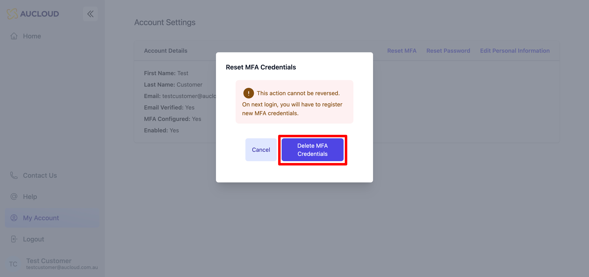

## Overview
This guide will detail how to manage and change your user account's own details after logging into the new Portal.

### Getting to Account Management

1. After [logging in](./portal-login.md) to your Portal account, click the **My Account** link in the bottom left.
   
    {: style="width:300px;border:1px solid black;"}

1. The browser will navigate to the **Account Settings** page.

&nbsp;

### Updating your personal info
To change your personal info, follow these steps:

1. Click the **Edit Personal Information** button.

    {: style="border:1px solid black;"}

1. You can change your first name, last name, and email. Enter the information as needed and click **Submit**.

    {: style="border:1px solid black;"}

### Updating your password

To change **password**:

1. Click **Reset Password**.

    {: style="border:1px solid black;"}

1. A dialog will appear. Enter a new password in the input boxes and click **Submit**.

    {: style="border:1px solid black;"}

&nbsp;

### Resetting two-factor authentication

To **remove** your existing two-factor authentication setup:

1. Click the **Reset MFA** button.

    {: style="border:1px solid black;"}

1. A confirmation dialog will pop up. Click **Delete MFA Credentials**.

    {: style="border:1px solid black;"}

1. The next time you log in, the app will ask you to set up your two-factor authentication again. Please follow the same flow as [outlined here from steps 8 to 10](portal-account-setup.md).
