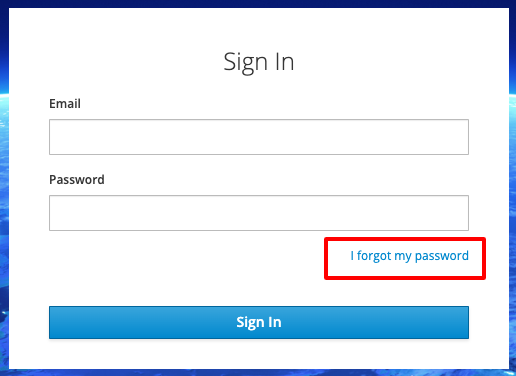
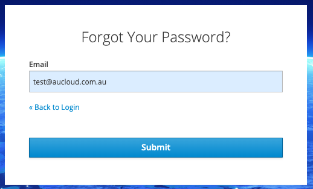
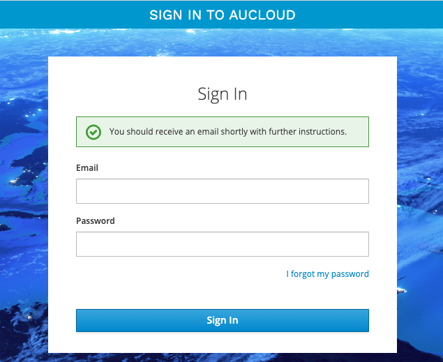
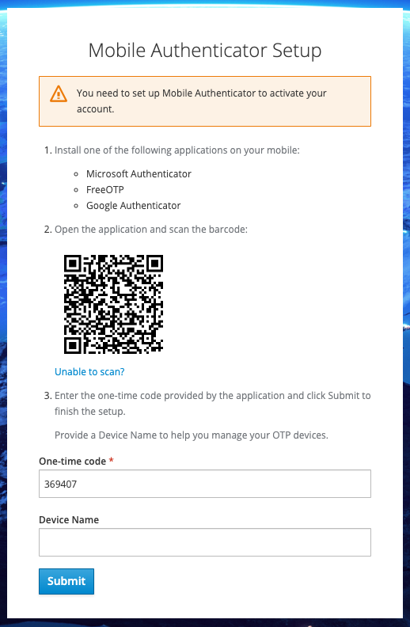
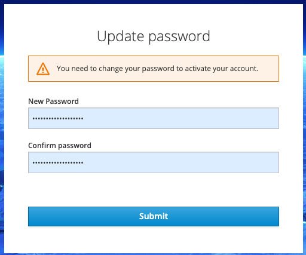
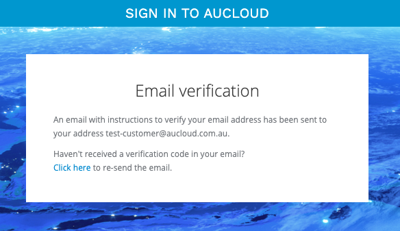

## Overview

If you previously had an account on the legacy Portal, you'll be able to log in using the same email address. This guide details the process of the initial login and MFA setup.

If you are looking for a guide on how to create a new user account as an administrator, please [click here](./portal-users-mgmt.md)

### Initial Setup

!!! Note "AUClouds strong security controls mean that passwords and 2FA credentials are encrypted in our database, preventing us from copying existing passwords and 2FA devices to our new Portal. This means that it is necessary for you to set a password and set up 2FA for your new portal account before you're able to log in for the first time."

Every customer of AUCloud is provided with a unique web address (URL) for logging in, which is specific to their account. Our Customer Success team would have shared this web address with you. If you're having trouble finding it, don't hesitate to [get in touch with the AUCloud support team](../../support) for assistance.

When you have your unique web address for logging in, you can begin setting up your new portal account by following these simple steps:

1. Open the web browser on your device.
1. Enter the unique web address (URL) you received from AUCloud into the browser's address bar.
1. This will take you to the login page for your account.
1. Click **I forgot my password**.

    

1. Enter your **Email**.
1. Click **Submit**.

    

1. An email will be sent to your inbox with instructions to follow to complete your password reset.

    

1. You will be prompted to setup your **Mobile Authenticator**. Follow the instructions to install application on your mobile.
1. For **One-time Code**, enter the code from your **Mobile Authenticator** app.
1. Click **Submit** to complete the setup.

    

1. You will be asked to change the password for your account. Enter your **New Password**.
1. Confirm your new password by enter it again in **Confirm Password**.
1. Click **Submit**

    

1. You will be asked to confirm your email address. An email will be sent to your inbox with instructions to follow to confirm your email address.

    

After verifying your email address you will have successfully logged into the new AUCloud Portal for the first time. 

From here you can:

- [Access VMware Cloud Director (VCD) tenancies](./vcd-login.md)
- [Manage Users and Permissions with your organisation](./vcd-user-mgmt.md)
- [Account Self Management (user details and password)](./portal-account-self-mgmt.md)

If you require any further assistance please email the AUCloud Support Desk at support@aucloud.com.au

### Forgot Password

1. Go to your account login page.
1. Click **I forgot my password**.

    

1. Enter your **Email**.
1. Click **Submit**.

    

1. An email will be sent to your inbox with instructions to follow to complete your password reset.

    

If you require any further assistance please email the AUCloud Support Desk at support@aucloud.com.au
