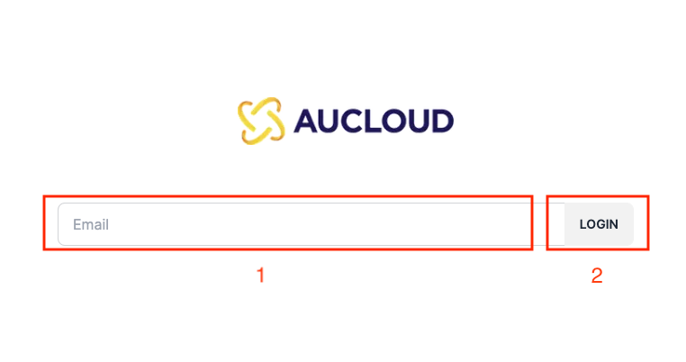
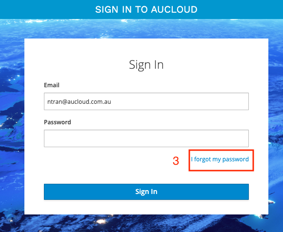
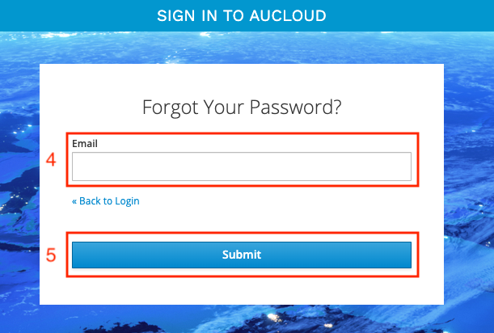
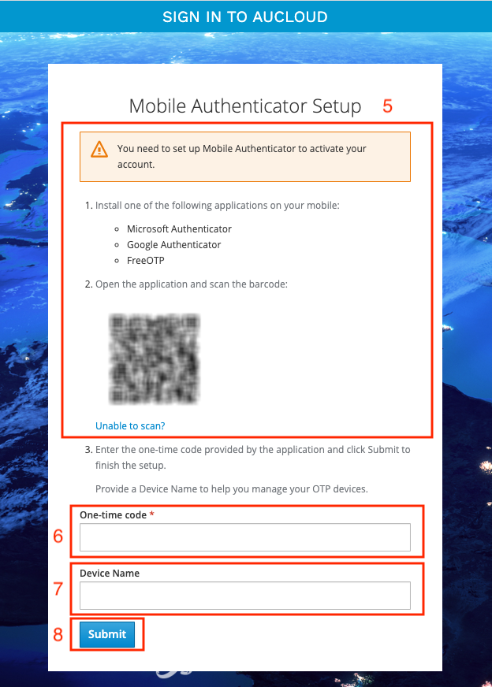
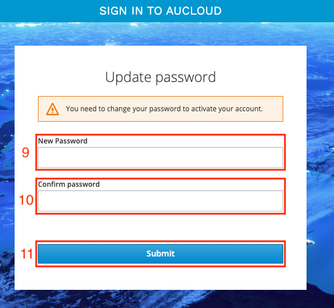

## Overview

If you previously had an account on the legacy Portal, you'll be able to log in using the same email address. This guide details the process of the initial login and security setup for these customers.

Please note that at this time, brand new customers without accounts on the legacy Portal will need to be onboarded via the AUCloud Support Desk (support@australiacloud.com.au) before following the steps in this guide.

### Initial Setup

AUClouds strong security controls mean that passwords and 2FA credentials are encrypted in our database, preventing us from copying existing passwords and 2FA devices to our new Portal.

This means that it is necessary for you to set a password and set up 2FA for your new portal account before you're able to log in for the first time.  This is how you do that: 

1. Access the new AUCloud Portal at https://app.aucloud.com.au.
1. Enter your **email** address.
1. Click **Login** to verify your email address.

    

1. The website will navigate to the login page, click **I forgot my password**.

    

1. Enter your **Email**.
1. Click **Submit**.

    

1. An email will be sent to your inbox with instructions to follow to complete your password reset.

    

1. You will be prompted to setup your **Mobile Authenticator**. Follow the instructions to install application on your mobile.
1. For **One-time Code**, enter the code from your **Mobile Authenticator** app.
1. Enter your **Device Name**.
1. Click **Submit** to complete the setup.

    

1. You will be asked to change the password for your account. Enter your **New Password**.
1. Confirm your new password by enter it again in **Confirm Password**.
1. Click **Submit**

    

1. You will be asked to confirm your email address. An email will be sent to your inbox with instructions to follow to confirm your email address.

    

You have now successfully logged into the new AUCloud Portal for the first time. 

If you require any further assistance please email the AUCloud Support Desk at support@australiacloud.com.au

### Forgot Password

1. Enter your **email** address.
1. Click **Login** to verify your email address.

    

1. The website will navigate to the login page, click **I forgot my password**.

    

1. Enter your **Email**.
1. Click **Submit**.

    

1. An email will be sent to your inbox with instructions to follow to complete your password reset.

    

If you require any further assistance please email the AUCloud Support Desk at support@australiacloud.com.au
