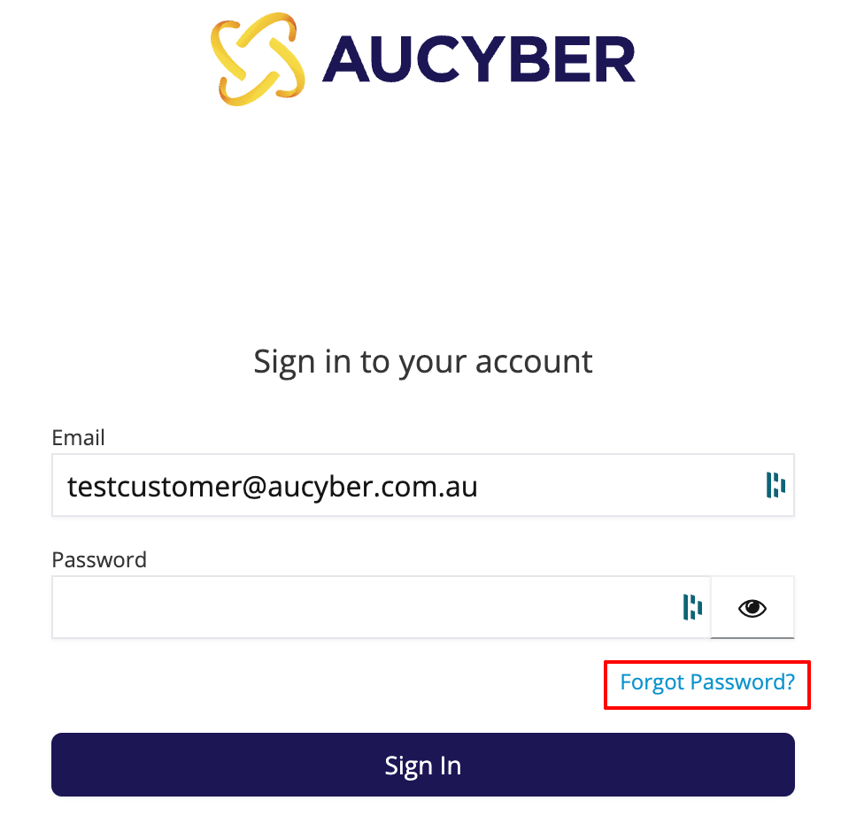
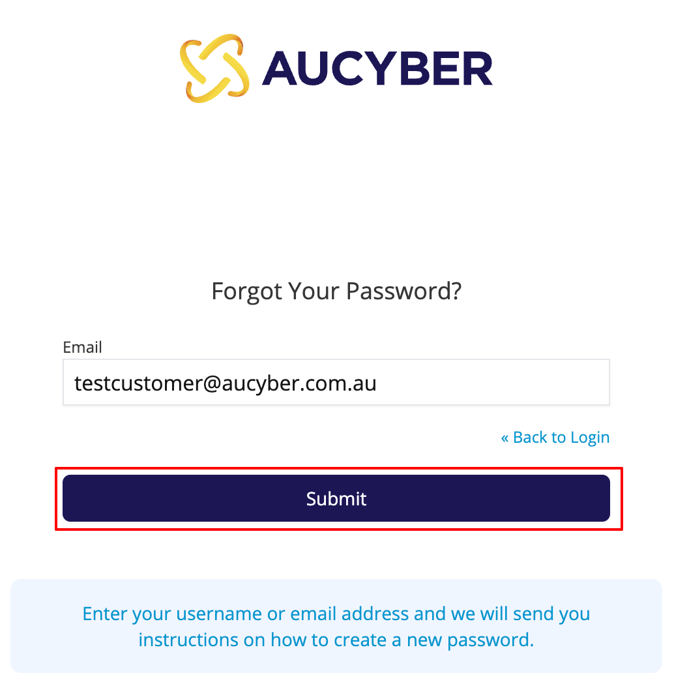
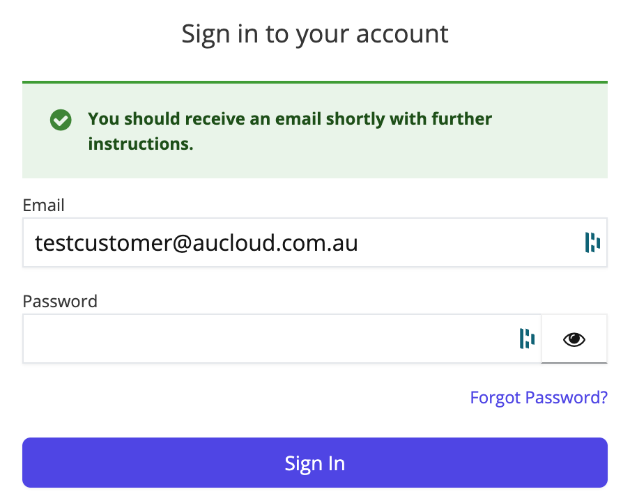
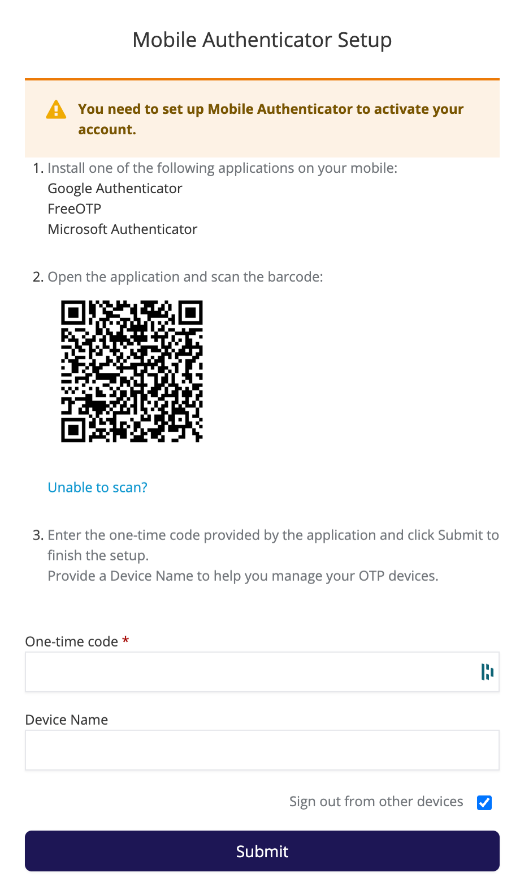
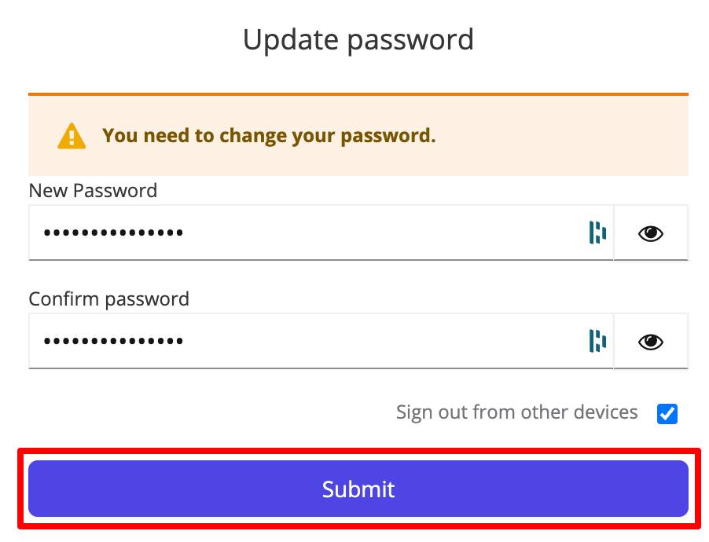

!!! info "Effective from the Portal release"
    This page describes the AUCyber Portal at [portal.aucyber.com.au](https://portal.aucyber.com.au), scheduled for release in Q4 2026. These instructions take effect once the Portal is released. Until then, continue to use the [legacy Portal](../portal/index.md) at portal.australiacloud.com.au and its documentation.

## Overview

If you previously had an account on the legacy Portal, you'll be able to log in using the same email address. This guide details the process of the initial login and MFA setup.

If you are looking for a guide on how to create a new user account as an administrator, please
[click here](./portal-users-mgmt.md)

### Initial Setup

!!! Note "AUCyber's strong security controls mean that passwords and MFA credentials are encrypted in our database, preventing us from copying existing passwords and MFA devices to the Portal. This means that it is necessary for you to set a password and set up MFA for your Portal account before you're able to log in for the first time."

You can begin setting up your Portal account by following these simple steps:

1. Open the web browser on your device.
1. Enter the URL for the Portal: https://portal.aucyber.com.au
1. Enter the email associated with your old portal account and click 'Log in'.
1. You will be redirected to auth.aucyber.com.au to log in securely.
1. Click **Forgot Password?** (this is necessary for setting your password for the first time).

    {: style="width:500px;border:1px solid black;"}

1. Click **Submit**.

    {: style="width:500px;border:1px solid black;"}

1. An email will be sent to your inbox with instructions to follow to complete your password reset.

    {: style="width:500px;border:1px solid black;"}

1. You will be prompted to setup your **Mobile Authenticator**. Follow the instructions to install application on your mobile.
1. For **One-time Code**, enter the code from your **Mobile Authenticator** app.
1. Click **Submit** to complete the setup.

    {: style="width:500px;border:1px solid black;"}

1. You will be asked to change the password for your account. Enter your **New Password**.
1. Confirm your new password by enter it again in **Confirm Password**.
1. Click **Submit**

    {: style="width:500px;border:1px solid black;"}

You will have successfully logged into the new AUCyber Portal for the first time. 

From here you can:

- [Access VMware Cloud Director (VCD) tenancies](./vcd-login.md)
- [Manage Users and Permissions with your organisation](./portal-users-mgmt.md)
- [Account Self Management (user details and password)](./portal-account-self-mgmt.md)

If you require any further assistance please email the AUCyber Support Desk at support@aucyber.com.au

### Forgot Password

1. Go to the portal login page https://portal.aucyber.com.au
1. Enter your **Email**.
1. Click **Log In**
1. Click **Forgot Password?**.

    {: style="width:500px;border:1px solid black;"}

1. Click **Submit**.

    {: style="width:500px;border:1px solid black;"}

1. An email will be sent to your inbox with instructions to follow to complete your password reset.

    {: style="width:500px;border:1px solid black;"}

If you require any further assistance please email the AUCyber Support Desk at support@aucyber.com.au
