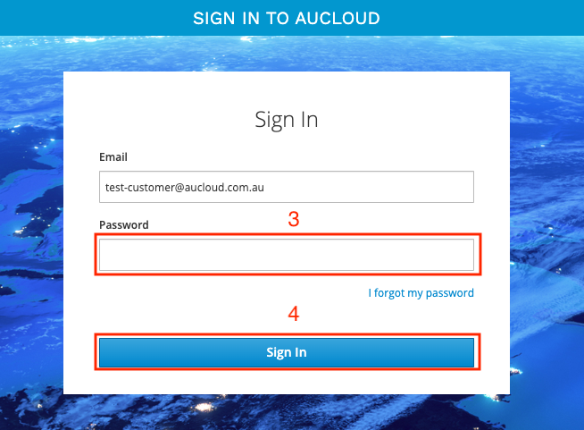
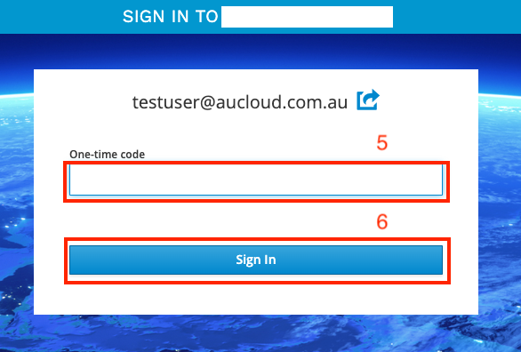
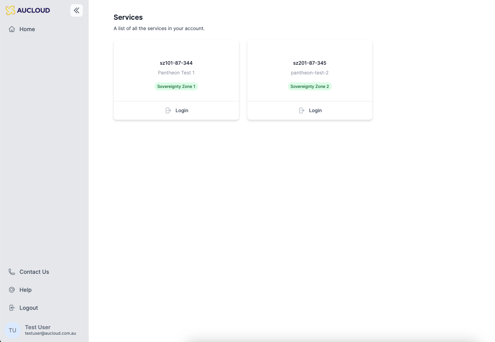

> :warning: **Effective from Dec 1st, 2023**

## Overview
This guide will detail how to log into the new Portal with a user that has already been [set up](portal-account-setup.md).

### Login
Access the new AUCloud Portal at https://app.aucloud.com.au.

1. Enter your **email** address.
1. Click **Login** to verify your email address.

    

1. The website will navigate to the login page. Enter your **password**.
1. Click **Sign In**.

    

1. The website will navigate to the One-time Code page. Enter your One-time code from your **Mobile Authenticator**.

1. Click **Sign In**.

    

1. The website will navigate to the Portal dashboard.

    
