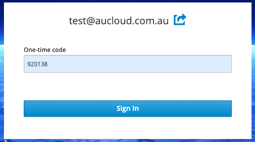
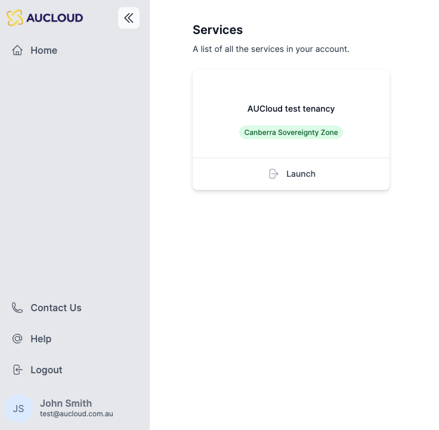

## Overview

This guide will detail how to log into the new Portal with a user that has already been [set up](portal-account-setup.md).

### Login

Every customer of AUCyber is provided with a unique web address (URL) for logging in, which is specific to their account. Our Customer Success team would have shared this web address with you. If you're having trouble finding it, don't hesitate to [get in touch with the AUCyber support team](../support/index.md) for assistance.

When you have your unique web address for logging in, you can follow these steps to access your AUCyber portal.

1. Open the web browser on your device.
1. Enter the unique web address (URL) you received from AUCyber into the browser's address bar.
1. This will take you to the login page for your account.
1. Enter your **email** address.
1. Enter your **password**.
1. Click **Sign In**.

    

1. The website will navigate to the One-time Code page. Enter your One-time code from your **Mobile Authenticator**.

1. Click **Sign In**.

    

1. The website will navigate to the Portal dashboard.

    
