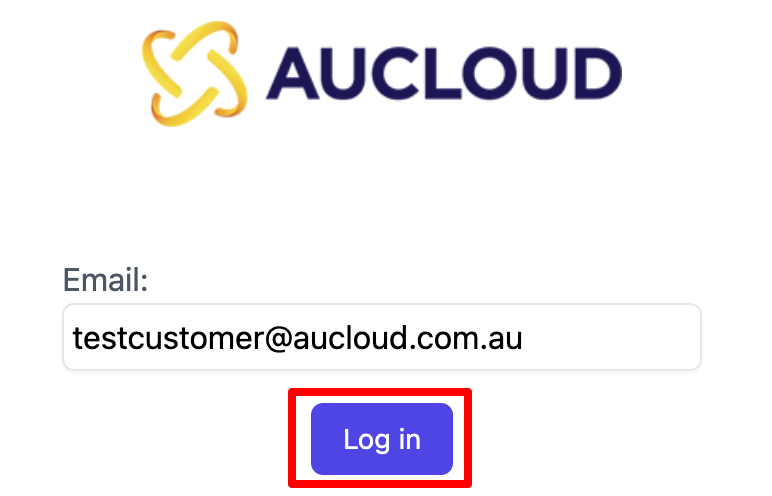
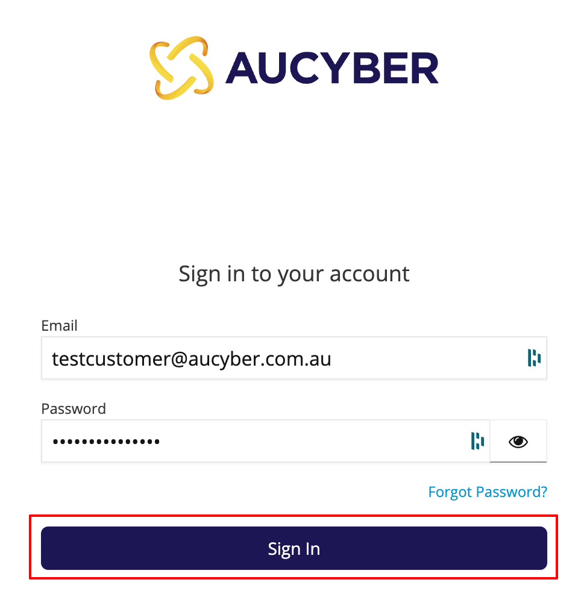
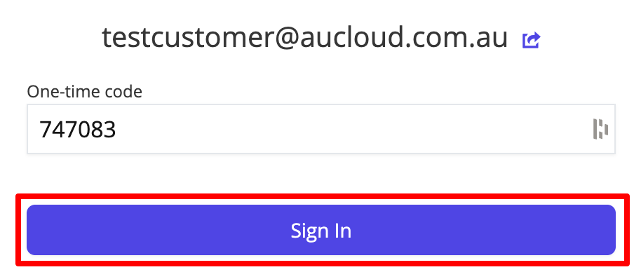
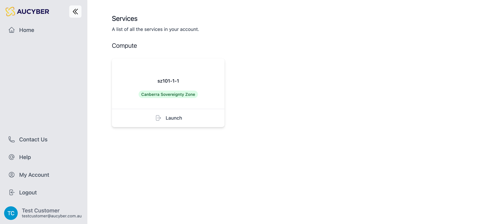

## Overview

This guide will detail how to log into the new Portal with a user that has already been [set up](portal-account-setup.md).

### Login

You can follow these steps to access your AUCyber portal.

1. Open the web browser on your device.
1. Navigate to the new portal https://app.aucloud.com.au
1. Enter your **email** address.
1. Click **Log In**

    {: style="width:500px;border:1px solid black;"}

1. You will be redirected to the secure login page for your account.
1. Enter your **password**.
1. Click **Sign In**.

    {: style="width:500px;border:1px solid black;"}

1. The website will navigate to the One-time Code page. Enter your One-time code from your **Mobile Authenticator**.

1. Click **Sign In**.

    {: style="width:500px;border:1px solid black;"}

1. The website will navigate to the Portal dashboard.

    {: style="border:1px solid black;"}
