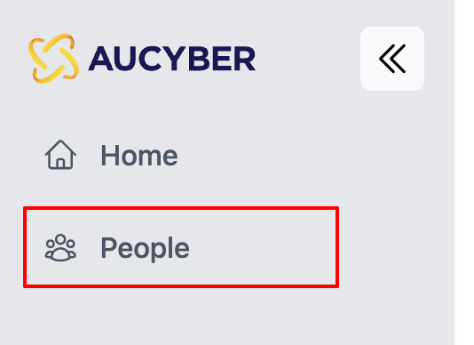
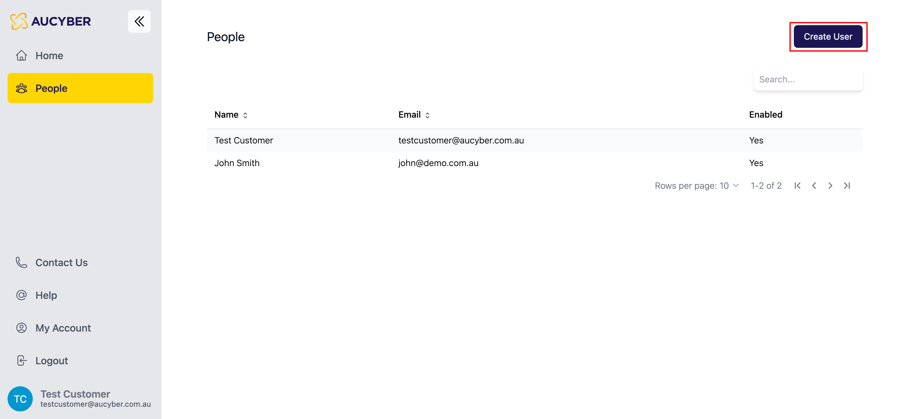
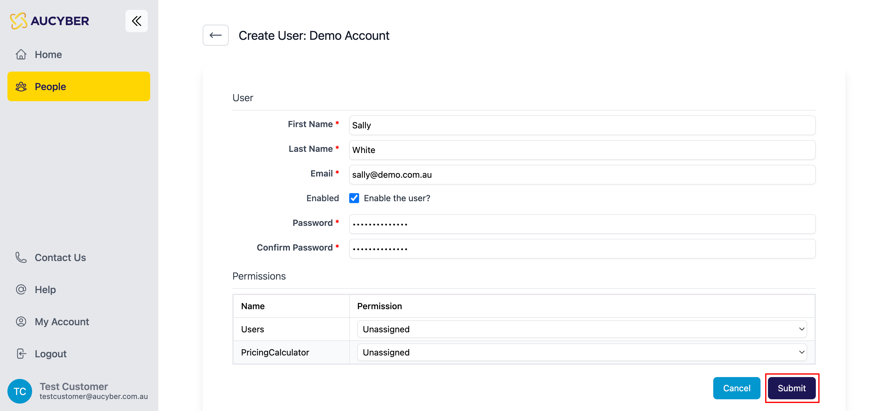
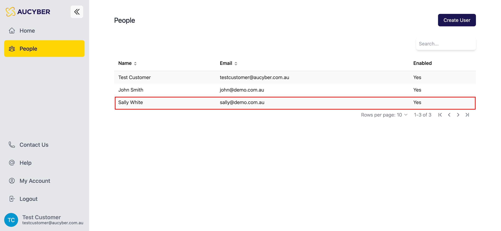
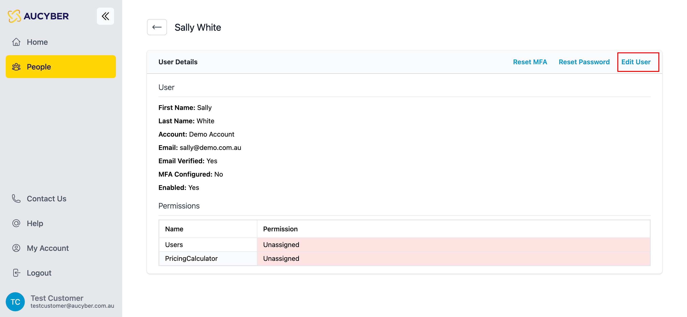
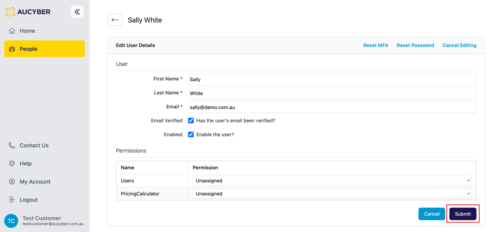
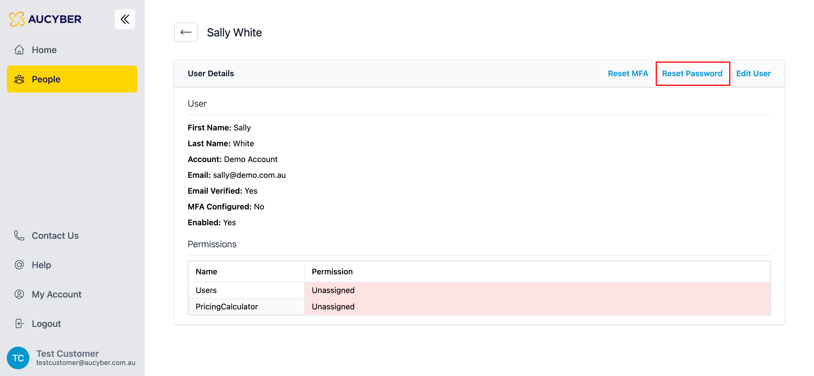
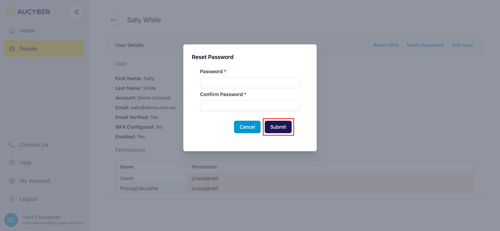
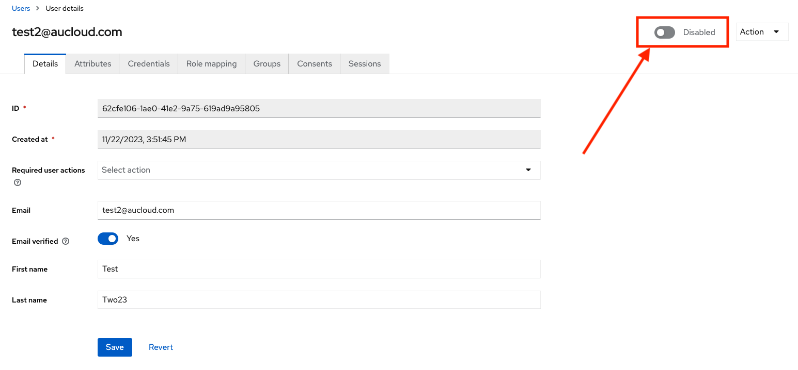
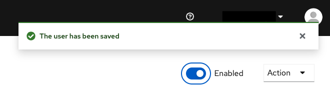

## Overview
This guide is for customers who have an [administrator role](#granting-portal-administration-privileges). These customers are able to manage users in their organisation, including creating new users, modifying existing users' accesses, and deleting users.

### Getting into the administration console
1. [Log in](./portal-login.md) to the Portal with your account that has Portal user management privileges at https://app.aucyber.com.au.
   
1. On the left sidebar, click the **People** tab.
   
    {: style="width:300px;border:1px solid black;"}

1. The browser will navigate you to the user management page.

### Adding A New User
1. Click the **Create User** button.

    {: style="border:1px solid black;"}

1. The create user dialog will open. Enter the users's name, email, password, and set any required permissions using the dropdowns before clicking submit to create the user.

    {: style="border:1px solid black;"}

1. The browser will navigate back to the list of people after successfully creating the user. The user will be required to set up an MFA token and reset their password on their first login.

### Editing a User's Details

#### Getting to the User Details page

1. Click the username of the user you wish to edit. You can also use the search bar to search for the user if required.

    {: style="border:1px solid black;"}

1. The website will navigate to that user's details page.

#### Change personal details and permissions
1. Once on the [user's details page](#getting-to-the-user-details-page), you can click the **Edit User** button to update that user's details.

    {: style="border:1px solid black;"}

1. Update any required details and permissions and click submit.

    {: style="border:1px solid black;"}

#### Change password
1. Once on the [user's details page](#getting-to-the-user-details-page), to change a user's **password**, click the **Reset Password** button.

    {: style="border:1px solid black;"}

1. Type the user's new password in the **Password** and **Confirm Password** input fields and click **Submit**.

    {: style="border:1px solid black;"}

1. The users password has now been changed. This is a temporary password, and the user will be prompted to change it on their next login.

#### Unlocking an account

//TODO: the user does not get disabled, there is a temporarily locked field that gets set to true. We do not have access to this in the current user management UI. An API change would be required to expose this and allow it to be changed.

Sometimes, a user may be locked due to multiple failed attempts to log in. To unlock it as a user administrator:

1. Navigate to the [user's details page](#getting-to-the-user-details-page).

1. In the top right, there will be a toggle displaying the user account as **Disabled**.

    

1. Click the toggle to **Enable** the user account.

1. The toggle will show **Enabled** and a toast will notify you of success.

    

#### Granting Portal administration privileges

To assign roles granting a user admin permissions in the portal, simply update that users permissions on the edit user screen (see [Change personal details and permissions](#change-personal-details-and-permissions)).

#### Revoking Portal administration privileges

To unassign roles granting a user admin permissions in the portal, simply update that user's relevant permission to be 'Unassigned' on the edit user screen (see [Change personal details and permissions](#change-personal-details-and-permissions)).