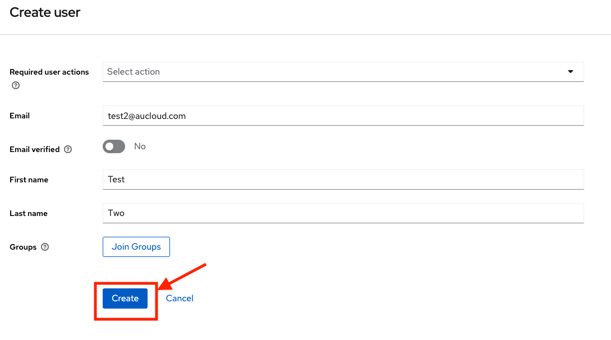

## Overview
This guide is for customers who have an administrator role. These customers are able to manage users in their organisation, including creating new users, modifying existing users' accesses, and deleting users.

### Getting into the administration console
1. [Log in](./portal-login.md) to the Portal with your account that has administration privileges.
   
2. On the left sidebar, click the **People** tab.
   
   

3. A new tab will open that takes you to the administration console.

    

### Adding A New User
1. Click **Users**.

    

2. The **Users** page will open, with a list of users and some controls. Click the **Add user** button.

    

3. The website will navigate to the **Create user** screen.

4. Set any **required user actions** you want the new user to perform using the dropdown menu.
  
   - 'Verify email' sends an email to the user to verify their email address. 
   - 'Update profile' requires user to enter in new personal information. 
   - 'Update password' requires user to enter in a new password. 
   - 'Configure OTP' requires setup of a mobile password generator.

    
    

 5. Enter the new user's email into the **Email** field. Please note this email must not already belong to a Portal user.

    

6. Choose whether the new account's email is verified. Selecting **No** will force the user to verify their email when they first log in.

    

7. Enter the new user's **First** and **Last names**.

    

8. The Groups section covers VCD permissions. Please refer to [this]() section for more information.

9. Click **Create**.

    

10. The new user will have been created and the website will navigate to that user's details page.