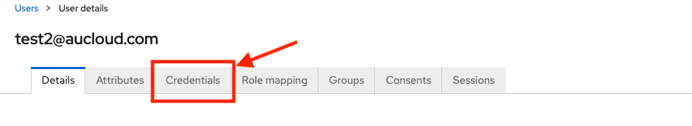

## Overview
This guide is for customers who have an [administrator role](#granting-portal-administration-privileges). These customers are able to manage users in their organisation, including creating new users, modifying existing users' accesses, and deleting users.

### Getting into the administration console
1. [Log in](./portal-login.md) to the Portal with your account that has Portal user management privileges at https://app.aucloud.com.au.
   
2. On the left sidebar, click the **People** tab.
   
   

3. A new tab will open that takes you to the administration console.

    

### Adding A New User
1. Click **Users**.

    

1. The **Users** page will open, with a list of users and some controls. Click the **Add user** button.

    

1. The website will navigate to the **Create user** screen.

1. Set any **required user actions** you want the new user to perform using the dropdown menu.
  
   - 'Verify email' sends an email to the user to verify their email address. 
   - 'Update profile' requires user to enter in new personal information. 
   - 'Update password' requires user to enter in a new password. 
   - 'Configure OTP' requires setup of a mobile password generator.

    
    

 1. Enter the new user's email into the **Email** field. Please note this email must not already belong to a Portal user.

    

1. Choose whether the new account's email is verified. Selecting **No** will force the user to verify their email when they first log in.

    

1. Enter the new user's **First** and **Last names**.

    

1. The Groups section covers VCD permissions. Please refer to [this]() section for more information.

1. Click **Create**.

    

1. The new user will have been created and the website will navigate to that user's details page.

&nbsp;

### Editing a User's Details
#### Getting to the User Details page
1. Click **Users**.

    

1. The **Users** page will open, with a list of users and some controls. Click the username of the user you wish to edit.

    

1. The website will navigate to that user's details page.

#### Change personal details
1. Once on the [user's details page](#getting-to-the-user-details-page), to change **required actions, email, email verified status, First name and Last name**, enter the new details in the relevant fields of this page and press **Save**.

    

1. A toast will pop up informing you of the successful operation.

    

#### Change password
1. Once on the [user's details page](#getting-to-the-user-details-page), to change a user's **password**, click the **Credentials** tab.

    

1. Click **Reset password**.

    

1. Type the user's new password in the **Password** and **New password confirmation** input fields.

    

1. By default, the **Temporary** toggle is on. Leaving this as **On** will force the user to reset their password upon logging in with the new password you have set in the step above.

    

1. Click **Save**.

    

1. A confirmation dialog will pop up. To proceed, click **Reset password**.

    

1. A toast will pop up informing you of the successful operation.

    

#### Granting Portal administration privileges

1. Once on the [user's details page](#getting-to-the-user-details-page), to assign administration privileges, click the **Role mapping** tab.

    

1. Click **Assign role**.
  
    

1. Click the **Filter by realm roles** dropdown.

    

1. Click the **Filter by clients** option.

    

1. You will find a list of available roles that the user can be assigned. For an example, a typical user admin would be given the **manage-users**, **view-users** and **query-users** roles in the **realm-management** client. Use the checkboxes to select which roles you want to grant the user.

    

1. After selecting the roles to grant, click **Assign**.

    

1. The new roles will appear in the table and a toast will inform you of success.

    

#### Revoking Portal administration privileges
1. Once on the [user's details page](#getting-to-the-user-details-page), to assign administration privileges, click the **Role mapping** tab.

    

1. Use the checkboxes to select which roles you want to revoke from the user.

    

1. Click **Unassign**.

    

1. A confirmation dialog will pop up. To proceed, click **Remove**.

    

1. The roles will be removed from the user and a toast will notify you of success.

    