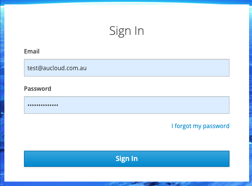
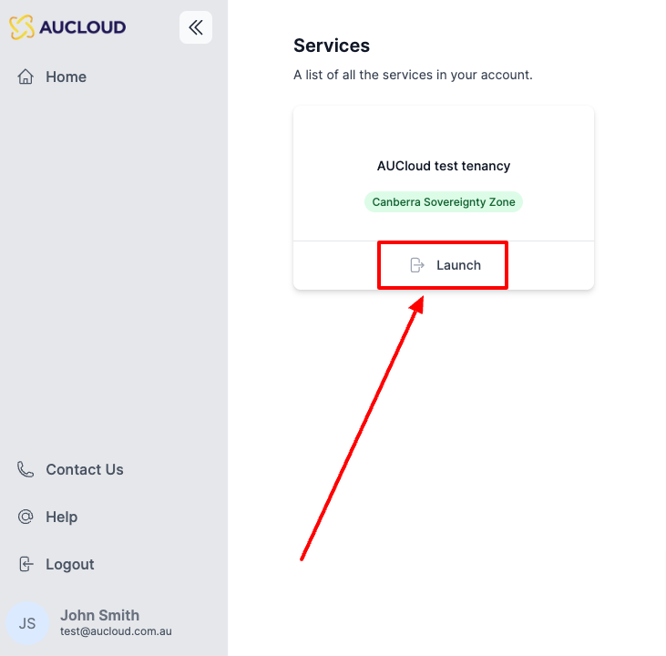
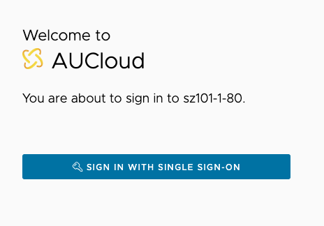
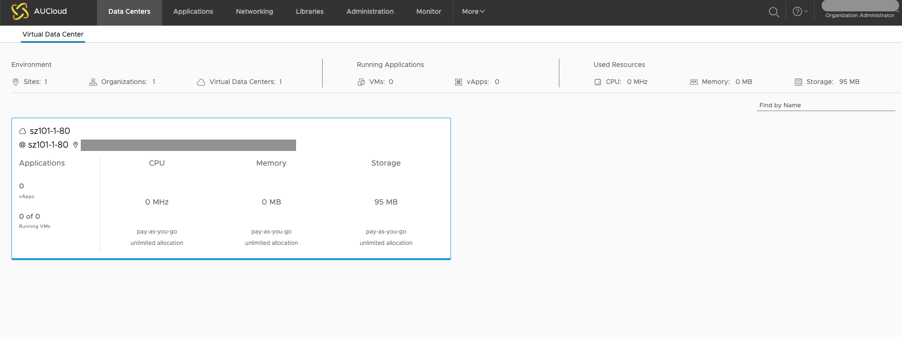

## Overview

In the new Portal, each user's VCD permissions are tied to their AUCloud login, streamlining the workflow to reach the user's VCD instance(s). This guide details the process of logging into an existing Portal account and accessing a VCD instance that account has been given access to.

### Logging in to the Portal

Every customer of AUCloud is provided with a unique web address (URL) for logging in, which is specific to their account. Our Customer Success team would have shared this web address with you. If you're having trouble finding it, don't hesitate to [get in touch with the AUCloud support team](../support/index.md) for assistance.

When you have your unique web address for logging in, you can follow these steps to access your VMWare Cloud Director tenancies.

1. Open the web browser on your device.
1. Enter the unique web address (URL) you received from AUCloud into the browser's address bar.
1. This will take you to the login page for your account.
1. Enter your **email** address.
1. Enter your **password**.
1. Click **Sign In**.

    

1. You will be directed to the Services page, which displays all the VCD tenancies you have access to. Click **Launch** on the tile of the tenancy you want to log into.
    
    

1. A new tab will open, directing you to the tenancy you clicked. Click **Sign In With Single Sign-On**.

    

    !!! note "If you are given an option to "Sign in with LDAP" please ignore it. LDAP authentication is no longer supported.  This option will be removed in the near future."

1. You will be redirected into the VCD tenancy.

    

If you require any further assistance please email the AUCloud Support Desk at support@aucloud.com.au
