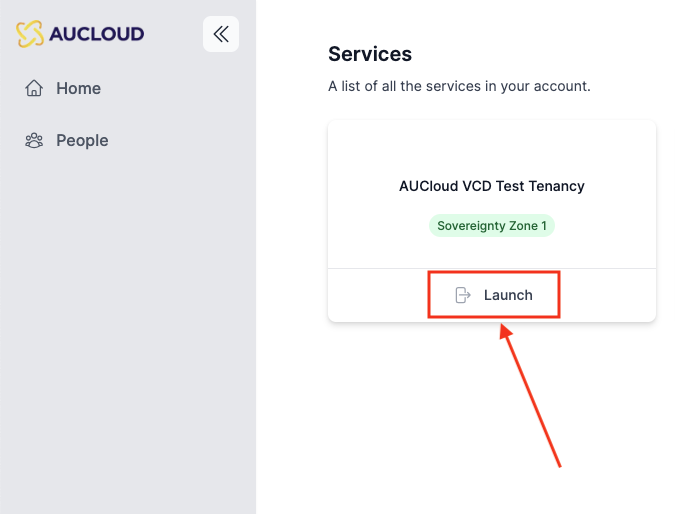

## Overview
In the new Portal, each user's VCD permissions are tied to their AUCloud login, streamlining the workflow to reach the user's VCD instance(s). This guide details the process of logging into an existing Portal account and accessing a VCD instance that account has been given access to.

### Logging in to the Portal

Access the new AUCloud Portal at https://app.aucloud.com.au.

1. Enter your **email** address.
1. Click **Login** to verify your email address.

    

1. The website will navigate to the login page. Enter your **password** .
1. Click **Sign In**.

    
  &nbsp;
  &nbsp;

1. You will be directed to the Services page, which displays all the VCD tenancies you have access to. Click **Launch** on the tile of the tenancy you want to log into.

    
  &nbsp;
  &nbsp;

1. A new tab will open, directing you to the tenancy you clicked. Click **Sign In With Single Sign-On**.

    
  &nbsp;
  &nbsp;

1. You will be redirected into the VCD tenancy.

    

If you require any further assistance please email the AUCloud Support Desk at support@australiacloud.com.au
