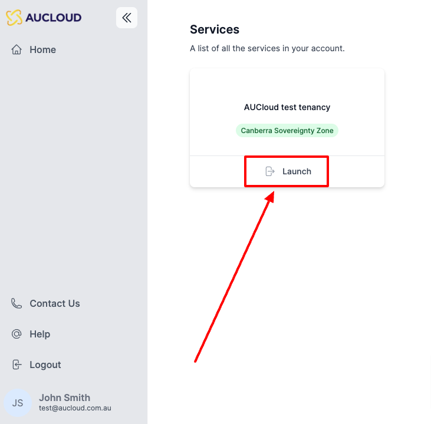
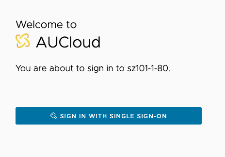
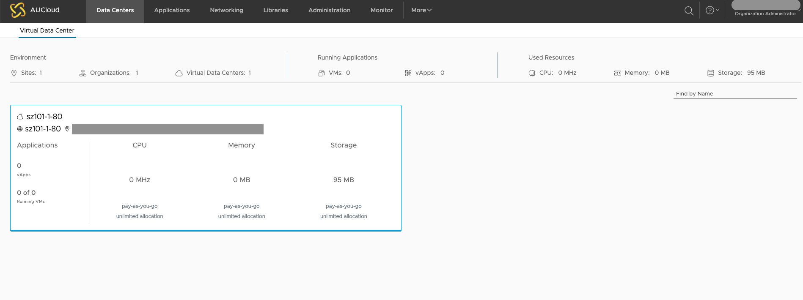

## Overview

In the new Portal, each user's VCD permissions are tied to their AUCyber login, streamlining the workflow to reach the user's VCD instance(s). This guide details the process of logging into an existing Portal account and accessing a VCD instance that account has been given access to.

### Accessing a VCD instance

1. [Log in](./portal-login.md) to your Portal account.

1. You will be directed to the Services page, which displays all the VCD tenancies you have access to. Click **Launch** on the tile of the tenancy you want to log into.
    
    {: style="border:1px solid black;"}

1. A new tab will open, directing you to the tenancy you clicked. Click **Sign In With Single Sign-On**.

    {: style="border:1px solid black;"}

    !!! note "If you are given an option to "Sign in with LDAP" please ignore it. LDAP authentication is no longer supported.  This option will be removed in the near future."

1. You will be redirected into the VCD tenancy.

    {: style="border:1px solid black;"}

If you require any further assistance please email the AUCyber Support Desk at support@aucyber.com.au
