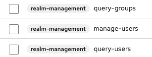
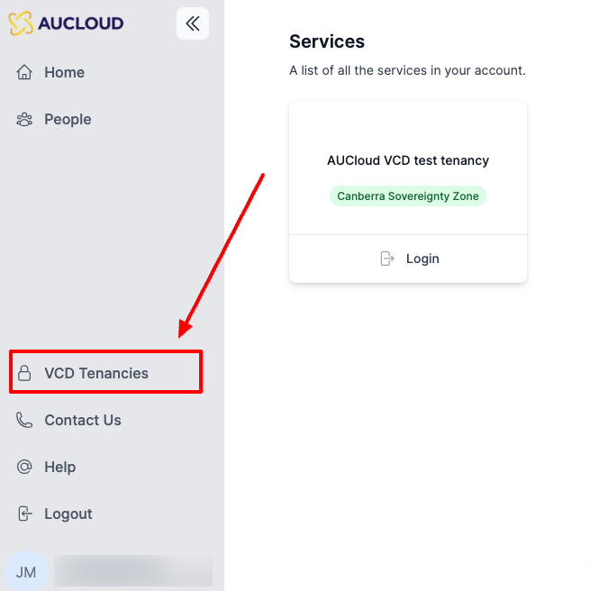
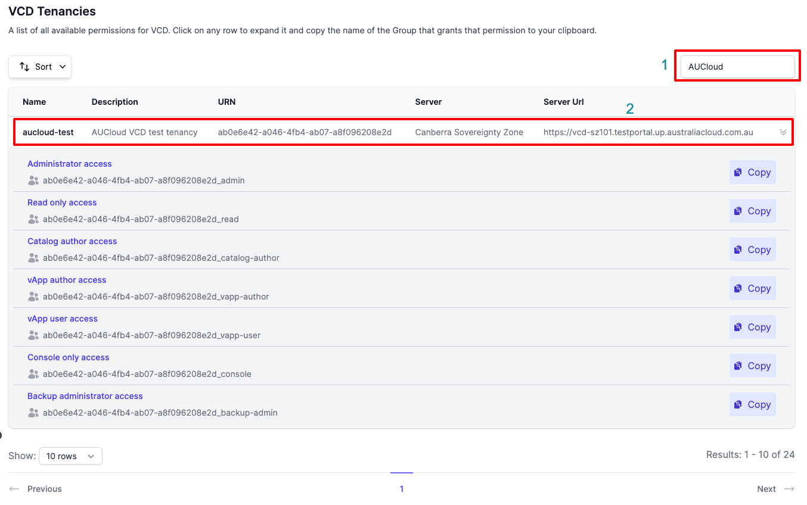
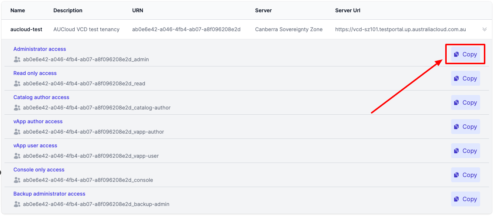

## Overview

To grant a user access to a VCD tenancy you will need the following Roles.  Please refer to [our guide on managing user roles](./user-roles-guide/) to get these Roles mapped to your user:

These roles will grant you the access required to manage users in your organisation.  Allowing you to give them access to your organisations VMware Cloud Director (VCD) tenancies. 

The steps for doing this are:

1. [Find the Group associated with the VCD tenancy + Role](#find-the-group-associated-with-a-vcd-tenancy--role) that you want to grant access to
1. [Add the user to that group](#add-a-user-to-a-group)

### Add a user to a group

1. 

### Find the group associated with a VCD tenancy + Role

1. Login to the Portal (app.aucloud.com.au)
1. Click "VCD Tenancies":

    

1. This will present you with a list of all VMware Cloud Director tenancies (AKA Organisations) that you control:

    

1. Search for the tenancy that you would like to add the user to and click on it, this will show the available roles and associated groups for that tenancy:

    

1. Click "Copy" on the row of the VCD role that you would like to grant to the user.  This will copy the Group name that is associated with that role.
    1. For example, if you want to grant the user the "Administrator" role to that VCD tenancy, you would click "Copy" for the "Administrator access" row:

    

1. You will now have copied the group name associated with that VCD tenancy and role to your clipboard.  You can then assign the user to that group to grant them access to that VCD tenancy, with the role you have selected. 
    1. For example, the group copied in the above screenshot will grant the user Administrator access to the `aucloud-test` tenancy when the user is assigned to that group