## Overview

To grant a user access to a VCD tenancy you will need the following Roles.  Please refer to [our guide on managing user roles](./portal-users-mgmt.md#granting-portal-administration-privileges) to get these Roles mapped to your user:

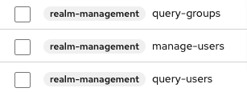

These roles will grant you the access required to manage users in your organisation.  This allows you to give them access to your organisation's VMware Cloud Director (VCD) tenancies. 

The steps for doing this are:

1. [Find the Group associated with the VCD tenancy + Role](#find-the-group-associated-with-a-vcd-tenancy-role) that you want to grant access to
1. [Add the user to that group](#add-a-user-to-a-group)

### Find the group associated with a VCD tenancy + Role

1. [Log in](./portal-login.md) to the Portal with your account that has Portal user management privileges at https://app.aucloud.com.au.
1. Click "VCD Tenancies":

    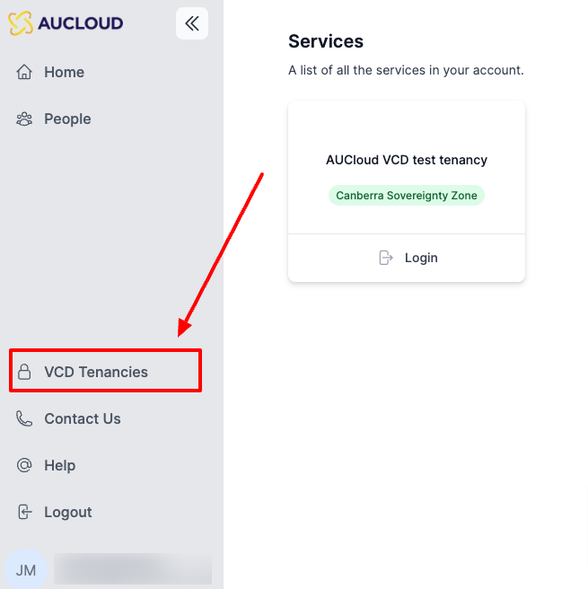

1. This will present you with a list of all VMware Cloud Director tenancies (AKA Organisations) that you control:

    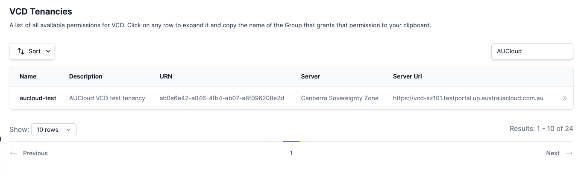

1. Search for the tenancy that you would like to add the user to and click on it, this will show the available roles and associated groups for that tenancy:

    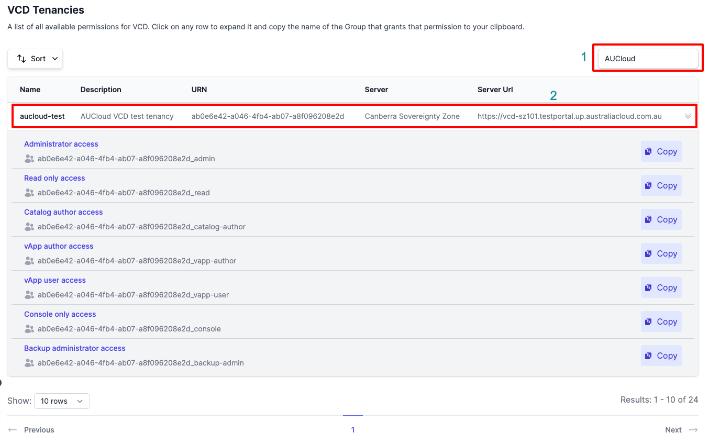

1. Click **Copy** on the row of the VCD role that you would like to grant to the user.  This will copy the **Group name** that is associated with that role.
    1. For example, if you want to grant the user the **Administrator** role to that VCD tenancy, you would click **Copy** for the **Administrator access** row:

    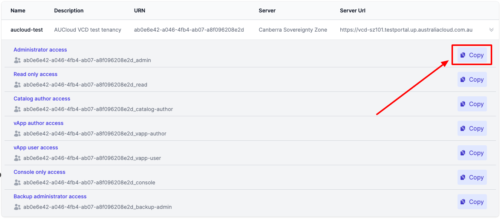

1. You will now have copied the group name associated with that VCD tenancy and role to your clipboard.  You can then [assign the user](#add-a-user-to-a-group) to that group to grant them access to that VCD tenancy, with the role you have selected. 
    1. For example, the group copied in the above screenshot will grant the user Administrator access to the `aucloud-test` tenancy when the user is assigned to that group.

### Add a user to a group

1. On the left sidebar, click the **People** tab.
   
    

1. A new tab will open that takes you to the administration console.

    

1. Click the **Groups** tab on the sidebar.

    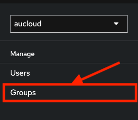

1. The **Groups** page should display. Paste the value [you copied](#find-the-group-associated-with-a-vcd-tenancy-role) from **VCD Tenancies** into the **Filter groups** search box.

    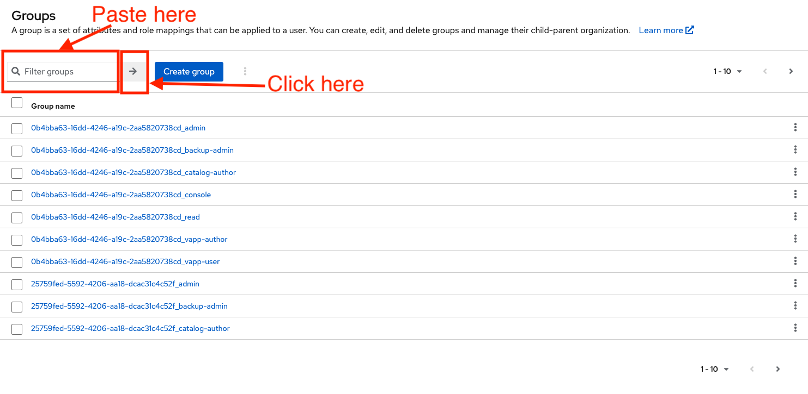

1. The table will filter to the group you specified. Click into the group name on the table entry.

    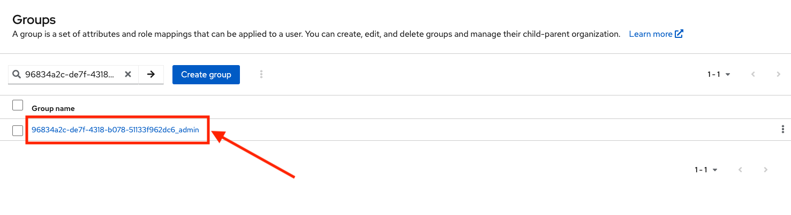

1. This will take you into the **Group details** page of the group you selected. Click the **Members** tab.

    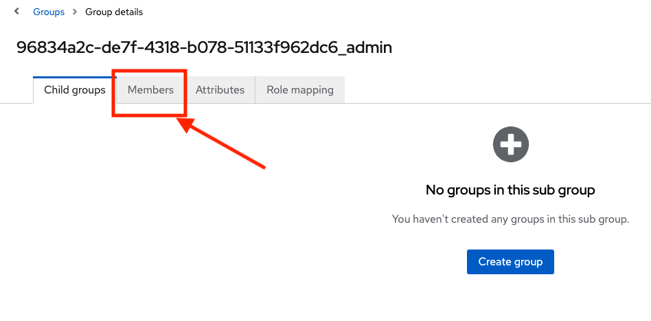

1. A new table will display containing the users currently assigned to that group. Click the **Add member** button.

    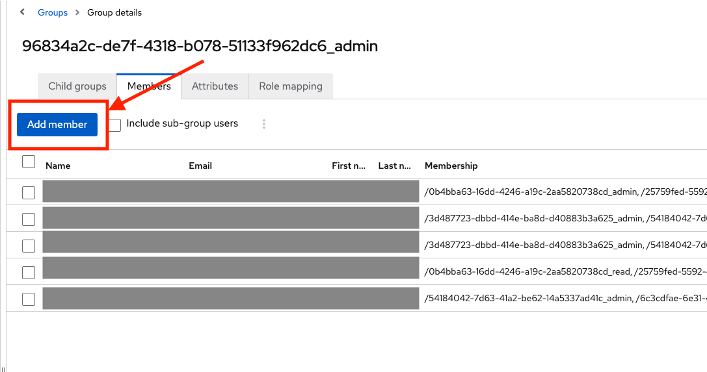]

1. In the **Search user** box, search for the user you wish to add to the group, using their Username, Email, Last name, or First name. Click the arrow button or press Enter to search.

    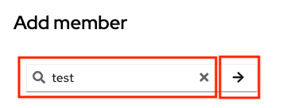

1. In the results table, use the **checkbox(es)** to select the user, then press the **Add** button.

    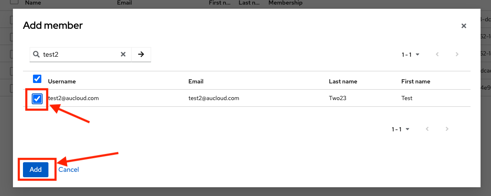

1. You will be returned to the **Members** page, where you can see the user now on the list of users in the group. Additionally, a toast message will confirm success.

    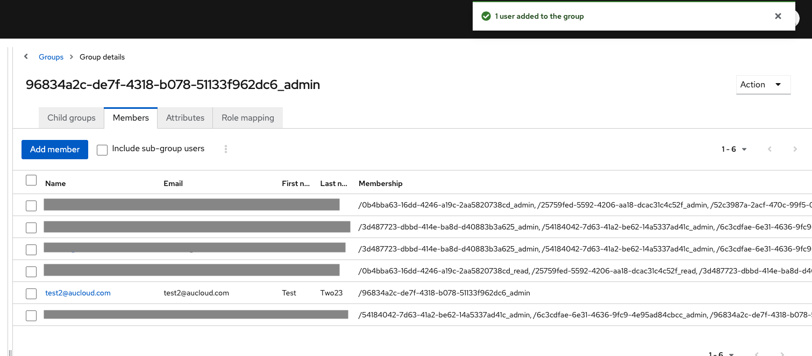

### Remove a user from a group
1. Use the steps [above](#add-a-user-to-a-group) to navigate to the **Members** page of the group you want to revoke access to. Use the **checkbox(es)** on the left to select the user you wish to remove from the group.

    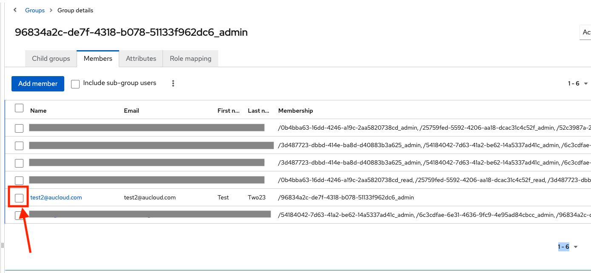

1. Click the **vertical three dots** button above the table.

    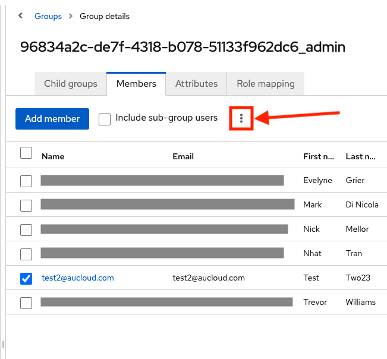

1. Click the **Leave group** dropdown item.

    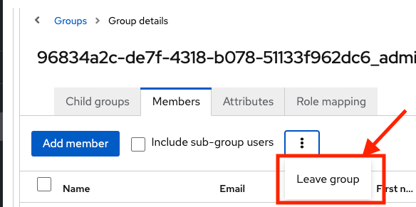

1. A toast notification will inform you that the user left the group. That user will no longer be in the table of Members.

    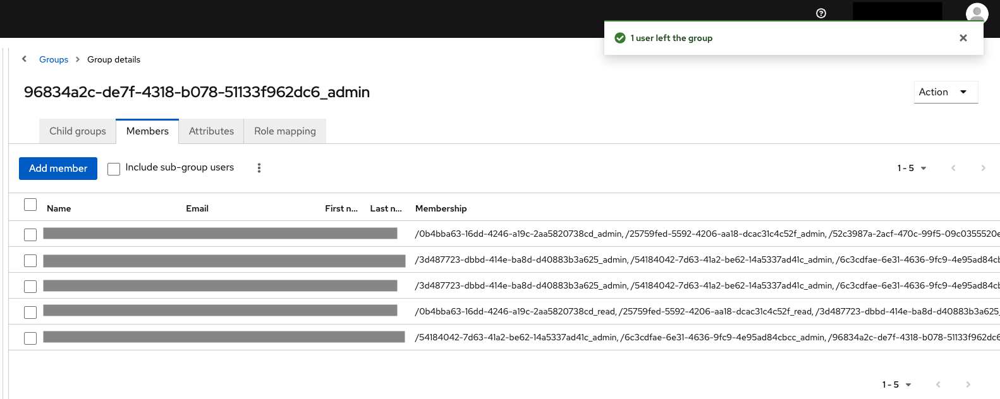