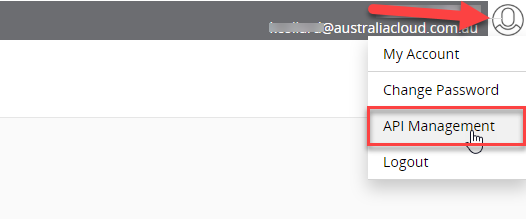
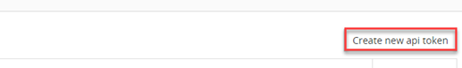
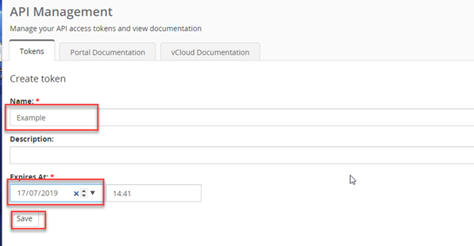
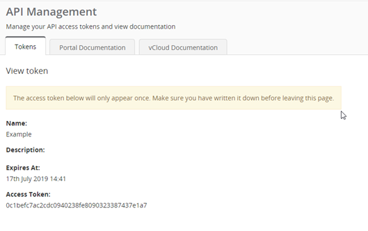
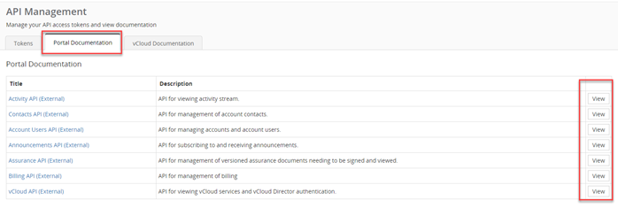
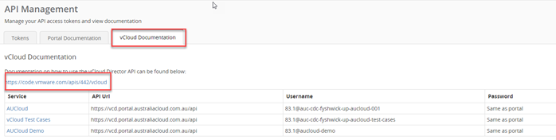
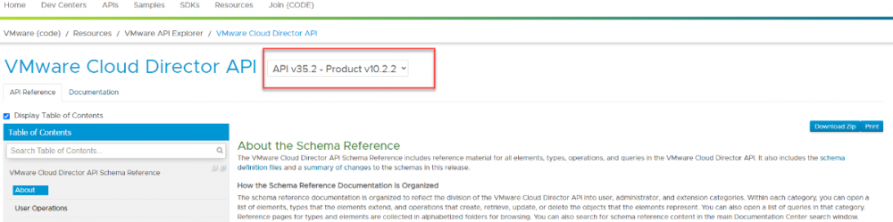

### Overview

The AUCloud Portal is fully API driven which allows codified functionality and allows us to implement the modern, best practice approach to automation of the tasks that we do.

AUCloud API documentation can be accessed through the AUCloud Portal. VMware Cloud Director documentation can be accessed through the URL link in the portal.

### Procedure

1. Click on the My Account icon and select API Management.

    

1. Select Create new api token.

    

1. Enter details for your token:

    1. name
    1. (optional) enter a description
    1. Expiry date and time
    1. click Save

    

1. Your token will be displayed (You will only be given access to your token once).

    

1. Copy your token details.
 
1. Access the AUCloud API documentation by clicking on the Portal Documentation tab and click View under the relevant title.

    

1. To access the VMware Cloud Director documentation, click on VMware Cloud Director Documentation and click on the URL.

    

1. You will be redirected to the VMware site.

    
