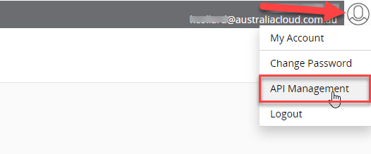
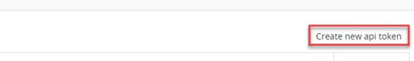
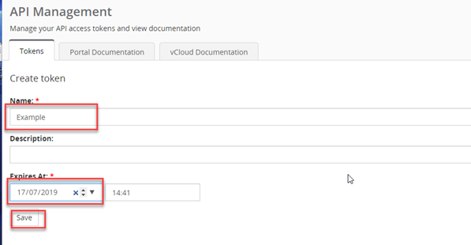
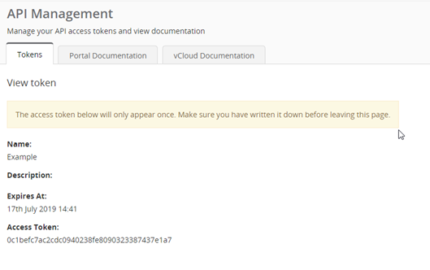
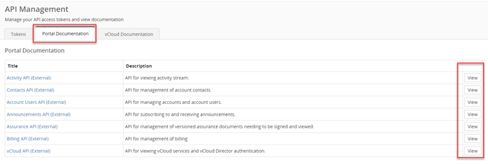

## Overview

!!! warning "Legacy Portal documentation"
    This page describes the legacy AUCyber Portal at portal.australiacloud.com.au. The AUCyber Portal at [portal.aucyber.com.au](https://portal.aucyber.com.au) is scheduled for release in Q4 2026. Once it is released, the legacy Portal will no longer function and the [Portal](../portal-new/index.md) documentation applies.

The AUCyber Portal is fully API driven which allows codified functionality and allows us to implement the modern, best practice approach to automation of the tasks that we do.

AUCyber API documentation can be accessed through the [AUCyber Portal.](../../Platform_Services/reference_urls.md#portal-ui) VMware Cloud Director documentation can be accessed through the URL link in the portal.

## Procedure

1. Click on the My Account icon and select API Management.

    

1. Select Create new api token.

    

1. Enter details for your token:

    - name
    - (optional) enter a description
    - Expiry date and time
    - click Save

    

1. Your token will be displayed (You will only be given access to your token once).

    

1. Copy your token details.
 
1. Access the AUCyber API documentation by clicking on the Portal Documentation tab and click View under the relevant title.

    