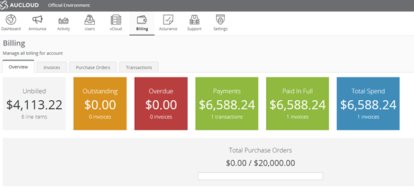
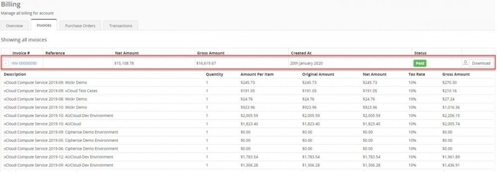
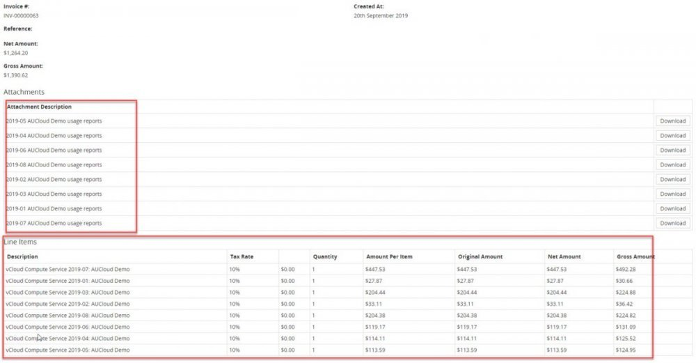
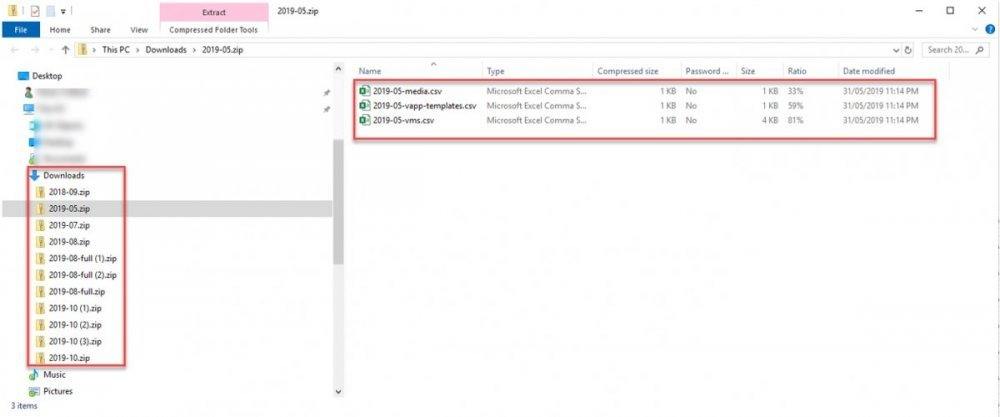
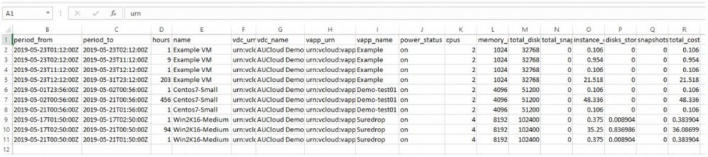
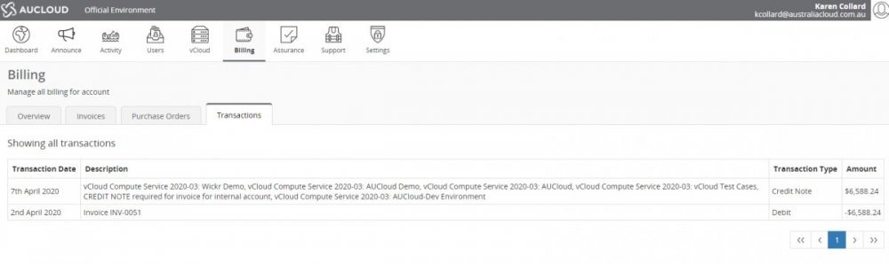

## AUCloud Billing Portal

This guide is intended for use by administrative and financial staff responsible for the payment of invoices issued by AUCloud. Staff that require access to the Billing portal should request this access through the IT administrator responsible for the AUCloud portal management.

## Billing overview

1. The billing portal can be accessed by logging on to the [AUCloud Portal.](../../Platform_Services/reference_urls.md#portal-ui) Log on to the portal with the credentials provided by your administrator.

1. The billing information can be accessed by selecting the Billing tab on the ribbon bar of the dashboard.

    

1. You will first be presented with an overview of your account. The overview presents the following information:

    - Unbilled: This is a real-time representation of all items for the current month. This amount is updated every 15 minutes.
    - Outstanding: This represents items which have been invoiced but not yet paid.
    - Overdue: These are amounts which have been invoiced but not paid within the due date of 30 days.
    - Total Spend: The total spend indicates the total spend on the account since the account began.
    - Total Purchase Orders: When a purchase order is received it is entered into your account. The two figures shown represent the total amount of the current purchase order and the burndown on that purchase order.
 
## Invoices Tab

1. Invoices are generated by AUCloud prior to the 15th of every month and emailed to the billing contact provided on the Purchase Order.

1. Under the invoices tab, you can view all invoices which have been generated. The following information is displayed on the invoice line:

    - Invoice Number: Clicking on the invoice number will show all details of that individual invoice.
    - Reference: A reference for the invoice.
    - Net Amount: The amount of the invoice prior to applying GST.
    - Gross Amount: The amount of the invoice after applying GST.
    - Created At: The date the invoice was created.
    - Status: Shows if the invoice has been paid, is outstanding or is overdue.
    - Download: Provides the option to download a PDF copy of the invoice.

    

## Viewing Invoice details

1. To view details of invoices, click on the Invoice number of the invoice you would like to view. The details of the invoice will be displayed on the screen.

1. The information displayed on the front page of the invoices tab will be shown at the top of the invoice. Under this information you can view usage reports as attachments and view the line items associated with the invoice.

    

1. Usage reports can be downloaded for each line item by selecting the Download button next to the report. Three reports will be downloaded as .csv files as a .zip into your downloads folder. The reports are broken down into Media, vApp-templates and vms.

    

1. The media report and vApp template reports detail all the media or vApp templates downloaded, the names, time period, size of the data in Mb and the cost.

1. The VM report details the individual VM's, the times they were turned on and off, total hours and cost. The report also details independent disks attached and any snapshots taken. An example report is below.

    

## Purchase Orders

1. All purchase orders are entered in customer accounts in the Portal. The purchase orders tab shows the following information

    - PO Number: This PO number relates to the customers purchase order.
    - Description: As per the purchase order submitted by the customer.
    - Allocated quota: shows the amount of the purchase order which has been used already.
    - Quota: shows the total amount of the purchase order.
    - Usage bar: shows the percentage of the purchaser order which has been used..
 
1. If discrepancies are discovered in the purchase order, please contact [AUCloud Support](../support/index.md) to have the issue fixed.

## Transactions

1. The transactions tab provides a list view of all credit and debit transactions on your account.

    

1. A debit transaction will appear once an invoice is created in the portal and a credit transaction will appear after payment has been processed by our accounts department.

## Discrepancies and Disputes

If you believe there is an error with an invoice received, please contact [AUCloud Support](../support/index.md) in the first instance so the problem can be investigated and resolved.