### Logging in to the AUCloud Portal

1. Go to the appropriate [URL](../../Platform_Services/reference_urls.md#portal-ui), depending on the community where your service is located.

1. Enter the organisational login credentials provided.

    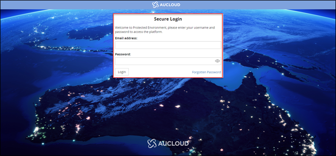

1. On your first login, you will be prompted to enter the memorable word provided to you. Enter only the highlighted characters from your memorable word.

    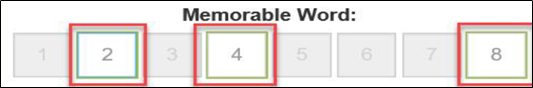

    For example, if your word is "academic" in the above scenario, characters 2,4 and 8 would be 'c', 'd' and 'c' respectively.

1. The QR code will appear which needs to be scanned into a One-Time Password (OTP) Authenticator app such as Google Authenticator. The authenticator will add an account which will generate a six-digit code which will be required for subsequent logins.

    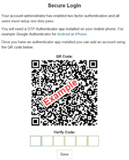      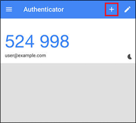

1. Once you have successfully logged into the portal, you will be presented with the dashboard.

    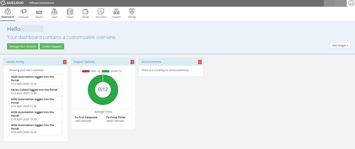

### Portal Overview

After you log in, you will see the portal home page. The portal home page is made up of the toolbar, navigation panel and content area. Options available to users are dependent on the permissions set by the account administrator.

| Icon      | Name | Description |
| ----------- | ----------- | ----------- |
|| **My Account** | Under my account you can view your account details, change your password and log out of the platform. This is also the area to obtain tokens to access the API.|
|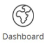| **Dashboard** | Upon first login you are presented with the Dashboard. There are currently two widgets available, however widgets can be developed based on customer requests.|
|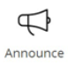| **Announcements** | The announcements tab will display all released announcements.|
|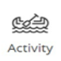| **Activity** | The activity tab contains all the user activities that occur on the portal, Every user can see their own activity by default and administrators can see all account activity.|
|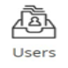| **Users** | The users tab is where you can view your own user account. The portal uses a role-based permissions system. If the Create New user radio button does not appear, either you do not have sufficient privileges, or your organisation has not signed the CRISP.|
|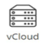| **VMware Cloud Director** | After your compute service and Virtual Datacentre (VDC) have been created by AUCloud you can start to build your applications. To do this, you must log in to VMware Cloud Director from the AUCloud portal.|
|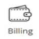| **Billing** | The billing console provides real time information on the consumption of AUCloud services. Portal users can monitor the status of existing purchase orders, download invoices and monitor financial transactions.|
|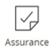| **Assurance** | The Assurance tab provides links to useful documentation. It also contains the link where assurance users can view the Community Rules Information Security Policy (CRISP).|
|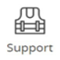| **Support** | The support tab tracks any issues or feedback you may have with your infrastructure and the virtual estate.|
|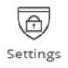| **Settings** | The settings tab contains sections for Security, Announcements and Contacts. It contains the minimum password requirements as set out by the Australian Government ISM.|
