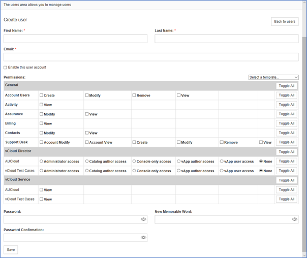
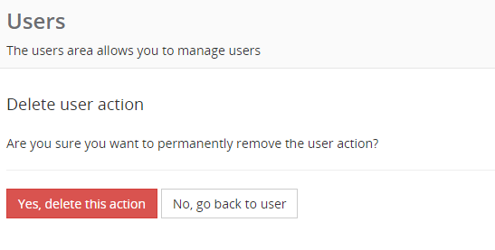

## Overview

Account administrators are responsible for the management of user accounts. This guide outlines the procedures used in managing users. Users are managed from the Users tab in the ribbon bar:

A list of all users will be displayed including their last log on and Status.

## Creating a user

1. Click on the Create new user tab.

1. Enter the user name, email and mobile number.

1. Select 'Enable this user account'.

1. Select Permissions boxes to grant user the required access.

1. Enter the user Password and Password Confirmation (passwords must meet the minimum requirements outlined under the Settings tab). For new users, this password will need to be reset on first logon

1. Enter a Memorable Word.

1. Click Save.

1. Provide the password and memorable word to the user.

    

## View user details

1. Click on the name of the user you want to view.

1. The user details will be displayed but cannot be edited from this page.

1. Click Back to users to return to the Users page.

## Edit user details

1. Click on the Edit button in the same line as the User you want to edit

    

1. Make changes to the user details and/or permissions as required.

1. Click Save.

## User Permissions

1. User permissions are defined by the account administrator. Permissions should be set according to the user's role and requirements. Permissions can be changed at any time by the account administrator.

1. In addition to setting the overall permissions, the account administrator can limit a user's access to individual VMware Cloud Director services.

## Changing user passwords

1. If a user has forgotten his/her password then this can be reset by the administrator by using the Edit user function.

1. Passwords are to conform with minimum standards outlined under the settings tab.

1. User passwords can only be reset once every 24 hours.

## User account locked out

1. Users may be locked out due to too many incorrect password attempts or a period of inactivity.

1. If a user has been locked out, navigate to the Users page and click on the name of the user who is locked out.

    

1. At the bottom of the page, check if the user has any Actions. In this example, the user has exceeded 30 days of inactivity.

    

1. To clear this action, click on Delete, then select Yes, delete this action to clear the action.

    

1. Confirm the action has been removed and advise the user their account is no longer locked out.

## User acquires new mobile phone

1. The OTP will need to be reset if a user acquires a new mobile device.

1. Administrators are to email AUCloud Support at support@australiacloud.com.au advising the user has a new mobile device and requires the OTP to be reset.

1. The memorable word will need to be reset if the user does not remember the original memorable word issued. Include this detail in the email if this is the case.

## Change of account administrator

1. AUCloud will retain contact details of the account administrator to contact with any issues pertaining to the account.

1. If there is a change in account administrator, please advise AUCloud support at support@australiacloud.com.au to ensure the correct person is contacted.

## Additional Assistance

1. Additional assistance and/or training can be provided as required.

1. Account administrators should contact their assigned CSM or AUCloud Support for assistance.