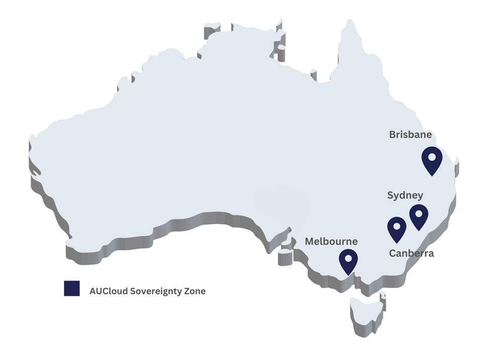

| City      | Sovereign Zone Short Code |
| --------- | ------------------------- |
| Canberra  | CSZ                       |
| Sydney    | SSZ                       |
| Brisbane  | BSZ                       |
| Melbourne | MSZ                       |

!!! note "Global Services"
Global services are PaaS or SaaS applications delivered by AUCyber across sovereignty zones (per community environment). If you believe you have requirements above this contact your CSM.

## Service availability

| Service                                                | Community environment | Region | Feature(s) / version                                                                                                            | Notes                                                        |
| ------------------------------------------------------ | --------------------- | ------ | ------------------------------------------------------------------------------------------------------------------------------- | ------------------------------------------------------------ |
| Infrastructure as a Service (VMware Cloud Director)    | Sovereign Cloud                  | CSZ    | VMware Cloud Director 10.3.3                                                                                                    | -                                                            |
|                                                        | Sovereign Cloud                  | SSZ    | VMware Cloud Director 10.3.3                                                                                                    | -                                                            |
|                                                        | Sovereign Cloud                  | BSZ    | VMware Cloud Director 10.4.1                                                                                                    | -                                                            |
|                                                        | Sovereign Cloud                  | MSZ    | VMware Cloud Director 10.4.0                                                                                                    | -                                                            |
| Network - Routing and Load balancing for IaaS          | Sovereign Cloud                  | CSZ    | NSX-V 6.4.14                                                                                                                    | No new VDCs                                                  |
|                                                        | Sovereign Cloud                  | CSZ    | NSX-T 3.2.1.2                                                                                                                   | -                                                            |
|                                                        | Sovereign Cloud                  | SSZ    | NSX-V 6.4.14                                                                                                                    | No new VDCs                                                  |
|                                                        | Sovereign Cloud                  | SSZ    | NSX-T 3.2.1.2                                                                                                                   | -                                                            |
|                                                        | Sovereign Cloud                  | BSZ    | NSX-T 3.2.1.2                                                                                                                   | -                                                            |
|                                                        | Sovereign Cloud                  | MSZ    | NSX-T 3.2.1.2                                                                                                                   | -                                                            |
| Disaster Recovery (VMware Cloud Director Availability) | Sovereign Cloud                  | CSZ    | 4.5                                                                                                                             | -                                                            |
|                                                        | Sovereign Cloud                  | SSZ    | 4.5                                                                                                                             | -                                                            |
|                                                        | Sovereign Cloud                  | BSZ    | 4.5                                                                                                                             | -                                                            |
|                                                        | Sovereign Cloud                  | MSZ    | 4.5                                                                                                                             | -                                                            |
| Storage as a Service (Object Storage)                  | Sovereign Cloud                  | CSZ    | Object lock available                                                                                                           | UI within VCD via Object Storage Extension                   |
|                                                        | Sovereign Cloud                  | SSZ    | Object lock available                                                                                                           | UI within VCD via Object Storage Extension                   |
| Microsoft 365 Backup aaS                               | Sovereign Cloud         | Global | Veeam M365 backup v6                                                                                                            | -                                                            |
| Backup as a Service - for VMs on AUCyber IaaS          | Sovereign Cloud                  | CSZ    | Veeam B&R version 11                                                                                                            | UI within VCD, Tiered storage across NVMe and Object Storage |
|                                                        | Sovereign Cloud                  | SSZ    | Veeam B&R version 11                                                                                                            | UI within VCD, Tiered storage across NVMe and Object Storage |
|                                                        | Sovereign Cloud                  | BSZ    | Veeam B&R version 11                                                                                                            | UI within VCD, Tiered storage across NVMe and Object Storage |
|                                                        | Sovereign Cloud                  | MSZ    | Veeam B&R version 11                                                                                                            | UI within VCD, Tiered storage across NVMe and Object Storage |
| Backup as a Service - for VMs outside of AUCyber IaaS  | -                     | Global | Veeam service provider console (cloud connect) v6                                                                               | Tiered storage across NVMe and Object Storage                |
| Security Operations Centre as a Service                | Sovereign Cloud         | Global | -                                                                                                                               | -                                                            |
| Sovereign Bridge (network connectivity)                | Sovereign Cloud                  | CSZ    | CDC - Connect & NextDC Axon                                                                                                     | -                                                            |
|                                                        | Sovereign Cloud                  | SSZ    | CDC - Connect & NextDC Axon                                                                                                     | -                                                            |
|                                                        | Sovereign Cloud                  | BSZ    | NextDC Axon                                                                                                                     | -                                                            |
|                                                        | Sovereign Cloud                  | MSZ    | NextDC Axon                                                                                                                     | -                                                            |
| Symmetric Key Agreement Platform (SKAP)                | -                     | Global | -                                                                                                                               | Contact your CSM for access                                  |
| Kubernetes Service                                     | Sovereign Cloud                  | CSZ    | VMware Container Service Extension 4.0.1 also see [Kubernetes versions](../Platform_Services/Kubernetes/kubernetes_versions.md) | -                                                            |
|                                                        | Sovereign Cloud                  | SSZ    | VMware Container Service Extension 4.0.1 also see [Kubernetes versions](../Platform_Services/Kubernetes/kubernetes_versions.md) | -                                                            |
|                                                        | Sovereign Cloud                  | BSZ    | VMware Container Service Extension 4.0.1 also see [Kubernetes versions](../Platform_Services/Kubernetes/kubernetes_versions.md) | -                                                            |
