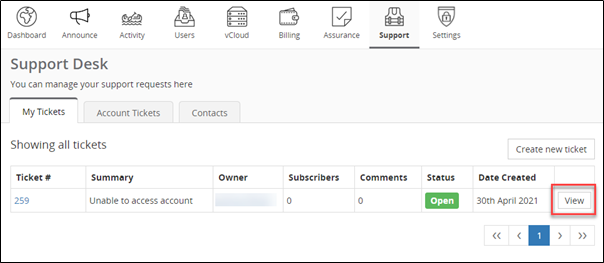
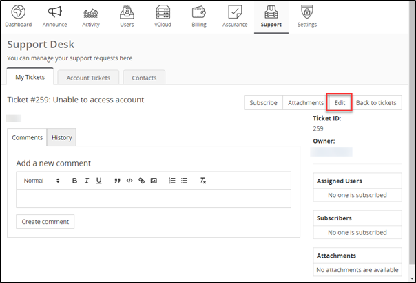

## Pre-requisites

- To edit support tickets you have created, you will need **View, Create and Modify privileges.**
- To edit support tickets all users have created, you will also need **Account View and Modify privileges**. 

_Please contact your Account Administrator to edit your privileges if required._

## How to Edit a Submitted Ticket

Once a support ticket has been submitted within the portal, you are able to modify the description, subject, status or add additional content and screenshots.

1. If you have the required permissions as outlined above, you may edit a support ticket by navigating to the **Support tab** and finding the respective ticket under _‘My Tickets’_ or _‘Account Tickets’_ and clicking **View**.

    

1. Once you are in the _View_ page of the respective ticket, you can click **Edit** to make your changes.

    

1. When changes are made, click **Save**.
