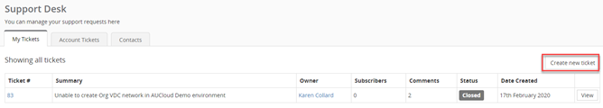
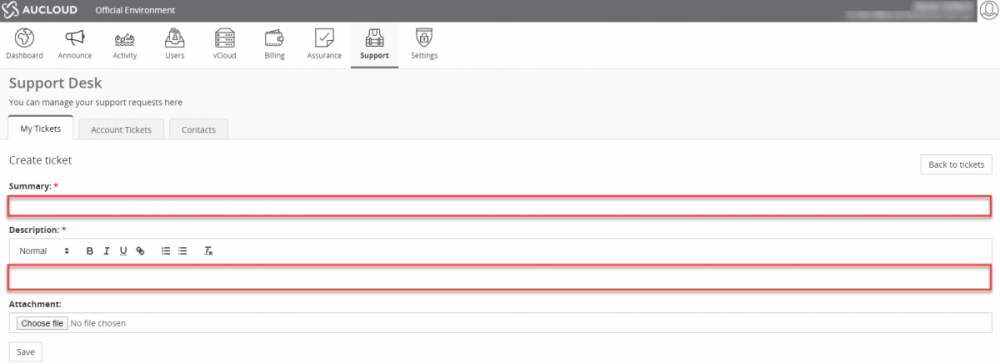

### Logging a Support ticket

1. Click on the **Support** Tab in the ribbon bar.

    

1. Click **Create new ticket**

    

1. Enter a Summary and Description with as much information as possible of the issue as this will assist our teams with troubleshooting. Attachments can be added to provide additional information. Once you have entered details click **Save**.

    

    General users will only have visibility of tickets raised by themselves.

    If you have administrator access, you will be able to view all support tickets raised by your organisation through the Account Tickets tab.

    The AUCloud Support contacts are also available on the Contacts tab.

    