### Roles

Any user from the connected Microsoft 365 organisation can log in to access and restore their own data from the most recent backup job. Users log in with their existing Microsoft 365 credentials.

Restore Operators can be specified as individuals or as security groups (where users can be managed by the customer) that can access the restore portal for all or specified objects. Please discuss your requirements for restore operators with your Customer Success Manager who can assist with setting these up for you.

## Launching the Restore Portal

## Log in

To launch the Restore Portal, do the following:

1. Open a web browser on any computer and navigate to the Restore Portal [web address](../../reference_urls.md#veeam-restore-web-address).

    !!! note

        Internet Explorer is not supported. To access Restore Portal, please use Microsoft Edge (version 79 or later), Mozilla Firefox (version 21 or later) or Google Chrome (version 24 or later).

1. On the welcome page, enter a user account that you use to connect to the Microsoft 365 organization. You must provide a user account in one of the following formats:

    - 'user@domain.com' or
    - 'user@domain.onmicrosoft.com'

1. Click **Log In**. Restore Portal will redirect you to the Microsoft authentication portal where you will be prompted to enter your Microsoft 365 user account password.

    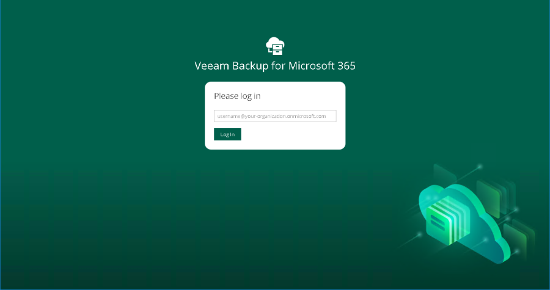

## Log out

To log out of Restore Portal, in the upper-right corner of the Restore Portal window, click the user name and click **Log Out**.  
After you log out, all sessions that were opened by Veeam Backup for Microsoft 365 to explore backed-up data are stopped. Restore sessions with restore operations that are running on Restore Portal will continue in the background till data restore completes.  
  
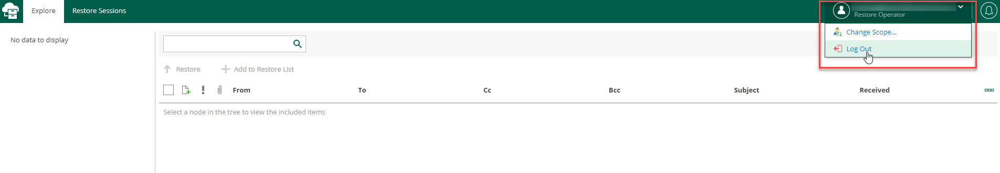
  
## User Interface

The web-based user interface of the Restore Portal is designed to let you quickly explore backed-up Microsoft Exchange, Microsoft SharePoint and Microsoft OneDrive for Business data in one window. It allows you to view details about restore sessions progress and results and the restore sessions history.  
The main window consists of the **Explore**, **Restore Sessions** and **Restore List** tabs.

### Explore Tab

This tab contains two panes:

- The navigation pane allows you to browse through the hierarchy of folders with backed-up data. Nodes with Microsoft Exchange, Microsoft OneDrive for Business and Microsoft SharePoint data are displayed in the navigation pane separately. Availability of nodes differs depending on backups created by Veeam Backup for Microsoft 365 for an object whose backed-up data is being explored.

For example, for a _user_ object the following data can be displayed:

- Exchange Online mailbox
- Archive mailbox
- OneDrive for Business
- Personal Site (available only for restore operators)

For restore operators, Restore Portal displays data for user objects and SharePoint sites that restore operators are allowed to explore.

- The preview pane allows you to view details about items that are contained in a folder you have selected in the navigation pane. You can search items and select items that you want to restore or add to the restore list.

!!! note

    Consider the following:
    Restore Portal displays up to 2000 items, so search for specific items.
    You can narrow your search results by specifying various search criteria using the criteria:value format. For more information about search parameters, see this section of REST API Reference.
    You can also use logical upper-cased operators such as AND, OR and NOT along with wildcard characters such as * and ?.
    To search items by a specific date/time, specify the time in the UTC format. You can hover over the date in the Received column to view the UTC value.

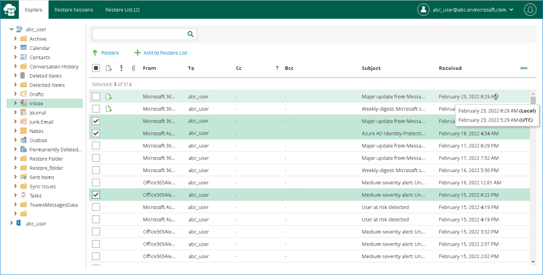

## Restore Sessions Tab

On this tab, you view details about restore session progress and results.  
You can do the following:

- Stop a restore session.
- Search and filter restore sessions by type, status and time period.
- View the list of events that occurred during a restore session, search and filter events by their status.

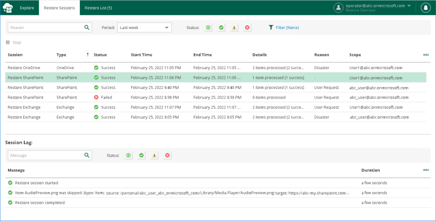

### Restore List Tab

On this tab, you view and edit the content of the restore list. This tab appears only if a restore list is not empty.  
You can do the following:

- Select items that you want to restore.
- Remove items from the restore list.
- Search and filter items by their restore status.

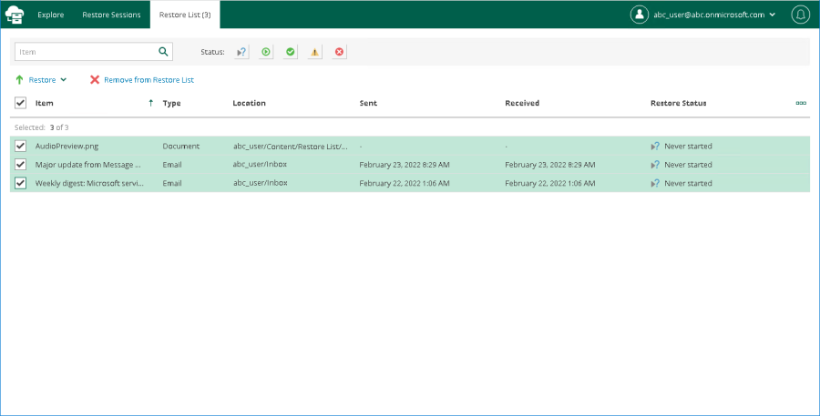

### Notification Pane

Notification pane is hidden in the upper-right corner of the Restore Portal window under the _notification_ icon shaped like a bell.  
To expand the notification pane, click the notification icon.  

### Managing Notifications

Restore Portal notifies you about restore sessions results. Notifications appear in the notification pane.  
Each notification includes a restore session name, a status icon, and a status link. If you click the restore session status link, Restore Portal opens the Restore Sessions tab and navigates you directly to the restore session record.  
If you want the notification pane to expand automatically when a new notification appears, do the following:

1. Click the notification icon to expand the notification pane.
1. Enable the **Auto-display new messages** option.

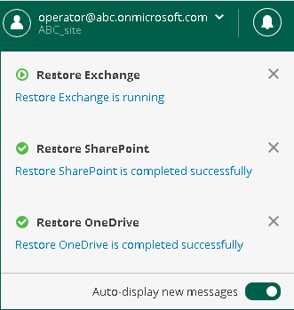
  
### Changing Restore Operator Scope

After logging in to Restore Portal, restore operators can view the list of objects available to them to manage — that is, to explore and restore data from backups created by Veeam Backup for Microsoft 365 for these objects.  
Restore operators can manage data of organization objects separately. Thus, they must switch between the managed objects: users, groups (group members only), sites, or the entire Microsoft 365 organization. In terms of Veeam Backup for Microsoft 365, this operation is called _Changing restore operator scope_.

!!! note

    If a restore operator is allowed to explore and restore data from backups created by Veeam Backup for Microsoft 365 for all objects (except teams) within a Microsoft 365 organization, loading of available objects may take a considerable time. To avoid this, the Veeam Backup for Microsoft 365 administrator can edit the restore operator role settings and select not the entire organization, but specific users, groups, or sites as objects to manage.

To select an object whose backed-up data a restore operator will explore and restore, do the following:

1. In the upper-right corner of the Restore Portal window, click the user name and select **Change Scope**.
1. In the **Change scope** window, select an object that you want to manage. You can search objects and filter them by their organization object type.
1. Click **Change scope**.

The name of the selected object will appear in the upper-right corner of the Restore Portal window under the restore operator user name. The Explore tab will be displayed, on which you can browse through the hierarchy of folders with backed-up data of the selected object.  

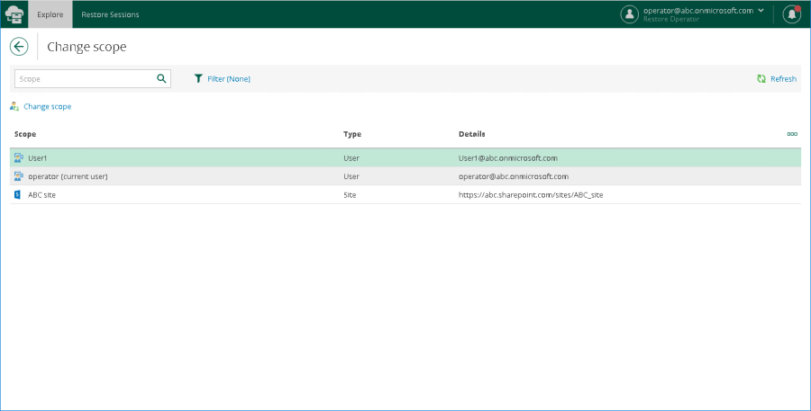
  
### Performing Restores

After logging in to Restore Portal, you can explore and restore data from backups created by Veeam Backup for Microsoft 365. If you act as an *end user*, you perform self-service restore of your own data. If you have a *restore operator* permissions, you explore and restore backed-up data for those objects that you are allowed to manage.  
To select items that you want to restore, do the following:

1. Open the **Explore** tab.
1. In the navigation pane, browse through the hierarchy of folders with backed-up data.
1. Select a folder that contains data you want to restore.
1. In the preview pane, select check boxes next to the necessary items.

For documents and files, you can select which version of an item you want to restore. To do this, in the **Version** column, click the most recent version number, and in the displayed window, select the earlier version to restore.

!!! note

    Consider the following:
    Restore Portal displays up to 2000 items, so search for specific items.
    You can narrow your search results by specifying various search criteria using the criteria:value format.
    You can also use logical upper-cased operators such as AND, OR and NOT along with wildcard characters such as * and ?.
    To search items by a specific date/time, specify the time in the UTC format. You can hover over the date in the Received column to view the UTC value.

1. Click **Restore**.
1. Configure restore operation options. Depending on the type of items that you selected to restore, Restore Portal runs one of the following wizards:

- Exchange Restore
- Sharepoint Restore
- OneDrive Restore

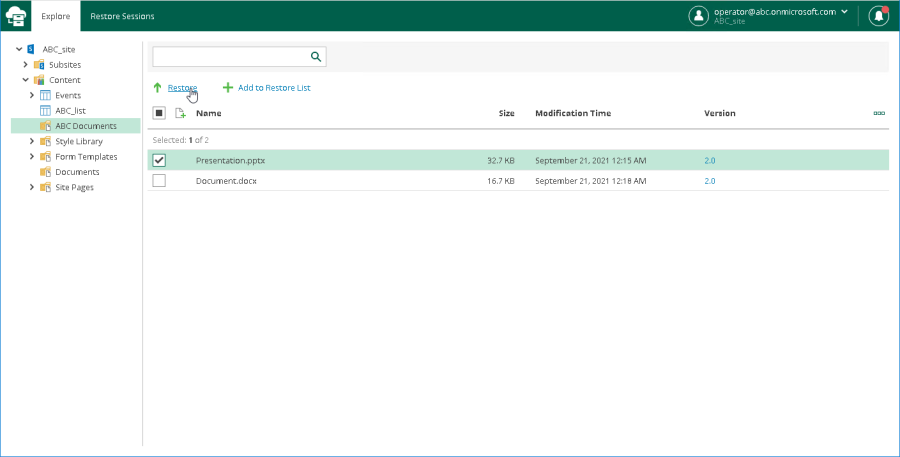

### Using Restore List

If you want to select items located in different folders in the hierarchy of folders with backed-up data displayed in the navigation pane, you can add them to the restore list. For example, you can add to the restore list one by one items of different types: mailbox items, OneDrive and SharePoint files, and proceed to their restore.  
To add items to the restore list, do the following:  

1. Open the Explore tab.  
1. In the navigation pane, browse through the hierarchy of folders with backed-up data.  
1. Select a folder that contains data you want to restore.  
1. In the preview pane, select check boxes next to the necessary items.  
For documents and files, you can select which version of an item you want to restore. To do this, in the Version column, click the most recent version number, and in the displayed window, select the earlier version to restore.  
1. Click Add to Restore List.  
1. Repeat steps 2–5 to add more items to the restore list.  
1. On the Restore List tab, review the list of items that you added to the restore list.  
1. To restore items, select check boxes next to the necessary items and click Restore and then select one of the following options:  
    - Restore Exchange Items. This option runs the Exchange Restore wizard.  
    - Restore OneDrive Items. This option runs the OneDrive Restore wizard.  
    - Restore SharePoint Items. This option runs the SharePoint Restore wizard.  
    - Restore SharePoint Documents. This option runs the SharePoint Restore wizard.  
    To remove items from the restore list, select check boxes next to the necessary items and click Remove from Restore List.
1. Follow the steps of the wizard that you ran and configure restore operation options. Mind that you must run wizards manually one after another.  

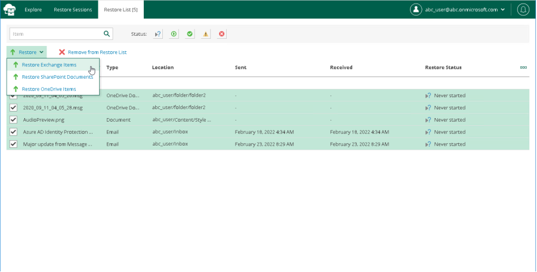

### Exchange Restore

The **Exchange Restore** wizard allows you to configure options that Veeam Backup for Microsoft 365 will apply when restoring the selected Microsoft Exchange items.  
To configure Exchange restore, do the following:

1. At the **Items** step, specify items that you want to restore. If you no longer want to restore an item, select it and click **Remove**.

    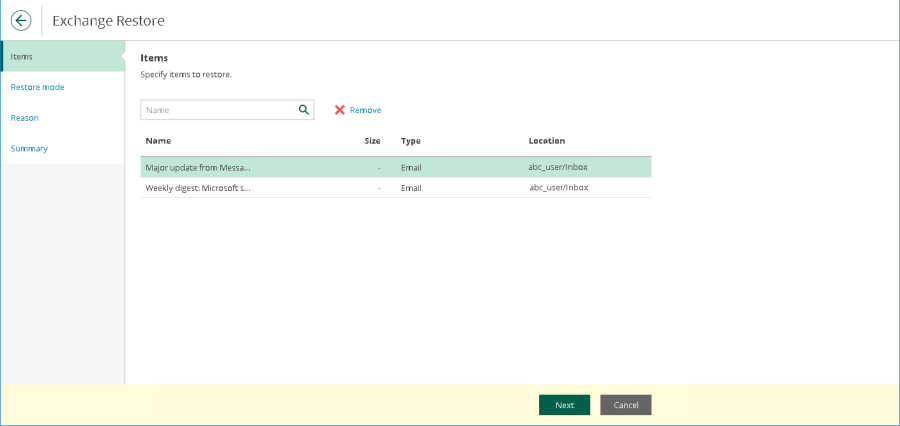

1. At the **Restore mode** step, select where you want to restore the selected items:

    - **Restore to the original location**. Select this option if you want to restore the selected items to their original location. Then proceed to step 5.
    - **Restore to a new location**. Select this option if you want to restore the selected items to another location and specify the folder name in the **Restore to the following folder** field. If the specified folder does not exist, it will be created automatically.

    

1. Click **Advanced options** to open the **Restore options** dialog.
1. In the **Restore options** dialog, select check boxes next to the additional options that you want to apply during the restore operation and then click **Apply**:

    - **Restore changed items**. Select this check box if you want to restore items that have been changed.
    - **Restore missing items**. Select this check box if you want to restore items that are missing in the target folder.
    - **Mark restored items as unread**. Select this check box if you want to mark each restored item as unread.
  
    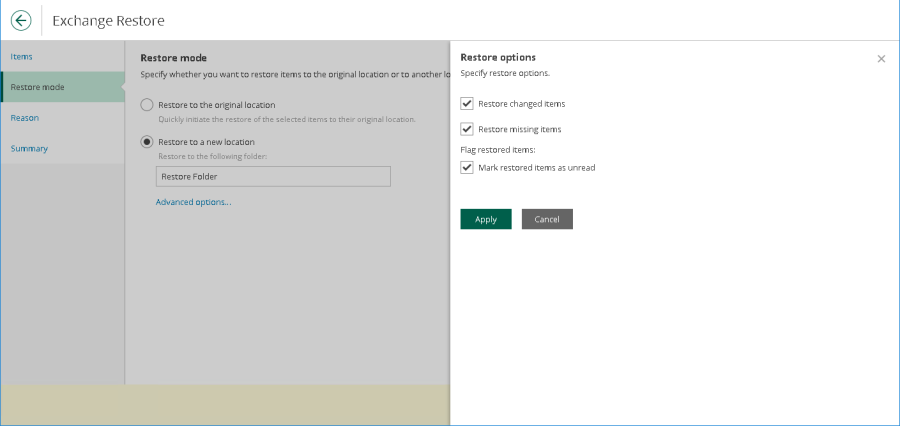

1. \[Optional\] At the **Reason** step, specify a restore reason. This information will be available in the **Reason** column on the **Restore Sessions** tab and you will be able to reference it later.

1. At the **Summary** step, review details of the restore operation and click **Finish**.
  
Restore Portal runs the restore operation immediately and opens the Restore Sessions tab, where you view details about restore session progress and results.  
  
### SharePoint Restore

The **SharePoint Restore** wizard allows you to configure options that Veeam Backup for Microsoft 365 will apply when restoring the selected Microsoft SharePoint items.  
To configure SharePoint restore, do the following:

1. At the **Items** step, specify items that you want to restore. If you no longer want to restore an item, select it and click **Remove**.

    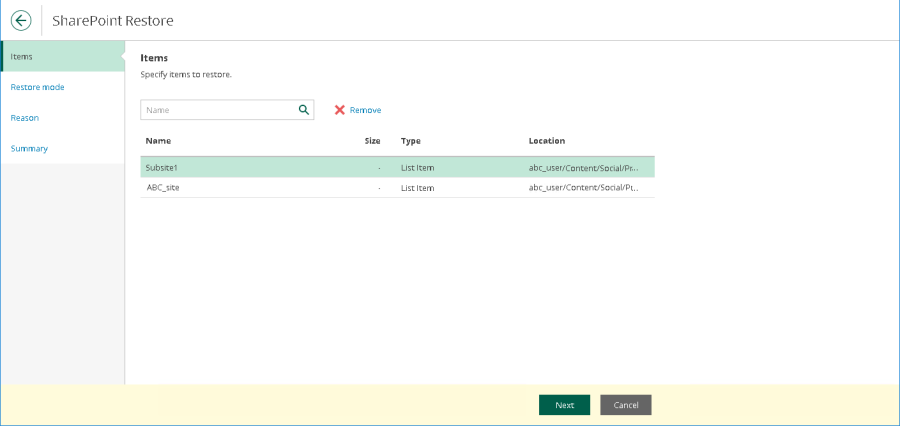

1. At the **Restore mode** step, select where you want to restore the selected items:

    - **Restore to the original location**. Select this option if you want to restore the selected items to their original location. Then proceed to step 5.
    - **Restore to a new location**. Select this option if you want to restore the selected items to another location and specify the list name in the **Restore to the following list** field.

    Mind that if you restore document libraries, lists or documents and the specified list does not exist, it will be created automatically. If you restore list items, make sure to specify a list that exists in the original SharePoint site.  

    

1. Click **Advanced options** to open the **Restore options** dialog.
1. In the **Restore options** dialog, select check boxes next to the additional options that you want to apply during the restore operation and then click **Apply**:

    - **Changed items**. Select this check box if you want to restore data that has been modified in the production environment.
    - **Missing items**. Select this check box if you want to restore missing items.
    - **Restore permissions**. Select this check box if you want to restore permissions.
    - **Send a notification by email to the users with permissions to the file**. Select this check box if you want to notify users about items restore.
    - **Restore only the latest version**. Select this check box if you want to restore only the latest version of items.
    - **Overwrite**. Select this option to overwrite data in the production environment.
    - **Merge**. Select this option to merge an existing and a backup version of items.

    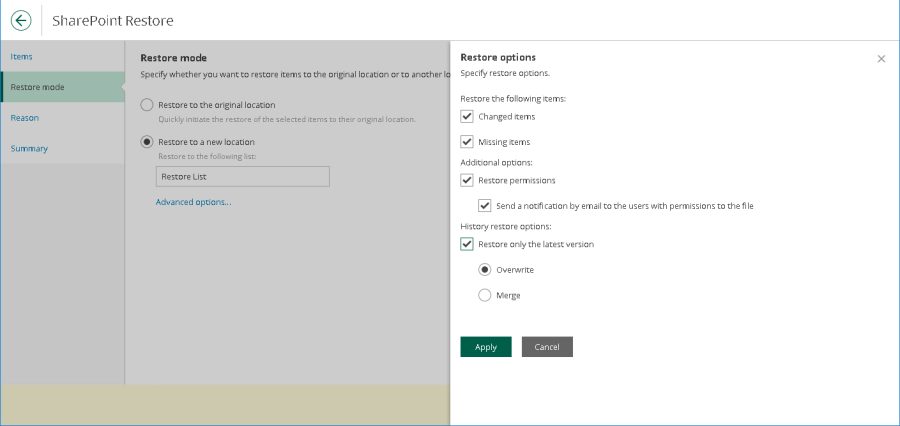

1. \[Optional\] At the **Reason** step, specify a restore reason. This information will be available in the **Reason** column on the **Restore Sessions** tab and you will be able to reference it later.

1. At the **Summary** step, review details of the restore operation and click **Finish**.

Restore Portal runs the restore operation immediately and opens the Restore Sessions tab, where you view details about restore session progress and results.  

### OneDrive Restore

The **OneDrive Restore** wizard allows you to configure options that Veeam Backup for Microsoft 365 will apply when restoring the selected Microsoft OneDrive for Business items.  
To configure OneDrive restore, do the following:

1. At the **Items** step, specify items that you want to restore. If you no longer want to restore an item, select it and click **Remove**.

    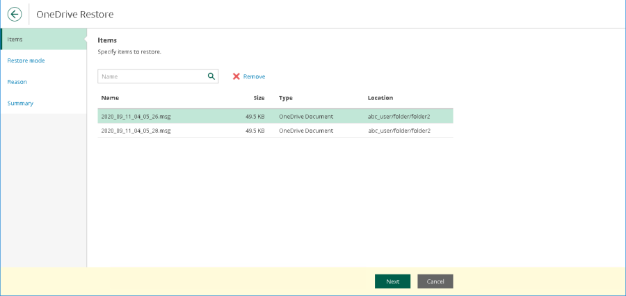

1. At the **Restore mode** step, choose whether you want to overwrite the file or document in the original location or keep the restored one along with the original.

    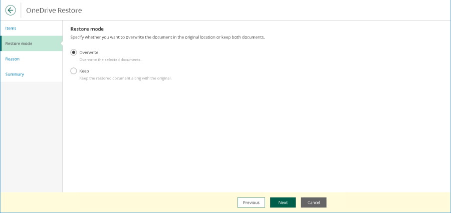

1. \[Optional\] At the **Reason** step, specify a restore reason. This information will be available in the **Reason** column on the **Restore Sessions** tab and you will be able to reference it later.

1. At the **Summary** step, review details of the restore operation and click **Finish**.

Restore Portal runs the restore operation immediately and opens the Restore Sessions tab, where you view details about restore session progress and results.

### Additional Functionality

There are additional features and functionality that can be performed on a secure call with an AUCloud Compute & Storage Engineer. Please contact [Support](../../../Platform_Overview/support/index.md) if you wish to perform any of the following:

- Access backup data from further back in time than the most recent backup
- Restore data to a different location/mailbox/tenant
- Export data as a *pst/msg/zip* file
- Explore and restore Group Mailboxes
- Explore and Restore Microsoft Teams data

For further questions about the capabilities of the restore portal, please contact [Support.](../../../Platform_Overview/support/index.md)