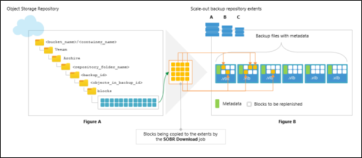

### Overview

The following information has been taken from the **Veeam Backup & Replication version 11 User Guide for VMware vSphere** and is intended to provide relevant information regarding backups within the AUCloud environment.

The full copy of the Veeam documentation can be found online [here](https://helpcenter.veeam.com/docs/backup/vsphere/about_backup.html?ver=110) or by downloading the [PDF](https://www.veeam.com/veeam_backup_11_0_user_guide_vsphere_pg.pdf).

### Scale Out Backup Repositories

 A scale-out backup repository is a repository system with horizontal scaling support for multi-tier storage of data. The scale-out backup repository consists of one or more backup repositories called performance extents and can be expanded with cloud-based repositories or local object repositories. All the storage devices and systems inside the scale-out backup repository are joined into a system, with their capacities summarised. The main benefits of this feature are as follows:

- It provides a convenient way of managing the backup storage.
- It provides an easy way to extend repositories when they run out of space by simply adding a new performance extent to the existing scale-out repository. You can expand the scale-out backup repository at any moment. For example, if backup data grows and the backup repository reaches the storage limit, you can add a new storage system to the scale-out backup repository. The free space on this storage system will be added to the capacity of the scale-out backup repository. As a result, you will not have to move backups to a backup repository of a larger size.
- It supports any backup target supported by Veeam: Windows or Linux servers with local or DAS storage, network shares, deduplicating storage appliances. All the features of any storage device or system are preserved.
- It allows you to set up granular performance policy. For more information, see Backup File Placement.
- It provides practically unlimited cloud-based storage capacity: you can instruct Veeam Backup & Replication to offload data from extents to the cloud for long-term storage.

A scale-out backup repository can be used for the following types of jobs and tasks:

- Backup jobs.
- Backup copy jobs. You can copy backups that reside on scale-out backup repositories and store backup copies on scale-out backup repositories.

 Backup files stored on the scale-out repository can be used for all types of restores, replication from backup and backup copy jobs.

### Backup File Placement

Veeam Backup & Replication stores backup files on all performance extents of the scale-out backup repository. When you configure a scale-out backup repository, you must set the backup file placement policy for it. The backup file placement policy describes how backup files are distributed between extents. You can choose one of two policies:

- Data locality
- Performance

The backup file placement policy is not strict. If the necessary extent is not accessible, Veeam Backup & Replication will disregard the policy limitations and attempt to place the backup file to the extent that has enough free space for the backup file.

For example, you have set the Performance policy for the scale-out backup repository and specified that full backup files must be stored on Extent 1 and incremental backup files must be stored on Extent 2. If before an incremental backup job session Extent 2 goes offline, the new incremental backup file will be placed to Extent 1.

### Data Locality

If you set the Data locality policy for a scale-out backup repository, all backup files that belong to the same backup chain are stored on the same extent of the scale-out backup repository.

The Data locality policy does not put any limitations to backup chains. A new backup chain may be stored on the same extent or another extent. For example, if you create an active full backup, Veeam Backup & Replication may store the full backup file to another extent, and all dependent incremental backup files will be stored together with this full backup file.

### Extent Selection

To select an extent for backup file placement, Veeam Backup & Replication checks the following conditions:

1. Availability of extents on which backup files reside. If some extent with backup files from the current backup chain is not accessible, Veeam Backup & Replication will trigger a full backup instead of incremental (if this option is enabled).

1. Backup placement policy set for the scale-out backup repository.

1. Load control settings — maximum number of tasks that the extent can process simultaneously.

1. Amount of free space available on the extent — the backup file is placed to the extent with the most amount of free space.

1. Availability of files from the current backup chain — extents that host incremental backup files from the current backup chain (or current VM) have a higher priority than extents that do not host such files.

### Capacity Tier (S3 Storage)

Capacity Tier is an additional tier of storage that can be attached to a scale-out backup repository. Capacity Tier transports applicable data from the scale-out backup repository performance extents to a cloud or to S3-compatible devices for long-term storage.

 This feature is most useful if:

- You are running out of storage space.
- Your organization policies allow you to store only a certain amount of data on your extents, while the outdated data should be stored elsewhere.
- You seek to store data on several sites to ensure its safety in case of a disaster.
- The Capacity Tier consists of only one capacity extent. The capacity extent can be either cloud-based object storage repository or on-premises object storage repository.
- The capacity extent is displayed in the scale-out backup repository wizard, on the Step 5. Add Capacity Tier step. With Capacity Tier you can:
- Move inactive backup chains to object storage, as described in Moving Inactive Backup Chains to Object Storage.
- Copy new backup files as soon as these files are created, as described in Copying Backups to Object Storage.
- Download data that was moved from object storage back to the source extents, as described in Downloading Data from Object Storage.

!!! note

    Pricing for Backup in the AUCloud Pricing Guide assumes data will be transferred to Capacity Tier Storage after one month by default.

### Immutability

Veeam Backup & Replication allows you to prohibit deletion of data from object storage by making it immutable. To make data immutable, Veeam Backup & Replication uses the Object Lock technology provided by S3-Compatible providers. Once imposed, the object lock prohibits deletion of data from object storage until the immutability expiration date is met. The value that defines the period after which the immutability expiration date occurs is specified when adding (or editing) an S3 Compatible object storage repository.

 The following operations cannot be performed on immutable data within the object storage:

- Manual removal of data, as described in Removing Backups from Object Storage Repository.
- Removal of data by the retention policy, as described in Retention Policy.
- Removal of data using any cloud service provider tools.
- Removal of data by the cloud service provider technical support department.
- Removal of data by the Remove deleted items data after option, as described in Maintenance Settings.

 Immutable data is preserved as described in Block Generation.

### Block Generation

Block Generation is an additional period of 10 days that is automatically added to the immutability expiration date. This period is designed to reduce the number of the requests to the object storage in cases when the immutability period of some blocks must be extended: for instance, when the blocks are being reused. Generations may grow, which happens after you offload data starting from the 11th day and up until the end of the immutability period, thereby creating new consecutive generations the period of which is also 10 days.

### Forward Incremental Backup Chain

The following figure shows an example consisting of three generations; each generation has immutable blocks of data, two of which have been reused during copy.

As per example:

 **\[Generation 1\]** On 01/01/2020, a Full Backup 1 consisting of blocks **A, B, C** and **D** has been offloaded to object storage. On 01/04/2020, the Full Backup 1 was succeeded by an Incremental Backup 1 consisting of blocks **E** and **F**.

 After both files have been offloaded, a backup (or backup copy) job went idle for the next 7 days. In such a scenario, blocks of these files (i.e. **A, B, C, D, E** and **F**) become part of the **Generation 1.**

 **\[Generation 2\]** On 01/11/2020 (11th day), a Full Backup 2 consisting of blocks **A, B, G** and **H** has been offloaded to object storage. On 01/12/2020, the Full Backup 2 was succeeded by an Incremental Backup 2 consisting of blocks **I** and **J**.

 Because all these blocks (i.e. **G, H, I** and **J**) have been offloaded no sooner than on the 11th day, these blocks become part of the **Generation 2**.

Blocks **A** and **B** of the Full Backup 2, however, have not been actually offloaded. Instead, these blocks have been taken from the Full Backup 1 and, therefore, have been reused.

 Such a scenario means that the **Generation 1** now has blocks **C, D, E** and **F** only (i.e., excluding reused blocks **A** and **B**), all of which become mutable on 02/09/2020.

 After the Incremental Backup 2 has been offloaded on 01/12/2020, the backup (or backup copy) job went idle for the next 10 days.

 **\[Generation 3\]** On 01/22/2020 (11th day), an Incremental Backup 3 consisting of blocks **K** and **B** has been offloaded to object storage. Blocks of this file become part of the **Generation 3** and block **B** has been reused from the Full Backup 2. Since all of the blocks that have been offloaded starting from 01/11/2020 **(G, H, I, J** and **K**) are of the same backup chain, these blocks now belong to the **Generation 3** altogether and can only become mutable on 03/02/2020.

 For instance, if the Incremental Backup 3 had not been offloaded on 01/20/2020, the immutability expiration window of blocks **A, B, G, H, I** and **J** would have been met on 02/21/2020, which is the date when the Full Backup 2 was offloaded plus 40 days.

According to this example, Veeam Backup & Replication continues to keep reused/dependent blocks of data locked by continuously assigning them to new generations, thereby extending the immutability expiration period.

### Managing Capacity Tier Data

You can manage the backup data in object storage in the following ways:

- Restore data directly from object storage back to production servers.
- Download offloaded data from object storage back to the source extents.
- Manage retention policies to remove obsolete restore points from the extents and the object storage.
- Reduce the amount of operations incurred by your cloud storage provider and decrease the amount of traffic being sent over the network when moving or copying data to object storage.

### Moving Inactive Backup Chains to Object Storage

To collect backup files that belong to inactive backup chains from the extents and move them to object storage, Veeam Backup & Replication uses an offload session which is executed automatically every 4 hours.

A complete name of each offload session is built up of the scale-out backup repository name + the Offload postfix. That is, if your scale-out backup repository name is AUCLOUD, the offload session name will be AUCLOUD Offload.

The offload session manages the following:

- Validation Process
- Data Transfer

Before your data can safely be moved to object storage repositories, Veeam Backup & Replication performs the following mandatory verifications and required actions:

- Verifies whether data that is about to be moved belongs to an inactive backup chain. For more information, see Backup Chain Legitimacy.
- Verifies whether source extents are available and have not been put into maintenance mode. Consider that data will not be offloaded from Linux-based extents that have internet access via HTTP(S) proxy. All Linux-based extents configured in your scale-out backup repository must have direct access to the internet.
- Verifies whether an object storage repository has not been put into maintenance or seal mode. For more information, see Switching to Maintenance Mode and Switching to Seal Mode.
- Verifies whether configuration parameters that define how and when inactive backup chains must be moved to object storage are met. Such parameters are configured, as described in Add Capacity Tier.
- Builds and maintains indexes to verify whether data that is being moved is unique and has not been offloaded earlier. For more information, see Indexes.
- Synchronizes the backup chain state between the local and object storage repository to maintain retention policies. For more information, see Retention Policy.

### Data Transfer

 After the validation process is complete, the SOBR Offload session does the following:

- Collects backup files that have passed verification. Such verified backup files are collected from all the extents added to a scale-out backup repository.
- Extracts data blocks from these files and moves these blocks to object storage leaving the backup files only with metadata (i.e. free of data blocks). Such backup files (without data blocks) will remain on the source extents and will also be replicated to the object storage repository.

 Having a copy of such dummy files on your extents allows you to:

- Download data that was moved back to the extents, as described in Data Download.
- Restore data back to production servers, as described in Data Restore.
- Having replicated versions of dummy files in object storage repositories allows you to:
- Synchronize the backup chain state of your object storage with that of your extents, as described in Synchronizing Capacity Tier Data.

 The following figure illustrates how inactive backup chains are moved to object storage.

The Figure A demonstrates a pool of extents (A, B and C) that are added to a scale-out backup repository (SOBR) and an object storage repository that is added to the same SOBR.

 Suppose that the extent A has an inactive backup chain consisting of one `.vbk` file and three `.vib`  files, that is, four restore points in total. Each of these files comprises metadata (represented as green vertical blocks) and the actual blocks of data (represented as yellow squares). During the offload session, Veeam Backup & Replication will collect all the orange squares — that is, the actual blocks of data — from all the backup files (`.vbk` and `.vib` ) and offload these blocks to the object storage repository represented in the Figure B.

 Each offloaded block might be of different size, which is defined during configuring storage optimization. The offloaded blocks are placed to the blocks directory in your object storage repository.

 Backup files with metadata (or dummy files) will be replicated to the object storage repository and will be placed to the `storages` directory. As per example, these files are one `.vbk` file and three `.vib`  files that are shown in the Figure B.

 Such an approach will be applied to all inactive backup chains that satisfy validation criteria.

 After offload is complete, the new Object Storage node appears in the Home view, under the Backups node and shows backups that have been moved to object storage.

### Copying Backups to Object Storage

 Veeam Backup & Replication allows you to copy backups from the extents of your scale-out backup repository to object storage as soon as these backups are created.

 To copy data to object storage, Veeam Backup & Replication uses a copy session that is executed automatically upon completion of a backup (or backup copy) job that is targeted to a scale-out backup repository that was extended with object storage.

 A complete name of each copy session is built up of the backup (or backup copy) job name + the Offload postfix. That is, if your backup (or backup copy) job name is Aucloud, the copy session name will be Aucloud Offload.

Once the backup (or backup copy) job is complete, Veeam Backup & Replication initiates a new copy session which simply extracts data blocks and metadata from each new backup file (`.vbk`, `.vib` , `.vrb`) created on any of the extents of your scale-out backup repository and copies these blocks to object storage, thereby making an identical replica of your backup data.

 Having such a replica gives you the ability to quickly restore data as of the latest state in case of any unexpected failure of any of your extents, or even of the entire scale-out backup repository, as described in Restore Scenarios.

 To enable data copy, make sure to select the Copy backups to object storage as soon as they are created option, as described in Add Capacity Tier.

### Combining Copy and Move Operations

 You can combine both the Copy backups to object storage as soon as they are created option and the Move backups to object storage as they age out of the operational restores window option. In such a scenario, a copy session will be copying newly created backups right upon creation.

 Once the backup chain becomes inactive (or sealed) and exceeds the operational restore window, data blocks will be removed from each associated backup file in such an inactive on-premises backup chain and only metadata will be preserved. Such a behavior mimics data movement, but instead of moving data that was already copied, Veeam Backup & Replication simply purges associated data blocks from the extents, thereby saving traffic and reducing costs that might be incurred by your storage provider for performing read/write operations.

The following figure shows an example in which both options are enabled, suggesting that each backup file has been copied to object storage upon its creation.

 The backup chain on the left becomes inactive after a new full backup file is created and consists of one `.vbk` file and five `.vib`  files. Since only the first four backup files (represented as grey blocks) in this inactive backup chain exceed the operational restore window, Veeam Backup & Replication removes blocks of data from these four files only and leaves the other two `.vib`  files (created on Thursday and Friday) as they are until the operational restore window moves forward, and so on.

After copy is complete, the new Object Storage node appears in the Home view, under the Backups node and shows backups that have been copied to object storage.

!!! note

    The copy is not performed in any of the following cases:
    - The target object storage repository is in the maintenance or seal mode.
    - During prohibited hours specified in the backup window configuration.

### Downloading Data from Object Storage

 To download data from object storage back to the source extents, Veeam Backup & Replication uses the SOBR Download session.

 The SOBR Download session is triggered right after you select the Copy to performance tier option; it collects offloaded blocks of data from object storage and copies them back to the on-premises extents. For more information, see Copying to Performance Tier and Downloading to Performance Tier.

 Consider the following:

- Before copying data blocks, Veeam Backup & Replication verifies whether any of such blocks exist on any of the extents of your scale-out backup repository. If found, Veeam Backup & Replication will use the existing blocks instead of downloading the exact same data from object storage.
- If a source extent is unable to accommodate data being copied due to lack of free storage space, Veeam Backup & Replication will find another extent in the associated scale-out backup repository that has sufficient storage capacity to receive the data. If your scale-out backup repository has no extents other than the one running out of space, the copy will not be possible.
- If you have removed any of the extents from a scale-out backup repository without evacuating backup files with metadata, the copy will not be possible. Backup files with metadata are created, as described in Moving Inactive Backup Chains to Object Storage.
- The SOBR Download session results are saved to the configuration database and available for viewing, as described in Viewing Download Job Session Results.

 The following figure shows an example of replenishing on-premises storage with the data blocks being copied from the object storage repository.

- The Figure A represents an object storage repository containing blocks of data to be copied.
- The Figure B represents extents that store backup files with metadata to be replenished.

### Backup Chain Legitimacy

 Before moving data to object storage repositories, Veeam Backup & Replication scale-out repository validates the backup chain state to ensure that the restore points to be moved belong to an inactive backup chain. This does not apply to the copy policy: all newly created restore points are copied immediately.

### Inactive Backup Chain of a Backup Job

 When a backup job is being executed for the first time, Veeam Backup & Replication creates an initial full backup file that contains complete information about the VMs that are being backed up. Each subsequent backup job sessions initiate creation of new incremental backup files that contain only changes which have occurred since the last backup session.

 Such a chain can be considered active as there are more incremental backups have yet to be created, depending on the backup job schedule configuration. For more information, see Define Job Schedule.

 To move data to object storage repositories, an active backup chain must be reset, that is, transformed into inactive.

 To transform an active backup chain into inactive, a new Active Full (or Synthetic Full) backup file must be created for such a chain. This can be done either manually, as described in Performing Active Full Backup, or you can configure a schedule, according to which new active full backups will be created automatically, as described in Active Full Backup.

 Once a new full backup file is created and the offload session is being executed, Veeam Backup & Replication collects all the restore points (full and incremental) that were created prior to the latest active full, and prepares them to be moved to the object storage repository, as described in Moving Inactive Backup Chains to Object Storage.

 The following figure shows both inactive and active backup chains created with the incremental method. The inactive backup chain consisting of one `.vbk` file and five `.vib`  files can easily be offloaded once it satisfies validation criteria, whereas the active backup chain consisting of a `.vbk` file and a `.vib`  file would continue to grow with another incremental backups until it is reset by another full backup and so on.

The same applies to backup chains created with the reverse-incremental method, except for in this method, all the `.vrb` files starting from the third restore point will be considered inactive automatically, as illustrated in the Figure A below. That said, you do not have to create an Active Full (nor Synthetic Full) backup manually unless you want to offload all the restore points including a `.vbk` file and the first two `.vrb` files, as illustrated in the Figure B.

!!! note

    Mind that a full backup file and the first two incremental backup files (that is, two `.vrb` files that immediately follow a `.vbk` file) will never be offloaded until another full backup file is created successfully, as illustrated in the Figure B.

 Consider the following examples:

- The Figure A shows a backup chain consisting of 1 `.vbk` file and 6 `.vrb` files, of which only 4 `.vrb` files (represented as gray blocks) can be offloaded.
- The Figure B shows a backup chain consisting of 2 `.vbk` files and 7 `.vrb` files, of which only 6 `.vrb` files and a `.vbk` file (also represented as gray blocks) can be offloaded.

 Backup chains can be of a different structure, depending on whether your backups were created using the perVM method or as a single storage; when all VMs are placed into a single file. Both structure types can be offloaded to object storage repositories as long as these types are inactive.

 For more information on how Veeam Backup & Replication creates and manages backup chains, see Backup Chain.

### Inactive Backup Chain of a Backup Copy Job

 When offloading backup chains created by backup copy jobs, only full backup files that have a GFS flag will be moved. That said, you must select the Keep the following restore points as full backups for archival purposes check box and (optionally) combine it with the Read the entire restore point from source backup instead of synthesizing it from increments check box at the Target step of the New Backup Copy Job wizard.

 For more information on how to configure a backup copy job and how the GFS retention works, see Creating Backup Copy Jobs and GFS Retention Policy respectively.

 Consider the following figures:

- The Figure A shows a backup chain consisting of 2 `.vbk` files and 5 `.vib`  files created with the synthetic full method.

 The Weekly Full Backup file (represented as a gray block) can be offloaded to object storage since it has a GFS flag assigned to it (as per example, the flag is Weekly), whereas the second `.vbk` file cannot be offloaded until it is also assigned a GFS flag, which happens after another full backup file is created.

- The Figure B shows a backup chain consisting of 3 `.vbk` files and 11 `.vib`  files created with the active full method.

 In this figure, a Weekly Full Backup file (represented as a gray block in the middle) has a Weekly flag, therefore, this full backup file can be offloaded to object storage. The second weekly full backup file (represented as an orange block on the rightmost side) also has a Weekly flag assigned, but since this file is active and is yet to be succeeded by another incremental backups during subsequent sessions of your backup copy job, it will not be offloaded until another full backup file is created and so on.

 The first backup file (represented as a green block on the left) will never be offloaded since it does not have any GFS flag assigned.

!!! note

    The following types of backup files are never offloaded from backup chains created by backup copy jobs:
    - Full backup files (`.vbk`) that have not been assigned any GFS flag.
    - Incremental backup files (`.vib`).

### Retention Policy

 A retention policy defines the number of restore points to keep on your extents and is configured in the Specify Backup Storage Settings step of the backup job configuration wizard.

 The restore points that fall under the retention policy will be removed from both the extents and object storage repositories in the following manner:

- An earliest restore point will be removed from the backup chain on the associated extent.
- Data blocks that correspond to the restore point that is being removed will be purged from the object storage repository upon the next offload or copy session.

 Make sure that an object storage repository has not been put into maintenance mode, as this mode prevents synchronization of the on-premises backup chain state with that of object storage.

 For more information about the offload and copy sessions, see Moving Inactive Backup Chains to Object Storage and Copying Backups to Object Storage respectively.

- Immutable blocks of data are removed after the immutability period is over.

 When a retention policy encounters immutable copied/moved blocks of data, it removes such blocks from the associated backup files on the extents only and then updates indexes, informing Veeam Backup & Replication that these blocks no longer exist and must be removed from object storage once mutable.

 For more information about immutability, see Immutability.

- Associated indexes will be updated for consistency purposes.
